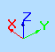

# Axis Indicator

To show or hide the Axis Indicator:

  *   *   * **3D View** ribbon **> > 3D Display >> Indicators >> Axis Indicator**.
  *   * (In an external 3D window) **Format >> Indicators >> Axis Indicator**.

The Axis Indicator is a viewing aid and is used to show the relative orientation of X, Y and Z world coordinate axes in the active 3D window. It looks like this:

The orientation of the indicator is dynamically updated when the view direction is altered using any of the navigation controls. This indicator is only a viewing guide and resides in the bottom left corner of a 3D window. 

**Note** : the [Axis Controller](<axes%20control%20tool%20overview.md>), on the other hand, can change the view orientation.

Related topics and activities

  * [Axis Controller](<axes%20control%20tool%20overview.md>)

  * [View Controller](<view_controller.md>)