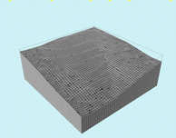
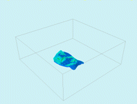
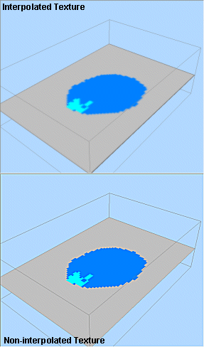

# Block Model Properties: General

To access this screen:

  * In the Sheets or **Project Data** control bar, active 3D window folder, Block Models sub-folder, right-click a block model, select Properties,

  * On the Block Model Properties screen, select the General tab.

  * Double-click a block model overlay in a 3D window.

Note: A Datamine [eLearning course](<https://datamine.learnupon.com/>) is available that covers functions described in this topic. Contact your local Datamine office for more details.

Define the colour, display type, exaggeration, display options and sequencing settings for a target block model **[overlay](<../COMMON/concept_views%20sheets%20overlays.md>)**. See [Block Model 3D Display](<blockmodels_introduction.md>) and [Block Model Slice Display](<Block%20Models_SectionvsIntersections.md>).

To configure general display formatting for a block model overlay:

  1. Display the **Block Model Properties: General** screen.

General settings for the target block model overlay display.

  2. Review and (optionally) edit the **Name** of the overlay.

  3. Review the **Source**. This is the name of the data object from which the target overlay is derived.

  4. Set the block model Display Type. This can be either _Points_ , _Lines_ , _Blocks_ , _Quick Section_ or _Intersection_. See [Block Model 3D Display](<blockmodels_introduction.md>).

**Note** : if an Intersection type is picked, the Intersection Section determines which data slice is shown.

  5. Choose if a 3D light source will illuminate the overlay, or if it displays in a flat colour, using the **Unlit** option:

     * If **Unlit** is unchecked, a simulated, directional light source is applied to the block model 3D data in the 3D view.

     * If Unlit is checked, the overlay displays its base colour without shading, making the colouring constant regardless of [environmental](<Environment_Lighting.md>) and [other light sources](<environment_adding%20more%20light%20sources.md>).

  6. Set the **Color** options. See [Legend Controls](<Legend-Pallete.md>).

  7. If you plan to animate your block model overlay in a 3D window, you will need to select a **Sequence Column**. This data column from your block model object contains numeric values that dictate the order in which data displays during [sequence animation](<Sequencing.md>) playback.

Selecting a **Sequence Column** enables the following options:

     * Forwardssequence the data according the increasing value of the selected attribute.

     * Single Framereplace instead of adding to displayed view frames.

     * Reverseselect this option to play the sequencing animation in reverse, from the highest record to the lowest record value.

     * Anim. Ratethis value represents the 'speed' at which the 'steps' are played. The most appropriate value depends on many factors, including the density of the data and how many 'steps' are in a particular animation.

     * Anim. Stepthis value determines the step size in the animation and equates to the number of records displayed or hidden for each frame. It is based on the values in the selected Sequence Column.

     * Loopif **checked** , your animation replays from the beginning once the final 'frame' has been displayed. If **unchecked** , the animation plays through once.

     * Annotateselect a field from the object that will be shown as on-screen annotation during sequence playback. 

       * Select Show Annotation to annotate the wireframe with sequence column data. You can control the formatting by clicking Configure to display the Sequence Annotation Overlay screen.

In the example below, an annotation attribute has been defined for a block model (IJK) and a wireframe (ZONE):

Each object is supported by its own **Sequence Control** bar. The annotation is displayed for both objects (although configured differently for each). When the sequence slider of either object is adjusted, the corresponding annotation is updated.

  8. Choose if you want to apply visual **Exaggeration**. 

This option is only available for _Lines_ and _Blocks_ display types. 

If **Exaggeration** is **checked** , data displays at the percentage value shown below. For example, blocks displayed at 90% of full size make cell boundaries more obvious than if cell boundaries are coincident (100%).

If **Exaggeration** is **unchecked** , model data is shown at actual size (100%).

  9. Choose fine tuning **Options** :

     * Show Fillif checked, the faces of each block, or the interior of each intersection polygon is filled according to the currently selected colouring options. Available for the Intersection and Blocks display types only.
     * Show Edgesif chosen, the boundary of the blocks or polygons will be drawn as unlit lines. Available for the Intersection and Blocks display types only.  
  
If both Show Fill and Show Edges options are selected, you can display highlighted edges, like this:

     * Show Absentchoose whether any cells being coloured by an Absent value are drawn. Choosing this option may be useful for getting a better feel for block model extents, while opting out may be better for showing grade boundaries, for example. In the image above, two intersections have been drawn: the horizontal one includes absent cell values (shown in grey), while the vertical intersection only shows those cells with valid values.

As another example, the image below shows an isometric view of a model represented as blocks with absent data included:

Whereas the following image shows the same model. but with the Absent Data unchecked:

     * Show Hullif checked, the 'bounding box' representing the data extents for the select block model will be displayed as a 3D box on screen.

     * Show Borderthis option is only available if a block model is being viewed as a Quick Section (see above). If enabled, a line will be shown to indicate the extremes of the object model (including absent data).

     * **Interpolate** when viewing block model data, you can choose to interpolate the section colors. Interpolated textures show a more 'blended' view of the disparate cell colors and can be useful when a hard boundary between parent cells isn't necessarily desirable. The image below shows (top) an interpolated and (bottom) non-interpolated section display type:

     * Apply Clipping: if checked, view clipping is applied to the target overlay. If not, clipping instructions are ignored and the overlay displays in full regardless.

**Note** : you can also change clipping behaviour using the Sheet or Project Data control bar's context menu for the target overlay.

  10. Set the **Opacity** of the overlay using the slider bar, set the transparency level of the selected block model. By default, data is shown at 100% opacity (0% transparency).

  11. If you are using the _Intersection_**Display Type** , select the Intersection Section to use to slice the model data.

See [3D Sections](<Sections.md>).

  12. Click **Apply** or **OK** to update all 3D views displaying the target overlay.

Related topics and activities

  * [Block Models Introduction](<blockmodels_introduction.md>)

  * [Quick Section Controls](<SectionControl_Dialog.md>)

  * Block Model Properties

  * [Block Model Properties: Labels](<BM_PropDialog_Labels.md>)

  * [Associated Files](<Associated%20Files%20Dialog.md>)

  * [Info Mode List](<Traces%20Properties%20Dialog%20\(Info%20Mode%20List\).md>)

  * [3D Display Templates](<3D_Templates.md>)