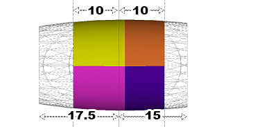
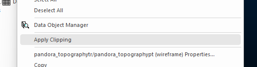
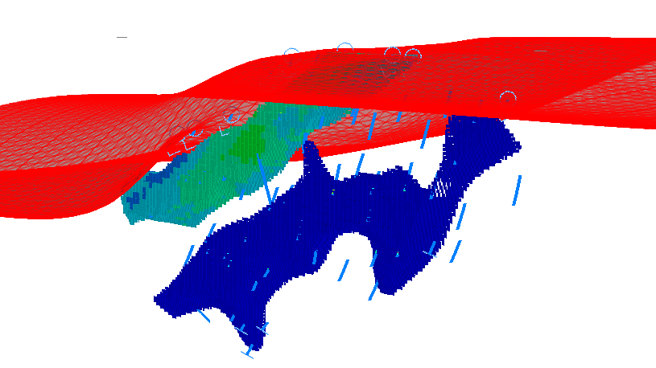
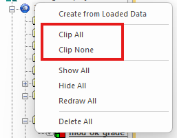
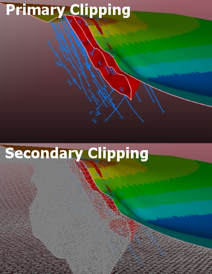

# Clipping 3D Data

By default, a 3D window displays all loaded (and visible) data, using whatever formatting is dictated by each overlay of a 3D object (an object can have multiple [overlays](<../COMMON/Formatting%203D%20Objects.md>)). 

Sometimes, it can be useful to show a cutaway view of data to better understand its relationship with other geometry. Seeing data in a particular 'slice' of the world can be quite revealing, such as checking the relationship of drillholes to categorical model surfaces, or viewing automatically-designed pit shells against a topography and an ultimate pit, for example. It's also very useful to see how cut-and-fill data interacts when running reconciliation reports. There are countless other uses.

;>)

_Clipped cut-and-fill data both before and after a DTM update operation_

## Clipping and the Section Corridor

"Clipping" is the mechanism used to remove visible data from a 3D view, commonly to visualize a cross-section of data in relation to one or more 3D sections. Clipping involves the concept of a _clipping plane_ and a _section corridor_.

  * **Clipping plane** this is the 2-dimensional plane orientation in 3D space that represents the plane from which clipping is applied.

  * **Section corridor** the 'slice' that is created by applying a section _width_ , which is the total of the back and front clipping widths.

In the image below, the 3 red vertical lines represent the back, centre and front section indicators (where the back-front distance is the section corridor). The primary clipping values are shown at the top (10 each way). The secondary clipping limits (explained further below) are shown at the bottom.

In the example above, the primary clipping corridor is 20 m and the secondary clipping corridor is 32.5 m. Note how the front and back clipping distances can be different.

Clipping is always performed in relation to one or more **[3D sections](<Sections.md>)** , where data can be clipped either in front of the section, or behind it, or both. As clipping instructions are tied to each section, it's possible to isolate even granular data elements using an arrangement of overlapping sections.

## Clipping Methods

Clipping can be applied in one of the following ways:

  * **Front** clip data that lies in front of the assigned section corridor. 

  * **Back** clip data behind the section corridor.

  * **Both** clip both sides of the corridor. 

Clipping can be applied using any of the following techniques (although not all facilities are available in all Studio products):

  * Toggle clipping on or off, and choose the type of clipping, using a ribbon switch. These settings are commonly located on the **3D View** ribbon, for example.

## Overlay- and View-Specific Clipping

By default, clipping applies to all data in view, but you can set individual overlays to 'opt out' of clipping using the **Sheets** (or Project Data) control bar context menus. These differ by product, but one common method is to right-click an overlay and uncheck the **Apply Clipping** toggle (enabled by default). This instructs Studio to draw the target overlay fully, regardless of any clipping toggles that have been set.

;>)

The Apply Clipping option of the Sheets control bar

For example, it can be useful to view a wireframe topography in full but show the associated resource model as a slice at a particular position (say, to establish or disprove a relationship between surface elements and underlying geology). You could do this by:

  1. Loading the topography (shown as a lit wireframe) and model (displayed as cubes).

  2. Defining a vertical section, with a 20m corridor, that aligns with the topography surface at an appropriate azimuth. See [3D Sections](<Sections.md>).

  3. Enabling Both clipping in the **3D** window.

  4. Ignoring clipping on the topography overlay using the **Apply Clipping** toggle.

For example:

;>)

View-specific clipping is toggled in a similar way, although in this case, the toggle is set using the view-level icon in the **Sheets** or **Project Data** control bar. 

The **Clip All** and **Clip None** commands override any settings made at the overlay level, forcing them to the same state as the others, for example:

**Note** : overlay- and view-specific settings are reapplied when data is redrawn. You will need to toggle the clipping state off to return the overlay to respond to clipping instructions again. This information is not stored between project sessions, however.

## Secondary Clipping

Secondary clipping is used to deprecate the view of data falling within a clipped data region, but without removing it from the screen completely. It can be useful to see an indicator of clipped data, without it obscuring the data you really want to see.

Clipping can be applied with within a section corridor to either side of the active section (front or back clipping). Primary clipping will remove data from the screen entirely, whereas secondary clipping leaves a lower-profile version of the data in view. 

For example:

See [Secondary Clipping](<Secondary_Clipping.md>).

## More About Clipping

Here's some things to consider when clipping data:

  * Clipping is simply the prevention of drawing. Data is still loaded, unlike filtering.

    * As such, running commands that interact with clipped data will process the data according to its data _object_ , not its clipped _overlay_. For example, evaluating a clipped block model with a wireframe volume will generate full evaluation results.

  * Clipping is a property of the 3D section. The only settings that overlays provide are whether to process or ignore clipping requests.

  * Clipping can be applied independently in [independent 3D windows](<../COMMON/Independent_3D_Windows.md>). Linked windows display identically clipped results unless clipping is disabled or enabled at the view level (via the **Sheets** or **Project Data** control bar).

  * You can't select clipped data.

  * Zooming to show all data (quick key = "za") will always zoom to the hull of both clipped and unclipped 3D overlays.

Related topics and activities

  * [Clipping Planes](<Clipping%20Dialog.md>)

  * [3D Sections](<Sections.md>)

  * [independent 3D windows](<../COMMON/Independent_3D_Windows.md>)

  * [Secondary Clipping](<Secondary_Clipping.md>)

  * [Windows, Sheets, Projections and Overlays](<../COMMON/concept_views%20sheets%20overlays.md>)

  * [The View Hierarchy](<../COMMON/View%20Hierarchy.md>)