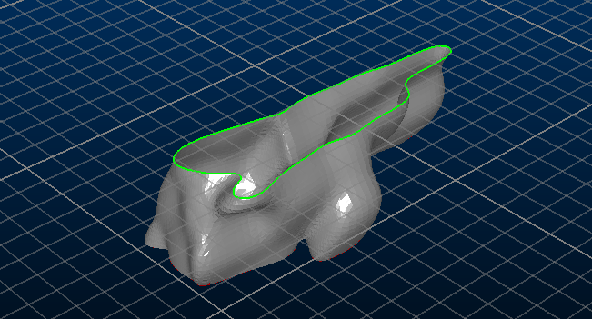

# Copy 3D Object Overlay

In some circumstances, it is useful to create a copy of a 3D object overlay.

See [Windows, Sheets, Projections and Overlays](<../COMMON/concept_views%20sheets%20overlays.md>).

Copying an overlay lets you render your data object in multiple different ways. For example, it may be useful to display a wireframe as both a front-clipped volume and to highlight the intersection with the section plane, like this:

;>)

Overlays are copied by right-clicking them in the **Sheets** or **Project Data** control bars and selecting **Copy**. A duplicate of the target overlay is created, with the same settings as the original. You can then edit the settings of the duplicate overlay to render the 3D object in a different way, alongside the original formatting.

**Note** : copying an overlay does not duplicate object data. A new overlay of the same data object is created.

Related topics and activities

  * [3D Data Folders](<SheetsOverview.md>)

  * [Windows, Sheets, Projections and Overlays](<../COMMON/concept_views%20sheets%20overlays.md>)

  * [The View Hierarchy](<../COMMON/View%20Hierarchy.md>)

  * [3D Design](<Designing_in_VR.md>)

  * [Viewing Data](<../COMMON/Interface_Viewing%20Data.md>)