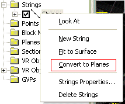
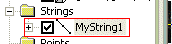
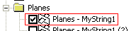
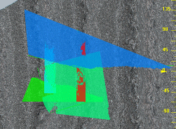

# 3D Planes

A _plane_ is 2-dimensional object that is very similar in most respects to a [section](<workspace_sections.md>). 

A plane is mainly used in the 3D window to visualize and analyze joint spacing and alignment data for the investigation of joint discontinuities, ultimately to highlight potential failure domains.

The Planes object is essentially a data table, very similar to a standard Section Definition table. To be recognised as a **Planes** type, the object must contain the following fields: XCENTRE, YCENTRE, ZCENTRE, PDIP, PAZI, HSIZE and VSIZE. In addition to these system fields, other attribute fields may be present and can be used to indicate lay, colouring, filtering and so on.

Planes can be imported and exported in the same way as any other table. For convenience, an Import option is available from the Planes folder in the section of the [Sheets](<../COMMON/Sheets%20Control%20Bar%20Overview.md>) and **Project Data** control bars. Other import and export options are also available throughout your system.

### Strings to Planes

A string digitized on a wireframe surface can be used to define a key planes, for example for joint space analysis. A variety of tools and visualization methods are available to help with their generation and interpretation. 

A string is converted to a plane using the Sheets or Project Data Bar's context menu, specifically the **Convert to Planes** option:

Both open and closed strings can be used to create planes. For each string, the average (mean)plane is calculated for the string. The plane is oriented around its line of true dip, and extents calculated to fit the source string extents.

Like all 3D objects in Studio applications, planes object overlays are configured using the [Planes Properties](<Planes%20Properties%20Dialog.md>) screen.

Once planes exist, they are no longer associated with the strings used to define them. You can edit the string and plane objects independently, for example, deleting the strings object used to create planes will not delete any plane objects. 

### Planar Calculations

Your application provides two different methods to calculate average planes from a series of points: Projected Areas, and Least Squared Fit. Both should produce suitable approximations for a plane passing through a string, although the Least Squared Fit may be more accurate in some circumstances. The calculation method can be chosen using the Project Settings[Geotechnial Settings](<../COMMON/Project_Settings_Geotec.md>) page.

**Note** : plane object properties can be viewed using the **Data Properties** control bar.

To create a plane from a loaded string object:

  1. Digitise a string (or strings) onto a loaded wireframe in the 3D window. For more information on this, see [Digitize and Edit](<Strings_Digitize%20and%20Edit.md>).

  2. Once digitized, a new entry is displayed in the Strings folder, for example:  
  

  3. Right-click this string to select the Convert to Planes option.

  4. A new object is added to the Planes folder with the description "Planes -" followed by the name of the string object used to create it, for example:  
  

  5. Planes are then generated in alignment with the profile of the points on the underlying string data, and are displayed in the 3D window. As with any other 3D object, you can switch the plane display on or off, or set visual properties by right-clicking an object to select [Properties](<Planes%20Properties%20Dialog.md>).  
  

Related topics and activities

  * [Planes Properties](<Planes%20Properties%20Dialog.md>)

  * [The Planes Folder](<Sheets_Planes.md>)

  * [Project Settings: Geotec](<../COMMON/Project_Settings_Geotec.md>)