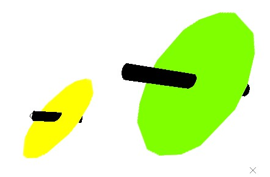
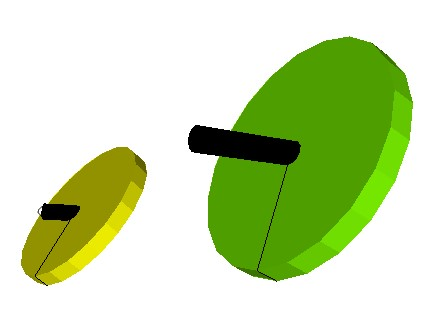
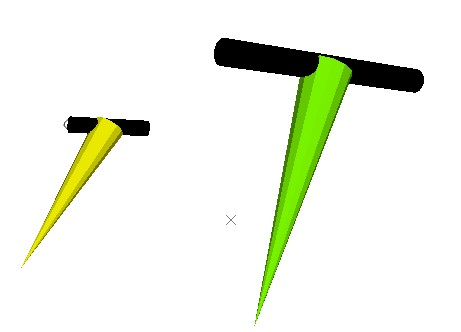
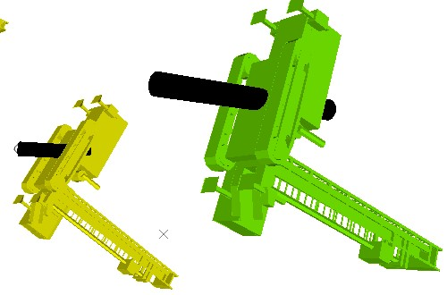

# Format Structural Symbols

Note: A Datamine [eLearning course](<https://datamine.learnupon.com/>) is available that covers functions described in this topic. Contact your local Datamine office for more details.

There are two types of drillhole overlay symbols; **[landmark](<DHProp-format-landmark-symbols.md>)** symbols and structural symbols.

The following activity describes how to display common landmark symbols on a drillhole object overlay to highlight the position of key positions such as the collar, the end of hole and where a drillhole intercepts the active section. It also describes how to show symbols at the start of each new core sample and fixed interval markers.

Drillhole overlay showing 3D structural symbols.

This activity references controls in the **Downhole Symbols** command group of the [Drillholes Properties: Symbols](<Drillholes%20Properties%20Dialog%20\(Symbol%20Visual\).md>) screen.

Activity steps

  1. Display drillhole data in any 3D view and display the [Drillholes Properties: Symbols](<Drillholes%20Properties%20Dialog%20\(Symbol%20Visual\).md>) screen.

**Note** : structural symbols require at least one angle field to be present in the loaded drillhole object. Up to three angles can be specified (dip, dip direction and roll).

  2. In the **Downhole Symbols** group, enable **Downhole Symbols**.

Downhole symbols controls activate.

  3. Use the **Rotation** fields to define up to three angle attributes. Values of these attributes will be used to construct a 3D marker with an azimuth indicator at the centre of each sample.

     * **Dip**

     * Dip Direction

     * Roll

Fields set to _< none>_ will be treated as zero for all samples.

  4. Choose between 2-dimensional and 3-dimensional symbols.

     * **2D** : structural symbols are shown as flat, shadeless items. For example, discs appear like this:

     * **3D** : structural symbols are shown as 3D shaded discs:

  5. Choose whether to **Hide absent values** if absent data is detected in the angle columns.

     * If **checked** , if any specified angle field (Dip, Dip Direction or Roll) contains absent data, a structural symbol will not be displayed.

     * If **unchecked** , absent data will be treated as zero for the angle column in which it was detected. This is the default setting.

  6. Choose which **Style** to use. 

     * **Disc** : use a circular disc with a line indicating the dip direction or, if one is specified, the roll). Examples can be seen in preceding images,

     * Arrow: display an arrow pointer representing the specified angles. A 3D example is shown below:

     * Imported model: display an imported 3D Direct X (,x) file. For example:

**Note** : example DirectX files exist in your installation directory's "VR" subfolder.

  7. If an imported .x model is used, choose whether to display **Transparent textures**.

     * If **checked** , if the imported model contains alpha channel data, transparency will be used to render the model.
     * If **unchecked** , transparency data in the imported model will be ignored. This is the default setting.
  8. To configure the **colour** of structural symbols. See [Legend Controls](<Legend-Pallete.md>).

  9. Specify the **Size and Position** of oriented structural symbols.

     * If the loaded drillhole object contains numeric size attributes, they can be specified. By default, attribute values aren't used.

       1. Choose a **Legend** containing intervals to be used for sizing symbols.

       2. Choose the data **Column** to which the legend relates. All numeric attributes are listed.

       3. To constrain legend lookup to a subset of available numeric values, define a **Minimum** and/or **Maximum** value to constrain the values matched to legend bins.

     * Where data samples down the hole are numerous (large holes or small samples packed together) it may make sense to batch up symbols of the same attribute value. For example, 20 samples with the same orientation may pass through a structural domain and grouping them will make the view simpler to understand.

Use **Group by** to choose whether to group symbols:

       * If **checked** , the **Column** attribute will be used to group symbols. All neighbouring symbols with the same attribute value will be treated as a single group, and a single symbol displayed in the centre of that group.

       * If **unchecked** , all samples with qualifying criteria will be appended with a structural symbols, regardless of neighbouring sample values or proximity.

     * Alternatively, Set the global screen **Scale** of all structure symbols.

  10. **Apply** your settings to update the target 3D view.

Related Information and Activities

  * [Display landmark symbols on drillhole overlays](<DHProp-format-landmark-symbols.md>)
  * [Drillholes Properties: Symbols](<Drillholes%20Properties%20Dialog%20\(Symbol%20Visual\).md>)
  * [Drillhole Properties - General](<DH_PropDialog_General.md>)
  * [Drillhole Properties - Lines](<DHPropDialog_Segments.md>)
  * [Drillhole Properties - Labels](<DH_PropDialog_Labels.md>)
  * [Drillhole Properties - Columns](<DH_PropDialog_Columns.md>)
  * [Drillhole Properties - Associated Files](<Associated%20Files%20Dialog.md>)
  * [Drillhole Properties - Info Mode List](<Traces%20Properties%20Dialog%20\(Info%20Mode%20List\).md>)
  * [Drillhole Properties - Templates](<3D_Templates.md>)
  * [Legend Controls](<Legend-Pallete.md>)