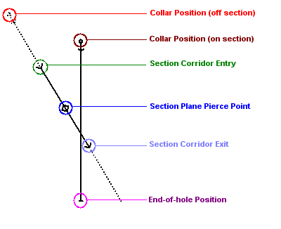
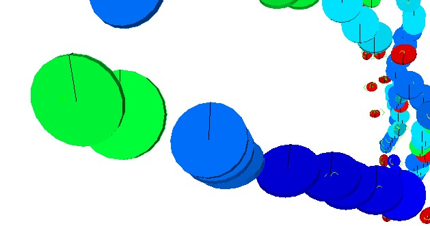

# Drillhole Symbols

Note: A Datamine [eLearning course](<https://datamine.learnupon.com/>) is available that covers functions described in this topic. Contact your local Datamine office for more details.

There are two types of drillhole overlay symbols; **[landmark](<DHProp-format-landmark-symbols.md>)** symbols and structural symbols.

  * **Landmark** symbols have a fixed location and represent key positions that identify the direction of the drillhole and how it is positioned with respect to a **[3D display section](<Sections.md>)**. Collar and end-of-hole positions, for example, are drillhole _landmark_ positions. See [Format Landmark Symbols](<DHProp-format-landmark-symbols.md>).

Drillhole landmark positions

  * **Structural** symbol positions vary from hole to hole and depending on other parameters. These are used to identify the orientation (dip, dip direction, roll) of core samples. Orientation information is derived from object attributes. See [Format Structural Symbols](<DHProp-format-structural-symbols.md>).

Drillhole overlay showing 3D structural symbols

Related topics and activities

  * [Drillholes Properties: Symbols](<Drillholes%20Properties%20Dialog%20\(Symbol%20Visual\).md>)

  * [Format Landmark Symbols](<DHProp-format-landmark-symbols.md>)

  * [Format Structural Symbols](<DHProp-format-structural-symbols.md>)