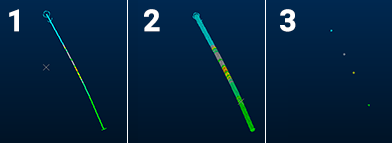
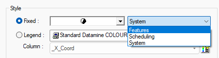
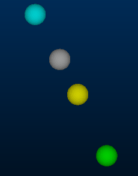

# Drillholes: Style

To access this screen:

  * Display the **Drillholes Properties** screen and select the **Style** tab.

Note: A Datamine [eLearning course](<https://datamine.learnupon.com/>) is available that covers functions described in this topic. Contact your local Datamine office for more details.

The **Style** tab of the Drillholes Properties screen determines how drillhole segments are drawn to the screen in the active **3D** window. Various formatting options are on offer, including the addition of 2D or 3D symbols, how the drillhole is rendered (see below), the colours used and other options.

The settings on this screen affect the display of the drillhole data. Other options are available to append the drillhole display with supporting columns down the hole. These are accessed using the **Columns** tab. See [Drillhole Properties: Columns](<DH_PropDialog_Columns.md>).

**Drillholes Properties** screen settings affect the current **[overlay](<../COMMON/concept_views%20sheets%20overlays.md>)** of the loaded drillhole object. The underlying data values of the drillhole are not affected by changes made here.

### Drillhole Display Types

The basic rendering type for a drillhole can be one of the following:

  1. **Pixel Line** display the drillhole as a line 1 pixel wide. This can be useful if many drillholes are displayed on screen, or you need to know the precise location of the center of the hole in relation to other reference data (such as a stope wireframe for proximity checking, for example).

  2. **Default Cylinder** display a 3D cylinder down the hole, of a custom width (which can be set to the value of a variable such as grade, density and so on). This can be often used to good effect in conjunction with a **Guideline**.

  3. **Points** display a point for each sample position, either the start, end or center. 

**Tip** : The design command **switch-drillhole-points-traces** (quick key = "sdpt") toggles between Pixel Line and Points drillhole rendering modes.

### Scaling Drillhole Segments

The general procedure for controlling the scale of drillhole segments is as follows

  1. Create a base value by setting one of the following options in theSizegroup:

     * Neither column nor legends the base value is assumed to be '1'. Use the Scale box to set a fixed line width.

     * Legend only only allowed if the legend is a filter legend. The base value is the line width value of the relevant item in the legend.

     * Column only the base value is the numeric data attribute in the specified column for the relevant string or edge.

     * Column and Legend the base value is the line width value of the relevant item in the legend. This is looked up using the data attribute of the relevant string or edge for the specified column (legacy functionality).

  2. Optionally specify minimum and maximum constraints in the Constraints group.

  3. Optionally specify a scale factor In the Scale group. Size values are multiplied by the scale value to produce the final width of the line, taking account of any specified constraints.

To specify the way a drillhole overlay appears in the target 3D window(s):

  1. Load drillhole data and display it in a **3D** window. 

  2. Choose from one of the basic **Display Options** and (optionally) enable a **Guideline** that runs through the center of the drillhole in a fixed colour. See "Drillhole Display Types", above, for more information.

  3. Drillhole segments can be **Size** d and scaled by either a fixed amount, or based on their associated data attributes. The attribute values can control the width of the line.

     * Legend specify a legend that contains values for line width.
     * Column select a column that contains the numeric data attribute for line width.
  4. If a data **Column** is specified for scaling, you can specify option **Constraints** to how variable size values are applied to the current overlay. You do this by specifying a **Minimum** and **Maximum** value.
     * Minimum the minimum allowable width of a drillhole segment. Any base value that is less than this width is treated as '0', and is not displayed. If required, the Guideline option can be used in this case to make the drillhole visible.
     * Maximum if selected, drillholes with a greater width than the value specified in the adjacent box are displayed using the specified maximum value.
  5. Choose how to Color your drillhole. See [Legend Controls](<Legend-Pallete.md>).
  6. **Apply** your settings to update the target 3D view.

To define additional settings for the "Points" rendering type:

The following options only appear if **Display Options** is set to **Points**.

  1. Choose between 2-dimensional symbol and a 3-dimensional sphere.

     * **2D** structural symbols are shown as flat, shadeless items. Choose from a library of symbol shapes, for example:

If displaying a 2D symbol, define its **Style** :

       1. Choose between a fixed symbol, or a symbol that corresponds to an integer in the drillhole object's database:

          * **Fixed** choose a 2D symbol using the list provided. If multiple symbol sets exist on your system, choose the set using the list on the right, for example:

          * **Legend** Pick a **Legend** and data **Column** containing symbol values in your drillhole database. This allows you to display multiple symbols down the same hole, if multiple data values exist for the chosen data **Column**. You can also access various legend-related functions using the pallet of icons on the right:

 Show the currently-selected legend intervals and display properties.

 Edit the currently-selected legend using the Legends Manager dialog.

 Select a default legend for the selected data column if one already exists, or if no default legend is available, the Create New Legend wizard will appear to let you create a new legend.

     * **3D** display a 3D sphere instead of a flat point, for example:

  2. Choose the **Position** at which your 2D or 3D symbols appear:

     * **Start** display the symbol at the FROM position of the sample. For the first sample, this is the collar position.

     * **Center** (default) display the symbol halfway down the length of the sample.

     * **End** display the symbol at the TO position of the sample. For the final symbol, this will be the end-of-hole position.

  3. **Apply** your settings to update the target 3D view.

Related topics and activities

  * [Drillhole Properties: General](<DH_PropDialog_General.md>)

  * [Drillholes Properties: Symbols](<Drillholes%20Properties%20Dialog%20\(Symbol%20Visual\).md>)

  * [Drillholes Properties: Labels](<DH_PropDialog_Labels.md>)

  * [Drillhole Properties: Columns](<DH_PropDialog_Columns.md>)

  * [Drillholes Properties: Associated Files](<Associated%20Files%20Dialog.md>)

  * [Drillhole Properties: Info Mode List](<Traces%20Properties%20Dialog%20\(Info%20Mode%20List\).md>)

  * [3D Display Templates](<3D_Templates.md>)
  * [3D Window Templates](<../COMMON/3D_Window_Templates.md>)

  * [Legend Controls](<Legend-Pallete.md>)