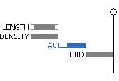
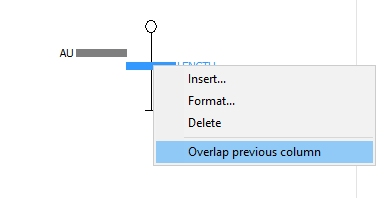
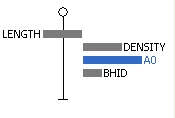

# Drillhole Properties: Columns

To access this screen:

  * On the Drillholes Properties screen, select the Columns tab.

Note: A Datamine [eLearning course](<https://datamine.learnupon.com/>) is available that covers functions described in this topic. Contact your local Datamine office for more details.

Apply visual formatting to your loaded static or dynamic drillhole objects in the form of supporting elements that line up with the drillhole display.

A choice of formatting options are available, including histograms, bitmap images, text, angle indicators and other useful enhancements.

_Downhole columns shown alongside drillhole core images_

You can align these 'downhole columns' with the Active Section, or a nominated [3D section](<workspace_sections.md>) that exists within the project.

Downhole columns are only displayed for unfiltered data.  

### Drillhole Previewer Overview

This provides an indication of the relative position of existing downhole columns that are associated with the loaded drillhole data. In the image above, for example, all information is shown to the left of the drillhole, although in reality, the actual position of the columns is determined by the **Alignment** options provided.

The vertical line with an "0" collar position and "_" end of hole indicator represents the position of the drillhole trace.

For newly-created drillhole objects, the previewer shows only the drillhole indicator. 

  * Once columns are enabled, add a downhole column using Insert. This displays a series of screens to choose a drillhole attribute, and the format in which it is displayed (bar chart, line chart, data values and so on). 
  * Edit an existing item either by selecting it and clicking Formator double-clicking it in the previewer.
  * Delete an existing column by selecting it and clicking Delete.

These options are also available via a right-click menu for each existing downhole column (see below).

For static (desurveyed, single file) drilllhole data, you can base your formatting on any field in the drillhole table. If a dynamic drillhole is being formatted, you can associate a downhole column with a data attribute from any of the associated component files (collars, assays, surveys, zones and so on) using the [Column](<../PLOTS_LOGS/columnwizard.md>) wizard.

If no column indicators are selected, the new column is added to the bottom of the list, however, if you have previously highlighted a column, the new column will be inserted directly _above_ it.

You can reposition formatting items in the viewer by dragging the relevant item up or down. 

You can reposition the whole set of items by dragging any of the items left or right.

By default, items will not overlap. You can force columns to overlap in the 3D view by right clicking any existing column and enabling the Overlap Previous Column option:

#### Viewing Margins in the Previewer

All downhole columns that have specific margin settings will be formatted to show the left/right margin widths at the scale they have been set. Margins for each column are independently configured using the [Format Column](<DH_PropDialog_Columns_Format.md>) dialog, for example:

The overall width of each column is shown to scale - this can also be adjusted with the **Format Column** screen. Overlapping items of different widths will always be aligned to the left edge of the column indicators in the same group, for example:

### Column Ordering

Columns are displayed using these rules:

  * Columns are always drawn according to a left-right rule.

  * The left-most column will always be drawn at the top.

  * Column widths are indicated and are always drawn to scale.

  * No two column indicators can share the same 'row'.

The display contains the name and relative position of each column and indicates the order in which data is drawn. This ordering is important: consider an example where a histogram column is drawn after a line graph in the same alignment - it is possible that the latter may obscure the former). You can reorder the drawing order of columns that overlap by dragging and dropping items into the required vertical layout.

### Aligning Downhole Columns

For all visualization options, downhole formatting is presented as a 2-dimensional visualization sheet. You get to choose how this information is aligned. The options are:

  * Set a manual Azimuth and Dip, or copy the current definition from the active section and edit it.

  * Align information with the currently active 3D section.

  * Align information with any other defined 3D section.

To add downhole columns to a STATIC drillhole overlay:

  1. In the Drillhole Properties screen, click the Columns tab.

  2. Check **Display downhole columns**.

  3. Choose how to arrange downhole columns in the 3D view(s):

     * **Check****Auto arrange** to automatically align each downhole column in its own 'lane', where the lane is parallel to the drillhole data.

     * If **Auto arrange** is **unchecked** :

       * Check **Snap to columns** to allow columns to only be repositioned to fixed positions in relation to the drillhole. This can help to align data columns, if this is required (say, to overlay a line graph of grade over braces with annotation showing rock type). If unchecked, downhole columns can be repositioned anywhere using the previewer.

  4. Choose the **Font** to display any text in downhole columns.

  5. Define your downhole column **Alignment** options:

     * If **Azimuth** is selected, enter an azimuth and **Dip** value (or transfer the settings of the active section by clicking **Set from active section**.

     * If **Section** is selected, choose a section definition from the list provided. Downhole columns will align with the chosen section.

  6. Click Insert.

  7. In the Select Column screen, select a data column that contains the values you wish to represent in graphical format.

  8. Click OK to display the [Format Column](<DH_PropDialog_Columns_Format.md>) screen, where you can set the **Alignment** , **Border** , **Width/Margins** , Filter, Template, **Graph/Color** or Text settings, using the appropriate tab. 

See [Format Overlay or Column](<DH_PropDialog_Columns_Format.md>).

  9. Click OK to add the downhole column to the drillhole trace - the preview is automatically updated.

Adding Downhole Columns to a DYNAMIC drillhole overlay:

  1. In the Drillhole Properties screen, click the Columns tab.

  2. Check **Display downhole columns**.

  3. Choose how to arrange downhole columns in the 3D view(s):

     * **Check****Auto arrange** to automatically align each downhole column in its own 'lane', where the lane is parallel to the drillhole data.

     * If **Auto arrange** is **unchecked** :

       * Check **Snap to columns** to allow columns to only be repositioned to fixed positions in relation to the drillhole. This can help to align data columns, if this is required (say, to overlay a line graph of grade over braces with annotation showing rock type). If unchecked, downhole columns can be repositioned anywhere using the previewer.

  4. Choose the **Font** to display any text in downhole columns.

  5. Define your downhole column **Alignment** options:

     * If **Azimuth** is selected, enter an azimuth and **Dip** value (or transfer the settings of the active section by clicking **Set from active section**.

     * If **Section** is selected, choose a section definition from the list provided. Downhole columns will align with the chosen section.

  6. Click Insert.

  7. In the [Column Wizard](<../PLOTS_LOGS/columnwizard.md>), select if you wish to represent a data column from a drillhole component file (lithology, assays etc.) or a calculated System Field. 

  8. Click Next.

  9. Select the data table containing the values you wish to broadcast with your new column. 

  10. Click Next.

  11. Select the field that you wish to represent and click Next.

  12. Click OK to display the [Format Column](<DH_PropDialog_Columns_Format.md>) dialog, where you can set the **Alignment** , Border, Width/Margins, **Filter** , **Template** , **Graph/Color** or Text settings, using the appropriate tab.

  13. Click OK to add the downhole column to the drillhole trace - the preview will be automatically updated.

To format an existing downhole column:

  1. Select the column indicator in the preview pane. It will be highlighted.

  2. Click Format (alternatively, you can double-click the column indicator or right-click the column and select Format from the context menu).

  3. Click OK to display the [Format Column](<DH_PropDialog_Columns_Format.md>) screen, where you can set the **Alignment** , **Border** , Width/Margins, **Filter** , **Template** , Graph/Color or Text settings, using the appropriate tab.

  4. Click OK to update the selected column.

Related topics and activities

  * [Sheets \- 3D - Drillholes Folder](<Sheets_Drillholes.md>)

  * Related Information and Activities

  * [Format Landmark Symbols](<DHProp-format-landmark-symbols.md>)
  * [Format Structural Symbols](<DHProp-format-structural-symbols.md>)
  * [Drillhole Properties - General](<DH_PropDialog_General.md>)
  * [Drillhole Properties - Lines](<DHPropDialog_Segments.md>)
  * [Drillholes Properties: Symbols](<Drillholes%20Properties%20Dialog%20\(Symbol%20Visual\).md>)
  * [Format Overlay or Column](<DH_PropDialog_Columns_Format.md>)
  * [Format Downhole Column: Image](<DH_PropDialog_Columns_Image.md>)
  * [Drillhole Properties - Associated Files](<Associated%20Files%20Dialog.md>)
  * [Drillhole Properties - Info Mode List](<Traces%20Properties%20Dialog%20\(Info%20Mode%20List\).md>)
  * [Drillhole Properties - Templates](<3D_Templates.md>)
  * [Dynamic Holes \- Using the Column Wizard](<../PLOTS_LOGS/Add%20Columns%20Wizard.md>)
  * [Positioning Downhole Columns](<../COMMON/concept_positioning_downhole_columns.md>)
  * [Desurvey Methods Introduction (Static/Dynamic)](<../COMMON/Drillhole%20Representation%20in%20Studio.md>)