# Format Overlay or Column

To access this screen:

  * Display the **[Downhole Columns](<DH_PropDialog_Columns.md>)** panel and insert or edit a downhole column.

  * A subset of functions shown here are accessed when defining Plot projection overlays. See [Format Display: Labels](<../COMMON/Format%20Display%20Dialog_Overlays_Labels.md>).

Note: A Datamine [eLearning course](<https://datamine.learnupon.com/>) is available that covers functions described in this topic. Contact your local Datamine office for more details.

Configure 3D downhole formatting for loaded drillhole data (static or dynamic). You can also use a version of this screen to design labels for plot items (a cut-down version is displayed). 

_Downhole column_ refers to visual artefacts that follow a drillhole throughout its length. Typically, the visual formatting reinforces or presents a particular aspect of the hole at a particular location, such as the grade of a sample, the angle of a core sample, an image representing the extracted core and so on.

[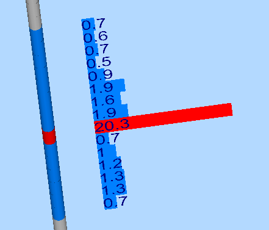](<javascript:void\(0\);>)

_An example of a 3D drillhole sample showing supporting CU grade histogram_

By the time the **Format Downhole Column** screen displays, you will have already selected either a 3D drillhole object or a plot feature attribute to be displayed. There are several formatting options available, although some may be restricted according to data type and how the screen was originally displayed.

Tip: display multiple downhole columns for the same hole and position them in relation to the hole using the **3D Properties: Columns** screen.

The general procedure for defining a downhole column is:

  1. Select the attribute to be configured (on the previous screen).

  2. Select a Style for your downhole column.

  3. Edit the properties that the selected style supports (see below).

  4. Apply the formatting.

  5. You can reinstate default values for the currently selected style by clicking Reset.

###  Formatting Styles

The following display styles are available for 3D downhole columns. Access them via the Style menu at the top of the **Format Downhole Column** screen:

Style |  Description |  Example |  More Information |  Property Help  
---|---|---|---|---  
Text |  Textual attribute values (numeric or alphanumeric, displayed down the hole). |  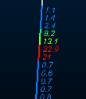 |  [Click here](<../COMMON/Downhole_Columns_Format_Text.md>) |  [Alignment](<../PLOTS_LOGS/Format_Column_Alignment_Dialog.md>) [Border/Color](<../PLOTS_LOGS/Format_Column_Borders_Dialog.md>) [Filter](<../PLOTS_LOGS/Format_Column_Filter_Dialog.md>) [Text](<../PLOTS_LOGS/Format_Column_Text_Dialog.md>) [Width/Margins](<../PLOTS_LOGS/format_column_margins_dialog.md>)  
Bars with Annotation |  Coloured (filled) bars and text overlay |  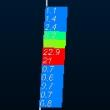 |  [Click here](<../COMMON/Downhole_Columns_Format_Text.md>) |  [Alignment](<../PLOTS_LOGS/Format_Column_Alignment_Dialog.md>) [Border/Color](<../PLOTS_LOGS/Format_Column_Borders_Dialog.md>) [Filter](<../PLOTS_LOGS/Format_Column_Filter_Dialog.md>) [Text](<../PLOTS_LOGS/Format_Column_Text_Dialog.md>) [Width/Margins](<../PLOTS_LOGS/format_column_margins_dialog.md>)  
Bars |  Coloured (filled) bars |   |  [Click here](<../COMMON/Downhole_Columns_Format_Text.md>) |  [Alignment](<../PLOTS_LOGS/Format_Column_Alignment_Dialog.md>) [Border/Color](<../PLOTS_LOGS/Format_Column_Borders_Dialog.md>) [Filter](<../PLOTS_LOGS/Format_Column_Filter_Dialog.md>) [Text](<../PLOTS_LOGS/Format_Column_Text_Dialog.md>) [Width/Margins](<../PLOTS_LOGS/format_column_margins_dialog.md>)  
Braces with Annotation |  Text annotation with brace style connector. |  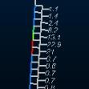 |  [Click here](<../COMMON/Downhole_Columns_Format_Text.md>) |  [Alignment](<../PLOTS_LOGS/Format_Column_Alignment_Dialog.md>) [Border/Color](<../PLOTS_LOGS/Format_Column_Borders_Dialog.md>) [Filter](<../PLOTS_LOGS/Format_Column_Filter_Dialog.md>) [Text](<../PLOTS_LOGS/Format_Column_Text_Dialog.md>) [Width/Margins](<../PLOTS_LOGS/format_column_margins_dialog.md>)  
Ticks with Annotation |  Text annotation with tick style connector.  |  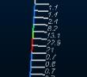 |  [Click here](<../COMMON/Downhole_Columns_Format_Text.md>) |  [Alignment](<../PLOTS_LOGS/Format_Column_Alignment_Dialog.md>) [Border/Color](<../PLOTS_LOGS/Format_Column_Borders_Dialog.md>) [Filter](<../PLOTS_LOGS/Format_Column_Filter_Dialog.md>) [Text](<../PLOTS_LOGS/Format_Column_Text_Dialog.md>) [Width/Margins](<../PLOTS_LOGS/format_column_margins_dialog.md>)  
Arrows with Annotation |  Text annotation with arrows style connector.  |  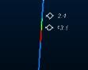 |  [Click here](<../COMMON/Downhole_Columns_Format_Text.md>) |  [Alignment](<../PLOTS_LOGS/Format_Column_Alignment_Dialog.md>) [Border/Color](<../PLOTS_LOGS/Format_Column_Borders_Dialog.md>) [Filter](<../PLOTS_LOGS/Format_Column_Filter_Dialog.md>) [Text](<../PLOTS_LOGS/Format_Column_Text_Dialog.md>) [Width/Margins](<../PLOTS_LOGS/format_column_margins_dialog.md>)  
Line Graph |  Unfilled line graph for Text annotation with brace style connector.  values |  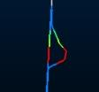 |  [Click here](<../COMMON/Downhole_Columns_Format_Graphs.md>) |  [Alignment](<../PLOTS_LOGS/Format_Column_Alignment_Dialog.md>) [Border](<../PLOTS_LOGS/Format_Column_Borders_Dialog.md>) [Filter](<../PLOTS_LOGS/Format_Column_Filter_Dialog.md>) [Graph/Color](<../PLOTS_LOGS/Format_Column_Graph_Dialog.md>) [Text](<../PLOTS_LOGS/Format_Column_Text_Dialog.md>) [Width/Margins](<../PLOTS_LOGS/format_column_margins_dialog.md>)  
Histogram |  Unfilled histogram for numeric values |  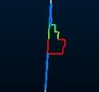 |  [Click here](<../COMMON/Downhole_Columns_Format_Graphs.md>) |  [Alignment](<../PLOTS_LOGS/Format_Column_Alignment_Dialog.md>) [Border](<../PLOTS_LOGS/Format_Column_Borders_Dialog.md>) [Filter](<../PLOTS_LOGS/Format_Column_Filter_Dialog.md>) [Graph/Color](<../PLOTS_LOGS/Format_Column_Graph_Dialog.md>) [Text](<../PLOTS_LOGS/Format_Column_Text_Dialog.md>) [Width/Margins](<../PLOTS_LOGS/format_column_margins_dialog.md>)  
Filled Histogram |  Filled histogram for numeric values |  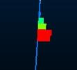 |  [Click here](<../COMMON/Downhole_Columns_Format_Graphs.md>) |  [Alignment](<../PLOTS_LOGS/Format_Column_Alignment_Dialog.md>) [Border](<../PLOTS_LOGS/Format_Column_Borders_Dialog.md>) [Filter](<../PLOTS_LOGS/Format_Column_Filter_Dialog.md>) [Graph/Color](<../PLOTS_LOGS/Format_Column_Graph_Dialog.md>) [Text](<../PLOTS_LOGS/Format_Column_Text_Dialog.md>) [Width/Margins](<../PLOTS_LOGS/format_column_margins_dialog.md>)  
Trace |  Show parallel trace using any attribute legend or color |  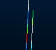 |  [Click here](<../COMMON/Downhole_Columns_Format_Trace.md>) |  [Alignment](<../PLOTS_LOGS/Format_Column_Alignment_Dialog.md>) [Border/Color](<../PLOTS_LOGS/Format_Column_Borders_Dialog.md>) [Filter](<../PLOTS_LOGS/Format_Column_Filter_Dialog.md>) [Text](<../PLOTS_LOGS/Format_Column_Text_Dialog.md>) [Trace](<../PLOTS_LOGS/Format%20Column%20Trace%20Dialog.md>) [Width/Margins](<../PLOTS_LOGS/format_column_margins_dialog.md>)  
Angles |  Show numeric values as angles (higher numbers show more severe angle deviation from hole) |  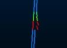 |  [Click here](<../COMMON/Downhole_Columns_Format_Angles.md>) |  [Alignment](<../PLOTS_LOGS/Format_Column_Alignment_Dialog.md>) [Filter](<../PLOTS_LOGS/Format_Column_Filter_Dialog.md>) [Border/Color](<../PLOTS_LOGS/Format_Column_Borders_Dialog.md>) [Text](<../PLOTS_LOGS/Format_Column_Text_Dialog.md>) [Width/Margins](<../PLOTS_LOGS/format_column_margins_dialog.md>)  
External Image File |  Show predefined images per hole or interval alongside the sample |  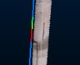 |  [Click here](<../COMMON/Downhole_Columns_Format_Images.md>) |  [Alignment](<../PLOTS_LOGS/Format_Column_Alignment_Dialog.md>) [Border/Color](<../PLOTS_LOGS/Format_Column_Borders_Dialog.md>) [Filter](<../PLOTS_LOGS/Format_Column_Filter_Dialog.md>) [Image](<DH_PropDialog_Columns_Image.md>) * [Text](<../PLOTS_LOGS/Format_Column_Text_Dialog.md>) [Width/Margins](<../PLOTS_LOGS/format_column_margins_dialog.md>)  
  
* See [Adding Images to your Drillhole Display](<../COMMON/Downhole_Columns_Format_Images.md>) for instructions on how to configure downhole images for loaded drillhole data.

### Drillholes, Object Filters, Columns and Column Filters

Drillhole data objects are often coupled with 'downhole column' data to provide more information about the drillhole data. This could be in the form of a histogram, listed grade values, braces, bar charts etc. Downhole columns are formatted separately (using this Format Column screen) from the actual 3D drillhole data (using the [Drillholes Folder](<Sheets_Drillholes.md>)).

View filtering can be applied to any object in memory, including drillholes, to control the data that is displayed at any one time. This is controlled by a filter expression which can be defined by various methods, including the [Data Object Manager](<../COMMON/Data%20Manager%20Dialog.md>) or, to specifically filter drillhole data, using the [filter-drillholes](<../command_help/filter-drillholes.md>) command. Drillhole segments and downhole columns will always honour this object-level filter. If data does not pass the filter, neither it nor the associated downhole column data will be shown.

However, the situation is slightly more complex where a 'column' filter exists; all downhole columns can be associated with their own filter. In this case, 3D downhole formatting (the downhole 'column' will only be shown if it passes both the object-level and column-level filters. 

For example; if a drillhole object was filtered in the Data Object Manager to only show data where X>150, only column and drillhole data would be shown above the 150 position. If an AU downhole column was set to show results only where AU>1.0, downhole column data would only be shown grade values exceed 1.0 ppm and only for unfiltered data (above 150 in X).

[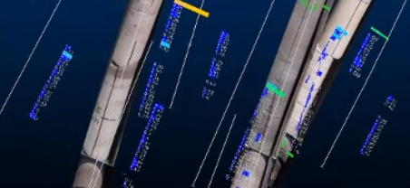](<javascript:void\(0\);>)

Multiple downhole columns showing grade histogram and core sample images for each sample

**Note** : the settings described here apply to the currently active 3D window and all linked external windows. [Independent](<../COMMON/Independent_3D_Windows.md>) windows are unaffected.

Related topics and activities

  * [Adding Images to your Drillhole Display](<../COMMON/Downhole_Columns_Format_Images.md>)

  * [Drillholes Properties - Columns](<DH_PropDialog_Columns.md>)

  * [Positioning Downhole Columns](<../COMMON/concept_positioning_downhole_columns.md>)

  * [Text, Bar, Braces, Ticks and Arrows](<../COMMON/Downhole_Columns_Format_Text.md>)

  * [Line Graphs, Histograms](<../COMMON/Downhole_Columns_Format_Graphs.md>)

  * [Traces](<../COMMON/Downhole_Columns_Format_Trace.md>)

  * [Angles](<../COMMON/Downhole_Columns_Format_Angles.md>)

  * [Format Column - Alignment](<../PLOTS_LOGS/Format_Column_Alignment_Dialog.md>)

  * [Format Column - Border/Color](<../PLOTS_LOGS/Format_Column_Borders_Dialog.md>)

  * [Format Column - Filter](<../PLOTS_LOGS/Format_Column_Filter_Dialog.md>)

  * [Format Column - Graph/Color](<../PLOTS_LOGS/Format_Column_Graph_Dialog.md>)

  * [Format Column - Width/Margins](<../PLOTS_LOGS/format_column_margins_dialog.md>)

  * [Format Column - Text](<../PLOTS_LOGS/Format_Column_Text_Dialog.md>)

  * [Format Column - Trace](<../PLOTS_LOGS/Format%20Column%20Trace%20Dialog.md>)

  * [Format Display: Labels](<../COMMON/Format%20Display%20Dialog_Overlays_Labels.md>)