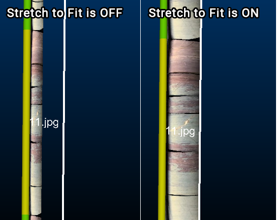

# Format Downhole Column: Image

To access this screen:

  1. Display the **[Drillhole Columns](<DH_PropDialog_Columns.md>)** screen and edit (or create) a downhole column

  2. Choose the _External Image File_ Style option.

Note: A Datamine [eLearning course](<https://datamine.learnupon.com/>) is available that covers functions described in this topic. Contact your local Datamine office for more details.

If you are displaying downhole images to support your drillhole display (either in the 3D or Logs window), use this screen to control how those images are displayed.

Use this screen to manage the Scale and Rotate settings for downhole images. These settings affect all images displayed for the target drillhole object (static or dynamic). 

;>)

Multiple downhole columns showing grade histogram and core sample images for each sample

**Note** : it is possible to apply independent rotation settings to images in your downhole set, but the Scale is applied to all images. If scaling of independent images is required, you will need to do this externally via an image editing application first.

See [Adding Images to your Drillhole Display](<../COMMON/Downhole_Columns_Format_Images.md>) for instructions on how to configure downhole images for loaded drillhole data.

To configure downhole images already displayed in the 3D window:

  1. Display the **Format Downhole Column** (Image) screen.

  2. Specify if the downhole image(s) are stretched to fill the available column width (as defined on the **[Width/Margins](<../PLOTS_LOGS/format_column_margins_dialog.md>)** screen).

     * If **Stretch to fit** is **checked** , all images are stretched to fill the available column width (excluding margins).

     * If **Stretch to fit** is **unchecked** , images are displayed at their original scale.

Consider the following example, showing a set of core sample images down a single drillhole. In the images below, the white line on the right indicates the edge of the full column width:

;>)

  3. You can **Rotate** images within your downhole set in increments of 90 degrees, either globally or per image:

     1. Choose a **Default rotation** to be applied to all images, unless a data column value overrides it. Choose either 0 (_None_), _90_ , _180_ or _270_ degrees).

     2. For per-image control, choose a **By column** data attribute containing angular rotations values (either 0, 90, 180 or 270). This data column resides in your images database table.

**Note** : if both **Default rotation** and **By column** are specified, images are rotated using the default value unless a value of 0, 90, 180 or 270 is detected in the images database for the specified column. All other values in this column are ignored (and the Default rotation is applied).

  4. Click **Apply** or **OK** to update the current downhole column display.

Related topics and activities

  * [Adding Images to your Drillhole Display](<../COMMON/Downhole_Columns_Format_Images.md>)

  * [Drillhole Properties: Columns](<DH_PropDialog_Columns.md>)

  * [Format Overlay or Column](<DH_PropDialog_Columns_Format.md>)