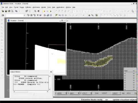
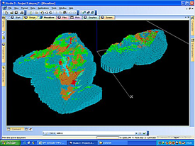
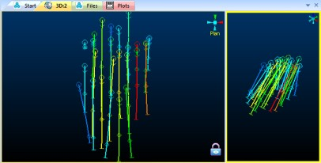
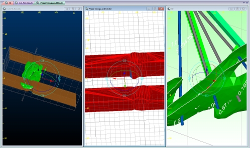

# 3D Design

## A History of Visualization in Studio Products

3D windows are used for both designing and visualization.

Previous Datamine products relied heavily on a 2D CAD environment to deliver design commands and functionality.

The Design window was originally created to represent 3D data using a 2D slice through the data. This slice of data, always shown face-on to the viewer, was known as the "Design Plane", "Working Plane" or "Design Section".

Back in the 2000s, in Studio 2, users were restricted to navigating data by defining this section and updating the screen, then viewing the data in a simple 3D preview window called the Visualizer window. Although linked, a 3D preview would need to be manually updated after design changes to see the effect. Studio 2 also relied on the presence of a GRAPHICS and SCREEN window to visualize the data files output from processes such as **TONGRAD** , **PPQQPLOT** and others.

The parameters governing the position of the working plane in the Design window is often referred to as the "section definition", although this term can be used to define any flat plane in 3D space.  

The last update to Studio 2 was released in January 2011

In Studio 3, this framework was extended, primarily by the introduction of an OpenGL-powered visualization window that was derived from another product of the time - Datamine InTouch. The VR window was linked closely with the **Design** window, allowing users to both engineer and visualize their data by swapping between different views of the same data. Studio 3 also incorporated functionality from another product; **Downhole Explorer** , which became the Plots window.

Note: a Visualizer window was also provided in the past as a quick rendering option for loaded data, providing simple 3D visualization. This window is no longer available as superior functionality is available via the 3D windows and the standalone **InTouch** visualizer. 

This offered more choice to the user in terms of which data view was the most appropriate for the operation being performed (e.g. Design window for drafting zone outlines, VR window for visualizing the zone volumes in reference to the sample drillholes and Plots for reporting these findings to the target audience):  

Studio 3's final public update was released in February 2015  

Towards the later versions of **Studio 3** in 2016, users started to ask for a more integrated environment in which both 2D and 3D operations could be performed without having to swap back and forth between data windows. In response, most of the commands intended for 2D (or 2.5D) usage were converted for use in the VR window.

One large difference between the **Design** and **VR** windows was that, in VR, there was no fixed Design Section; data slicing was (and still is) performed using one or more section definitions that were simply defined in space and not forced to be orthogonal to the viewer. It was (and still is) possible to copy the section definition from Design to VR, but the VR section was not fixed in relation to the 'camera'.

At the same time, these design commands were optimized and, in many cases, made vastly quicker. In parallel, the VR window became the basis for dedicated developments to support both design and visualization needs.

It became clear that the toolbox approach adopted by Studio 3 (an application for all mine planning disciplines) was making it increasingly difficult to react to the needs of independent domains; open pit design and planning, resource modelling, exploration data management and underground design and planning. Because of the this, a "Studio Family" of products was created to deliver independently directed products for each domain. Sharing common features, but more aligned with the workflow of each discipline. 

The advent of **Studio RM** , **Studio OP** , **Studio EM** and **Studio UG** started this campaign, and was a good opportunity to finish the mission started with Studio 3; to create a single environment for design and visualization. Other products have since joined the Studio family, and there are more to come in the future.

;>)

Studio RM showing a locked and unlocked view of drillhole data  

Your application represents the latest step on this journey; a fully-integrated design and visualization environment that allows you to set up one or more data views in an optimal way for the type of work you are doing. One example could setting up a locked section for digitizing in a plan view, whilst simultaneously viewing the 3D data in another window, rotating it to show the best profile.

Superseding the VR window and Design windows, the 3D window represents the best design and visualization environments in one window. The Plots window has been retained, and is the subject of ongoing and active development. All design commands, previously the domain of the legacy Design window (which we started to deprecate afterwards), we refactored and (in many cases) recreated to make best use of a 3D design environment, where the design 'canvas' could be anywhere. This project took a while as many thousands of hours of code refactoring and QA was required to ensure users didn't get left out in the cold when moving to the 3D environment.

In 2016, support was provided for [external](<../COMMON/External_3D_Windows.md>) 3D windows. This was another view, linked to the 3D window, but could be positioned outside of the main application frame. Although some form of clipping customization was added later, this window remains linked to the overlay and scene formatting of the parent.

In 2019, 3D window support was given a huge boost with the introduction of [independent 3D windows](<../COMMON/Independent_3D_Windows.md>). This facility allows you to create as many independently-configurable 3D windows as you like, available in either embedded and external form. No longer bound to the formatting of the previous window, this provides much more flexibility to how you present your 3D data. 3D windows still rely on a single 'roster' or loaded data objects (although the overlays that are shown in each window can be completely different).

;>)

Multiple independent-embedded 3D windows

See [Independent 3D Windows](<../COMMON/Independent_3D_Windows.md>).

Independent 3D windows was (and still is) a very popular feature, but with the advent of multiple 3D windows, this places additional demands on both the CPU and GPU, and combined with 3D technology that was first introduced over 30 years ago, it's now time to look to the future, and there are big plans in place to take Studio visualization to the next level. Of course, we have to do this to remain competitive with companies that started later in the day, with less technical debt (for now) and leveraging more modern rendering engines, but there's another driver to our campaign; data is getting bigger. The data demands of the mining industry will only grow, and as models get bigger and more elaborate, we will be adding the next chapter in this story soon.

## Advanced String Design

The most commonly used design commands in Studio products are **new-string** (quick keys "ns") and **extend-string** ("ext"). These important commands are used to create string data in any 3D window, either by digitizing string vertices onto the currently active section or by [snapping](<../COMMON/Snapping-3D-windows.md>) to other loaded data positions.

Using either command, you can digitize in one of the following modes:

  * **Freeform** The default setting. You can digitize new string points anywhere or snap to any other data position precisely whilst creating a string. Click **Done** or press <ESC> to complete digitizing.

  * **Advanced** Constrain the creation of new string edges (segments) so they adhere to rules that restrict the segment length, azimuth, gradient or azimuth change. This can be useful where more regular, less organic design is required, such as for road network planning or other designs relating to operations.

The mode is set using the **Project Settings** (**[Points and Strings](<../COMMON/Project%20Settings_Points%20and%20Strings.md>)**) screen. Enable **Show advanced digitizing controls** to show a popup when either command is next used:

Advanced string design controls

If digitizing is constrained, edges adhere to the settings provided. For example, to only permit azimuth changes of 45 degrees whilst drawing, use **Angles Multiples of** and check both **Apply String Constraints** and **Azimuth**.

Note: If Advanced mode is deactivated, both commands return to Freeform mode.

Note: Advanced string controls are ignored and not applied if you are using [Auto Node](<../command_help/auto-node-switch.md>) or [Rapid Digitize Mode](<../command_help/rapid-digitize-switch.md>) for digitizing.

See [Advanced String Design](<../COMMON/advanced_string_design.md>).

## Large 3D Worlds

Each 3D view automatically expands its limits to accommodate all loaded data. This is often referred to as the "hull" of the 3D window.

However, the larger the hull, the more information Studio needs to keep track of. For example, where data is loaded that represents a very large 3D scene (for example, data in different global coordinate systems being widely separated over thousands of virtual measurement units), each loaded object represents a much smaller part of the scene than normal.

This can give rise to unusual rendering behaviour when 'looking at' a particular part of your data. This could manifest as 'shaking' data where the data falls within such a tiny part of the overall scene, it alternates between coordinates at a precision level. A redraw will resolve this ('rd' quick key).

Alternatively, keep your scenes to a manageable size, such as that expected by a single pit operation

## Multiple 3D Windows

Your application supports multiple, linked 3D windows.

These additional windows can be additional representations of the current window (and linked to it), either by splitting the screen [horizontally and/or vertically](<Split_Windows.md>), or can be an ['external'](<../COMMON/External_3D_Windows.md>) floating view that is connected to your primary 3D window data and formatting options. All of these views are linked to a single data source and formatting settings.

Each window is supported by its own Sheets control bar sub-menu.

Independent 3D windows are also available. These allow you to set your own window-specific formatting of overlays, sections, grid and many other scene controls. Independent windows can either be embedded or external/floating.

## Designing in a 3D Window

Designing in a 3D window provides the following advantages:

  * Working in a virtual 3D space (for those users who prefer to work in a virtual environment).

  * Digitizing onto surfaces i.e. Wireframes or [Sections](<Sections.md>), as well as by snapping to point, string and drillhole data. See [  
**Digitizing in the 3D Window**.](<Digitizing_In_VR.md>)

  * Separate control of multiple sections and views.

  * Everything is updated dynamically - see how that switchback you designed appears in relation to the bench shape, model and topography in full 3D.

  * Viewing data in [split windows](<Split_Windows.md>), multiple floating windows, locked or unlocked.

  * Viewing and editing data in multiple, independently-formatted windows.

The following general methodology is used when designing in the 3D window e.g. digitizing new geological model section strings using drillhole data, generating and manipulating wireframes, designing a mine layout. More detailed procedures for digitizing in the 3D window can be seen [here](<Digitizing_In_VR.md>).

  1. Select any 3D window.

  2. Load and format 3D data you want to look at.

  3. Create a new current object in the Current Objects toolbar. See [The Current Objects Toolbar](<../COMMON/Current_Objects_Toolbar.md>).

  4. Edit or create a **[3D section](<Sections.md>)** to use for clipping and designing, if required. See [3D Sections](<Sections.md>).

  5. Set the view up how you want it. There are hundreds of view manipulation commands in Studio products.

  6. If digitizing, use the left mouse button (or stylus) to tap points, which will 'fall' onto the currently active section, or right-click (or use a smart stylus equivalent) to snap to existing data.

Tip: Enable advanced string design tools to constrain string segment azimuths, gradients and lengths during digitizing.

**Tip** : various snapping modes are available. For example, Auto Snap lets you automatically snap to nearby data.

For more information on 3D window visualization and design, have a browse through other help files, or visit Datamine's eLearning site, where several courses are available that explain how 3D objects can be rendered and manipulated.

## Sections and Viewpoints

Design commands are generally used in the same way in the 3Dwindow. Any differences in usage are explained in the relevant command's help page by means of additional notes. The main difference when working in these windows however, is the way in which the position and orientation of the working plane i.e. the plane on to which data is digitized when not snapping, and the viewing this working are controlled and used during the design process.

In a 3D window, on the other hand, it is possible to have multiple sections and multiple viewpoints. Multiple sections can be defined and displayed, although only one of them is active at any one time. This active section is referred to as the Current Section. By default, the section named 'Default Section' is automatically selected as the current section; other section types are also available. 

The viewpoints and their settings are independent of the sections; only one viewpoint is active and displayed at any one time, this is referred to as the Current Viewpoint. The viewpoint most often used is the 'Floating' viewpoint; other fixed viewpoints can also be defined. [More...](<VR_Viewpoints.md>)

It's position and orientation is controlled by using the Navigation toolbar, shown below.

## 3D Data Clipping

By default, a 3D window displays all loaded (and visible) data, using whatever formatting is dictated by each overlay of a 3D object (an object can have multiple [overlays](<../COMMON/Formatting%203D%20Objects.md>)).

"Clipping" is the mechanism used to remove visible data from a 3D view, commonly to visualize a cross-section of data in relation to one or more 3D sections. Clipping involves the concept of a _clipping plane_ and a _section corridor_.

Clipping is always performed in relation to one or more sections, where data can be clipped either in front of the section, or behind it, or both. As clipping instructions are tied to each section, it's possible to isolate even granular data elements using an arrangement of overlapping sections.

See [Clipping 3D Data](<Clipping-Data.md>)  

## 3D Drawing Units

Studio products provide an extensive range of 3D visualization options for 3D overlays in a 3D view. Some options rely on a value to determine the size of a particular item. For example, the width of digitized string data, the size of symbols and dimensions of downhole formatting artefacts, and so on.

See [ 3D window drawing units](<../COMMON/3D%20Window%20Drawing%20Units.md>).

Related topics and activities

  * [About the 3D Window](<VR_Introduction.md>)

  * [External 3D Windows](<../COMMON/External_3D_Windows.md>)

  * [Independent 3D Windows](<../COMMON/Independent_3D_Windows.md>)

  * [Independent View Dialog](<../COMMON/IndependentView_Dialog.md>)

  * [Views Sheets and Overlays](<../COMMON/concept_views%20sheets%20overlays.md>)

  * [The View Hierarchy](<../COMMON/View%20Hierarchy.md>)

  * [Sections](<Sections.md>)

  * [Digitizing in the 3D Window](<Digitizing_In_VR.md>)

  * [Advanced String Design](<../COMMON/advanced_string_design.md>)

  * [Project Settings: Points and Strings](<../COMMON/Project%20Settings_Points%20and%20Strings.md>)