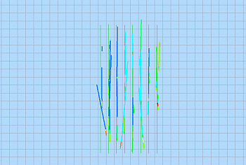
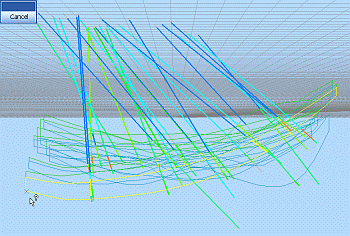
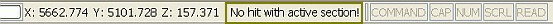
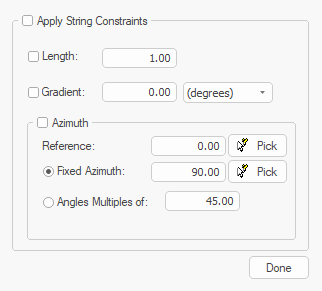
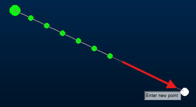
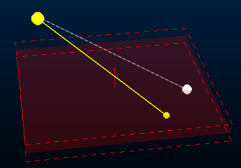
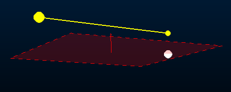

# Digitizing in 3D

Digitizing (drawing) point and string data is one of the key activities used in creating geological models, designing open pit or underground workings and scheduling.

3D windows offer [advantages](<Designing_in_VR.md>) and the ability to separately control [section](<Sections.md>) and [view](<view_controller.md>) parameters during these processes, a useful feature when dealing with complex 3D modelling and design scenarios. These display types evolved from legacy display ports which were predominantly 2D in nature. 

See [3D Design](<Designing_in_VR.md>) for more information on the history of 3D windows in Studio products.

Listed below are a number of short procedures, introducing point or string data creation in a 3D window. Although each procedure lists a single method, other options, alternative methods and variations are also possible, in order to achieve the desired result.

Digitizing new data and editing existing objects in the 3D window can both involve generating new data. Data is defined by picking 3D locations. 

**Note** : when digitizing the first points for new data such as points or strings, in a new project which does not yet have other data displayed and in memory, the current section may seem to disappear and then reappear as the second and subsequent point(s) are digitized. This behaviour is expected as the current section, by default, automatically fits to the extents of the data hull. With a single digitized point on the screen, this hull then initially has zero width; as the additional points are digitized, the data hull no longer has zero width and the section should appear as normal. 

## Snapping to 3D Data

Data points are added either by left-clicking with the mouse (or tapping with the stylus) to register a data location on the current 3D section. The 3D section is, essentially, the canvas upon which data is created unless you choose to snap data points to other existing data, typically achieved with the right click of the mouse, or the corresponding behaviour with a smart stylus. 

Snapping is supported by all digitizing commands, and in some cases, snapping is automatically enforced.

Left-clicking, or 'free' digitizing, relies on the current 3D section being oriented in such a way that all clicks hit the section plane. Failure to digitize a point onto the active section (see below) results in the following status bar message:

"No hit with active section"

Placing points by right-clicking (snapping) does not require a section as a data point is added to be coincident to the nearest data (within reason, if there's no data anywhere nearby, right-clicking results in nothing). 

Snapping allows you digitize onto a wireframe, a loaded image or any other data that has 3D context. The data that can be used as a target for snapping is determined by your current snap settings. 

You can even restrict snapping to particular loaded 3D objects, and toggle a passive snapping mode that ignores the way vertices are digitizing (see [auto-snap-switch ("asn")](<../command_help/auto-snap-switch.md>)).

See [Snapping to 3D Data](<../COMMON/Snapping-3D-windows.md>).

## "Sketch" Digitizing

Typically, a combination of free digitizing and snapping is used during design. However, you can also convert your cursor or stylus to operate in a "sketching" mode. In this mode, many points are digitized to the screen in rapid succession, allowing a line to be sketched without having to digitize individual string vertices.

This only applies to string digitizing, but can be useful when tracing, say, a geological feature from a loaded 3D image or textured wireframe surface, for example. 

By default, sketching mode is disabled, but it can be toggled using the **[auto-node-switch](<../command_help/auto-node-switch.md>)** command.

## The Active 3D Section

The easiest way of seeing the position, extents and orientation of the active 3D section is by displaying the **section indicator grid**.

**Note** : Only one 3D section can be active in a 3D window at any time. If there are linked 3D windows, the active section is consistent in all of them, however, independent 3D windows can have their own active section definition. See [Independent 3D Windows](<../COMMON/Independent_3D_Windows.md>).

The visual properties of a 3D section are determined by its section properties. These are **[configurable](<Section%20Properties%20Dialog.md>)**. A section can either be a single 3D plane, or can be a collection of 3D planes in the same object (known as a "section definition table"). See [3D Sections](<Sections.md>).

In the image of the drillhole and geological section strings data below, the current section is horizontal and the view direction is set to 'Plan'. In this case, any data which is digitized or edited, being placed with a left-click, will intersect and be placed on the plane of the current section. 

In the image of the drillhole and geological section strings data below, the current section is still horizontal but the view direction is has been changed to 'East'. Note that the current section does not fully fill the view.

Here, any attempts to digitize or edit data, placed with a left-click, where the placement click falls outside of the grid (as shown in the above image), will result in a warning tone and the warning message 'No hit with active section!' being displayed in the Status Bar at the bottom of the main window, shown below.

**Note** : Precise digitizing can be achieved by specifying **[command line coordinates](<../COMMON/Coordinates_Command%20Line.md>)**.

## Advanced String Design

The most commonly used design commands in Studio products are **new-string** (quick keys "ns") and **extend-string** ("ext"). These important commands are used to create string data in any 3D window, either by digitizing string vertices onto the currently active section or by [snapping](<../COMMON/Snapping-3D-windows.md>) to other loaded data positions.

Using either command, you can digitize in one of the following modes:

  * **Freeform** The default setting. You can digitize new string points anywhere or snap to any other data position precisely whilst creating a string. Click **Done** or press <ESC> to complete digitizing.

  * **Advanced** Constrain the creation of new string edges (segments) so they adhere to rules that restrict the segment length, azimuth, gradient or azimuth change. This can be useful where more regular, less organic design is required, such as for road network planning or other designs relating to operations.

The mode is set using the **Project Settings** (**[Points and Strings](<../COMMON/Project%20Settings_Points%20and%20Strings.md>)**) screen. Enable **Show advanced digitizing controls** to show a popup when either command is next used:

Advanced string design controls

If digitizing is constrained, edges adhere to the settings provided. For example, to only permit azimuth changes of 45 degrees whilst drawing, use **Angles Multiples of** and check both **Apply String Constraints** and **Azimuth**.

Note: If Advanced mode is deactivated, both commands return to Freeform mode.

Note: Advanced string controls are ignored and not applied if you are using [Auto Node](<../command_help/auto-node-switch.md>) or [Rapid Digitize Mode](<../command_help/rapid-digitize-switch.md>) for digitizing.

See [Advanced String Design](<../COMMON/advanced_string_design.md>).

### Snapping with Advanced Digitizing

If [Advanced string controls](<../COMMON/advanced_string_design.md>) are enabled, snapping can be affected. Where digitizing constraints (segment length, azimuth, azimuth change or gradient) are enforced, snapping will attempt to honour both these constraints and the objective of snapping. In most cases, the results will be ambiguous, so the following logic applies:

  * If (only) the **Length** of new string segments are constrained, snapping will determine the azimuth and gradient of the next string segment(s) but the length constraint is enforced. For example, in the image below, a string is extended multiple times by 15m intervals by snapping to the white dot (click any image to expand it):

;>)

  * If (only) the **Azimuth** is specified, it is honoured but the distance between the latest string vertex and the snap point determines the segment length. The change in gradient (if any) between the latest string vertex and the snap point is honoured:

;>)

  * If (only) the **Gradient** is specified, the gradient is enforced. Azimuth and distance are determined by the snap position:

;>)

Where constraints are used, including in combination, these take precedence over selected snap positions. In a similar way, if you specify [command line coordinates](<../COMMON/Coordinates_Command%20Line.md>), and constraints are in effect, the coordinates are honoured only so far as they don't violate digitizing constraints.

Related topics and activities

  * [3D Design](<Designing_in_VR.md>)

  * [Command Line Coordinates](<../COMMON/Coordinates_Command%20Line.md>)

  * [Clipping 3D Data](<Clipping-Data.md>)

  * [Viewing Data](<../COMMON/Interface_Viewing%20Data.md>)

  * [Sections](<Sections.md>)

  * [Viewpoints](<VR_Viewpoints.md>)

  * [Advanced String Design](<../COMMON/advanced_string_design.md>)

  * [Snapping to 3D Data](<../COMMON/Snapping-3D-windows.md>)

  * [3D Section Widgets](<../COMMON/Section_Widgets.md>)

  * [auto-node-switch ("ans")](<../command_help/auto-node-switch.md>)

  * [auto-snap-switch ("asn")](<../command_help/auto-snap-switch.md>)