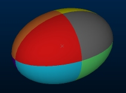
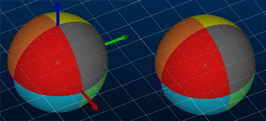
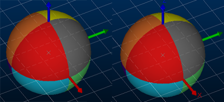

# Ellipsoids Properties: General

To access this screen:

  * In the [Ellipsoids Properties](<Ellipsoids%20Properties.md>) screen, click the **General** tab.

Define how the target ellipsoid data overlay is displayed in the 3D window.

This screen relates to the presentation of the **[ellipsoids](<Ellipsoids_Overview.md>)** data type, which are similar to points data but with additional attributes to specify axes dimensions and orientation. 

**Note** : legacy ellipsoids data, as produced by the **[ELLIPSE](<../Process_Help_XML/ellipse.md>)** process, is formatted as wireframe data.

To configure an ellipsoids data object's overlay:

  1. Review the **Name** of the overlay. You can edit this name, which will not affect the description assigned to the underlying data file or object. This is the same as using the Sheets control bar menu's Rename option.

  2. Review the **Source** object name. This can't be edited.

  3. Set the **Color** of the ellipsoid. By default, the standard COLOUR Legend is applied.

     * You can set your ellipsoid data to be a **Fixed** colour. All ellipsoids of the target overlay are rendered using this colour.

     * Colouring an ellipsoid using a **Legend** allows you to conditionally colour the ellipsoid data of the target overlay by matching **Column** values to a defined display legend. 

     * Specify 3 numeric data attributes that represent the **RGB** colours to display for each ellipsoid on display. Each ellipsoid will have a single colour.

     * Show each of the ellipsoid **Octants** in distinct colours, like this:

  4. Choose if you wish to **Display axis Indicators** or not, on all ellipsoids within the target object. In the image below, for example, indicators are enabled for the left image and disabled for the right:

;>)

  5. Choose whether to **Display axis labels**. This option is only available if **Display axis indicators** is enabled (see above). These axis labels indicate which arrow represents X, Y and Z.  
  

  6. Set the **Size** of the labels of the axis indicators.  

  7. Adjust the Opacity of the ellipsoids of the target overlay by dragging the slider to the right to increase opacity, or to the left for increased transparency.

  8. Click **OK** or **Apply** to update the ellipsoid overlay display in 3D windows.

Related topics and activities

  * [Ellipsoids](<Ellipsoids_Overview.md>)

  * [Ellipsoids Properties: Labels](<Ellipsoids_PropDialog_Labels.md>)

  * [Associated Files](<Associated%20Files%20Dialog.md>)

  * [Info Mode List](<Traces%20Properties%20Dialog%20\(Info%20Mode%20List\).md>)

  * [3D Display Templates](<3D_Templates.md>)