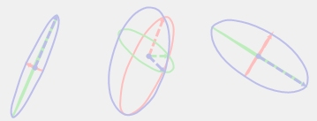
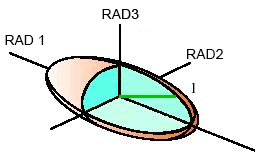
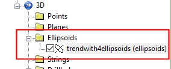

# Ellipsoids

An ellipsoid is a surface that may be obtained from a sphere by deforming it by means of directional scaling, or more generally, of an affine transformation.

Ellipsoids are used throughout Studio products as a function of a geospatial search. This includes (but is not limited to) grade estimation, surface interpolation between known points (including implicit and explicit modelling), determining the trend of a surface or volume and generating dependencies between activity points for scheduling.

An ellipsoid, by definition is a 3-dimensional volume, and in Studio products they are commonly visualized as a closed wireframe, although the Ellipsoid data type is more accurately regarded as a 'super point'; a point supported by additional attributes that define the limits of the search volume in 3D space, and the orientation of each ellipsoid (azimuth, dip and roll) within the loaded object.

Ellipsoid data objects are used in many Studio processes where a search volume is needed, and are detected by Studio due to the presence of a number of system fields.

Ellipsoid geometry is defined simply within Datamine products using mandatory attributes. In the list below, the description in brackets represents the attribute that hosts the property value.  

  * The volumetric centroid position of the Ellipsoid (**XP** , **YP** , **ZP**)
  * The azimuth of the ellipsoid in 3D space, using a value range from -360 to 360 (**AZI**)
  * The dip (using a positive downwards convention) using a range from -90 to 90 (**DIP**) 
  * The roll (using a positive-clockwise convention) with a range from -180 to 180 (**ROLL**)
  * The radius of the semi-major axis of the ellipsoid (**RAD1**)
  * The radius of the semi-minor axis of the ellipsoid (**RAD2**)
  * The minor axis of the ellipsoid (**RAD3**)  
  

Data files including these attributes will be categorized as an ellipsoid data type when loaded, and will appear in Studio control bars within the "Ellipsoids" sub-folder.

In some cases, for example, the Sheets control bar, ellipsoids can be used to access [context-sensitive commands](<Sheets_Ellipsoids.md>) for formatting, reloading, refreshing and editing specific loaded objects.  

## The Legacy ELLIPSE Process  

You can convert a search volume parameter file as used in the [ESTIMA](<../Process_Help_XML/estima.md>) or [COKRIG](<../Process_Help_XML/cokrig.md>) grade estimation processes into an actual 3D wireframe surface (and partner point file), using the [ELLIPSE](<../Process_Help_XML/ellipse.md>) process. 

In this scenario, the output wireframe allows you to visualize the extents of the search volumes held within a search volume parameter file, but the output volume(s) are otherwise the same as any other wireframe volume, and appear in the "Wireframes" folder of the Sheets, Project Bar and Project Files control bar once generated. These wireframes should not be confused with Ellipsoid data objects, which appear in the "Ellipsoids" folders once part of a project (and are described in the preceding section).

## Ellipsoid Commands

The following tools are available to create, edit, select and delete ellipsoid data:

  * [new-ellipsoid](<../COMMON/New_Ellipsoid.md>)
  * [edit-ellipsoid  
](<../COMMON/Edit_Ellipsoid.md>)

## Managing Ellipsoid Data

Ellipsoid data can be independently loaded, imported, saved and exported, providing the system fields outlined above can be defined.

#### Loading Ellipsoid Data

Ellipsoid wireframes (.tr and .pt), such as those created by the ELLIPSE process, will be loaded as standard wireframes and are primarily used for search volume visualization only. They are not used as inputs to downstream processes such as grade estimation (where a search volume parameter file is used), or implicit modelling (where an Ellipsoid data type object is used).

Ellipsoid data objects (those described in "The Ellipsoid Data Type", above), will be automatically detected if they contain the system fields that represent an ellipsoid (**XP** , **YP** , **ZP** , **AZI** , **DIP** , **ROLL** , **RAD1** , **RAD2** , **RAD3**). You can load this type of data using any of the standard data loading functions.

See [Loading Data](<../COMMON/Concept_Loading%20Data.md>).

#### Importing Ellipsoid Data

Ellipsoid data can be imported using Datamine's Data Source Drivers. This has the advantage of allowing you to choose which fields to import, and also to denote the incoming object as an ellipsoid type and define its system fields for orientation, size and position (although they will be automatically detected if standard attribute names are used. Import routines also give you access to non-Datamine formats. 

See [Importing Data](<3d_objects.md>).

#### Saving Ellipsoid Data

Ellipsoid data objects can be saved using any of the standard Studio data saving functions.

#### Exporting Ellipsoid Data

Ellipsoid data objects that are already loaded can be exported using the Data Source Drivers function. This approach lets you export to a Datamine or non-native format, map fields to ellipsoid system attributes and, if required, filter out unwanted attributes.

See [Exporting Data](<../COMMON/ExportTable.md>).

Related topics and activities

  * [The Ellipsoids Folder (Sheets)](<Sheets_Ellipsoids.md>)

  * [Ellipsoids Properties](<Ellipsoids%20Properties.md>)

  * [Creating a New Ellipsoid](<../COMMON/New_Ellipsoid.md>)

  * [Editing Ellipsoids](<../COMMON/Edit_Ellipsoid.md>)

  * [Grade Estimation Search Volume Introduction](<../STUDIO_RM/Grade%20Estimation%20Search%20Volume%20Introduction.md>)

  * [Grade Estimation Search Volume Parameter File](<../STUDIO_RM/Grade%20Estimation%20Search%20Volume%20Parameter%20File.md>)