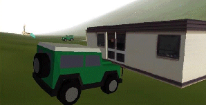
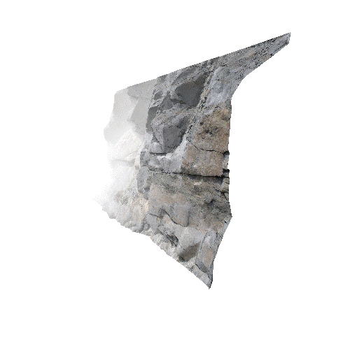
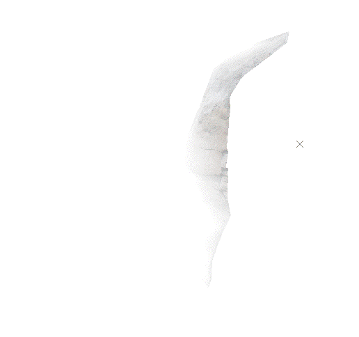
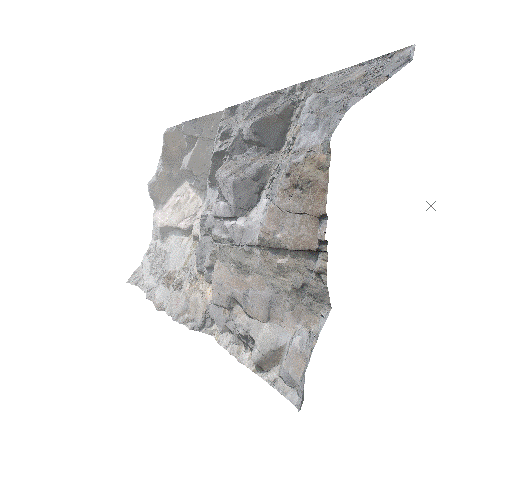

# Fog

You can create the effect of haze, mist, fog or gloom with the Fog settings. To produce an overall environmental effect e.g. "foggy morning" or "gloomy night", you will need to make appropriate changes also to the Sky and Lighting settings. A guide to these combination settings is given in [Getting the Right 3D Effect](<Environment_Getting%20the%20right%20effect.md>).

A 3D view with VR objects and fog 

The recommended settings for day-time worlds are:

  * Fog Color = Sky Color = 'pale blue'

  * Minimum = 1000

  * Maximum = 10000

This has the effect of "hazing" the horizon and blends the sky color into the sky texture. The distances used do however depend on the dimensions of your world. The units of distance will correspond to the units of distance used in your terrain surface i.e. '1000' corresponds to either '1000 feet' or '1000 meters' depending on the wireframe surfaces you have imported.

## Fog Settings Tips

  * As a rule, the best effects are obtained by keeping the fog and sky colors the same. For mist or fog, use 'white', and for gloom use 'black'. Try matching the sky color to your sky texture to minimize edge effects.

  * Fog varies linearly from the close distance to the far distance, for the best results it is recommended that you set the Minimum Distance very close (near to or at zero)) and gradually increase the Maximum Distance until a satisfactory effect is found.

## Minimum and Maximum Distance

  * Minimum distance (**From**) is the distance from your view position over which you have 100% visibility. The fog effect starts from this distance and then steadily increases.

  * Maximum distance (**To**) is the distance from your view position beyond which you have 0% visibility. The fog effect starts from the Minimum distance until you have zero visibility at the Maximum distance.

For example, here's the same scene with different fog extents in relation to a textured wireframe (unlit):

;>)

Fog from 10m to 20m

;>)

Fog from 5m to 10m

;>)

_Fog from 5m to 30m_

**Note** : **From** and **To** values are defined as world measurement units.

To apply or change a fog effect:

  1. Double-click an empty part of any 3D window.

The **[Environmental Settings](<EnvironmentalSettings_Dialog.md>)** screen displays.

Note: You can also activate the **3D** (View) ribbon and select **3D Display >> Environment**.

  2. In the **Fog** command group, check Active.

A prompt displays, asking if you wish to match the fog and background colour. This is up to you, but typically, fog applied over a similarly coloured background can appear more realistic than if contrasting. But, you do you and feel free to experiment for interesting effects (to imply air pollution or a sandstorm, for example).

  3. Expand the colour list and pick a base colour for the fog. 

  4. Choose the extent of the fog in your seen using **From** and **To** values. See "MInimum and Maximum Distance", above.

  5. Click **Apply** or **OK** to update the target 3D window.

Related topics and activities

  * [Environmental Settings](<EnvironmentalSettings_Dialog.md>)

  * [Environmental Lighting](<Environment_Lighting.md>)

  * [Getting the Right 3D Effect](<Environment_Getting%20the%20right%20effect.md>)

  * [3D Sky Settings](<Environment_Sky.md>)