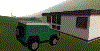
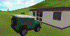
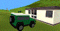
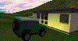
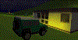
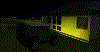

# Getting the Right 3D Effect

The following lighting, background, fog and clouds environmental settings can be used to give different environmental effects. These settings are applied using the [Environmental Settings](<EnvironmentalSettings_Dialog.md>) screen.

Some of these are shown in the table below:

Displayed Effect |  Property |  Setting |  Value  
---|---|---|---  
Foggy Morning  |  Lighting |  Ambient |  40%  
Direct |  60%  
Azimuth |  -80  
Latitude |  36  
Fog |  Colour |  white  
Min |  10  
Max |  300  
Sky |  Single Colour |  white  
Texture |  none  
Summer Haze  |  Lighting |  Ambient |  60%  
Direct |  40%  
Azimuth |  0  
Latitude |  36  
Fog |  Colour |  white  
Min |  1000  
Max |  10000  
Sky |  Single Colour |  soft blue  
Texture |  cldsmap  
Desert Sun  |  Lighting |  Ambient |  75%  
Direct |  50%  
Azimuth |  -10  
Latitude |  20  
Fog |  Colour |  off  
Min |  -  
Max |  -  
Sky |  Single Colour |  sky blue  
Texture |  none  
Dusk  |  Lighting |  Ambient |  20%  
Direct |  60%  
Azimuth |  80  
Latitude |  36  
Fog |  Colour |  pink-mauve  
Min |  500  
Max |  5000  
Sky |  Single Colour |  pink-mauve  
Texture |  sunset  
Starry Night  |  Lighting |  Ambient |  20%  
Direct |  20%  
Azimuth |  70  
Latitude |  36  
Fog |  Colour |  midnight blue  
Min |  1000  
Max |  10000  
Sky |  Single Colour |  midnight blue  
Texture |  starrynight  
Gloomy Night  |  Lighting |  Ambient |  20%  
Direct |  off  
Azimuth |  -  
Latitude |  -  
Fog |  Colour |  black  
Min |  20  
Max |  300  
Sky |  Single Colour |  black  
Texture |  none  
  
To change environment effects in a 3D scene:

  * Select the 3D window,

  * Double-click an empty space in a 3D window.

  * Use the [Environmental Settings](<EnvironmentalSettings_Dialog.md>) screen, using the above table as a guideline, to define the **Ambient Light** , **Directional Light** , **Background Colour** , **Fog** and **Clouds** settings.

  * Click Apply and then check the resultant effect in the 3D window.

  * Click OK to save the current settings.

Related topics and activities

  * [Environmental Settings](<EnvironmentalSettings_Dialog.md>)

  * [local light sources](<environment_adding%20more%20light%20sources.md>)

  * [Lighting](<Environment_Lighting.md>)

  * [Fog](<Environment_Fog.md>)

  * [3D Sky Settings](<Environment_Sky.md>)

  * [Clipping 3D Data](<Clipping-Data.md>)