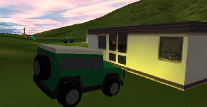

# Lighting

Any number of light sources can be defined in a 3D view, including ambient, directional, point and spot light sources. The color, position, intensity and direction of the light source - depending on its type \- can also be varied. 

Light sources can be:

  * Atmospheric (like the sun) and referred to as _scene_ light sources.

  * Attached to stationary and mobile [VR objects](<VR-Objects-and-Types.md>) (like buildings, trucks and equipment). These are referred to as _object_ light sources.

An example of an object light source

Note: Independent 3D views have their own light sources. See [Independent 3D Windows](<../COMMON/Independent_3D_Windows.md>).

To add or change a scene light source:

  1. Display the [Environmental Settings](<EnvironmentalSettings_Dialog.md>) screen.

  2. Adjust the background light source, known as an Ambient Light source. This lighting affects all lit and untextured 3D surfaces, including wireframes (providing they are not unlit - see [Wireframe Properties: General](<Wireframe_Properties_Dialog.md>)), 3D strings, block model cuboids, drillholes rendered as cylinders and 3D point symbols. 

Ambient light is non-directional, and is applied equally to all 3D surfaces regardless of orientation.

     * If **checked** , an ambient light source is applied and its intensity can be adjusted using the slider.

     * If unchecked, no ambient light source is applied and lighting is derived solely from **Directional Light** (see below) or object light sources (see further below).

  3. Check or uncheck Directional Light to control the directional light applied to the scene. 

     * If **checked** , a single directional light source is applied to the scene. 

Change the intensity with the slider, or change the light source position with the Azimuth and Latitude dials.

       * The Azimuth of the **Directional Light** corresponds to the time of day (0 for midday and 90 for sunset or dawn).

       * The Latitude of the **Directional Light** corresponds to the equatorial latitude (0 for tropical and 90 for arctic).

Tip: Negative **Azimuth** and **Latitude** settings can be used for back lighting effects.

  4. Use the **Headlight** option to increase the focus of global lighting applied to the scene. Consider the examples below, where **Headlight** is unchecked (left) and checked (right):

  5. By default, light is applied to both sides of a surface because 2 Sided is checked by default. If unchecked, light is only rendered on the side of a surface facing a light source (scene or object).

  6. Click **OK** or **Apply** to update your scene.

Related topics and activities

  * [Adding Lights to Stationary and Mobile Objects](<Objects_Object%20lights.md>)

  * [Fog](<Environment_Fog.md>)

  * [Sky](<Environment_Sky.md>)

  * [Getting the right effect](<Environment_Getting%20the%20right%20effect.md>)

  * [VR Objects and Types](<VR-Objects-and-Types.md>)