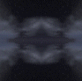
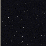

# 3D Sky Settings

You can change the color of the sky, or for greater realism, apply a moving sky texture with clouds or stars.

Tip: To haze or blur the boundaries between the horizon, sky and texture, see [Fog](<Environment_Fog.md>) and [Getting the Right Effect](<Environment_Getting%20the%20right%20effect.md>).

You can create your own textures and add these to the 3D library. The dimensions of texture bitmaps must be a power of 2, for example 256x256, 512x512 and so on. To minimize the tiling effect, the image should be double-mirrored, as in the following examples:

   
Cldsmap |     
Cloudynight  
---|---  
   
Starrynight |     
Sunset  
  
To change the sky effect:

  1. Display the [Environmental Settings](<EnvironmentalSettings_Dialog.md>) screen.

  2. Set the **Background Color** to either a Single colour or Gradient fill.

Tip: Select a colour which matches the dominant colour of the sky texture you plan to use.

  3. In the **Clouds** command group:

  4. Browse to select a texture bitmap.  

  5. Set the Tile Size for the sky texture. This is the dimension of a square tile onto which the bitmap is drawn. The best settings for Tile Size depend on the dimension of your world and the detail of the sky texture. Typical values range from '4000' to '32000'. Experiment with different sizes until you get the effect you want.

  6. Set the number of Segments used for the sky texture. This parameter smooths the tiling of the sky. The best settings for Segments depend on the quality of your graphics card. Try a value of '4', then keep doubling the value until the texture is smooth.

  7. Set the Speed at which the clouds or stars move across the sky.

dZ and dX values are the lateral components of speed at which the sky moves in meters or feet per second. Actual cloud speeds can range up to 200 meters per second. Use 1-5 for starry textures and 10-100 for clouds.

Related topics and activities

  * [Lighting](<Environment_Lighting.md>)

  * [Fog](<Environment_Fog.md>)

  * [Getting the right effect](<Environment_Getting%20the%20right%20effect.md>)