# Environmental Settings

To access this screen:

  * Double click empty space in any 3D window.

  * Activate the Format ribbon and select 3D Display >> Environment

Control global parameters for lighting (directional and ambient), fog and sky, clipping and view exaggeration in the active 3D window.

### Lighting

Environmental lighting is applied in addition to **[local light sources](<environment_adding%20more%20light%20sources.md>)**.

There are two general light sources that can be applied to a 3D scene: _ambient_ and _directional_.

**Ambient Light** is the background light that illuminates all 3D objects from all directions simultaneously. For example, with ambient lighting, a scene may look like the following:

;>)

**Directional Light** illuminates 3D objects from a single direction (defined by **Azimuth** and **Latitude**). For example, with the ambient lighting turned off (and a directional light's latitude and intensity increased) the following effect is achievable:

[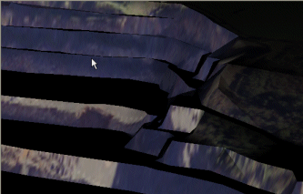](<javascript:void\(0\);>)

Directional light can be focussed (to reduce its spread) using a **Headlight** option, for example, in the image below, the right image is lit by a headlight-style light source, whereas the left image has a more general source.

[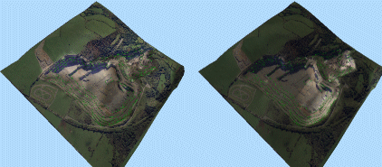](<javascript:void\(0\);>)

A **2 Sided** option exists to illuminate surfaces with directional light from both sides. If **unchecked** , the brightness of a surface will depend on the direction of the surface normal, regardless which side of the surface is being viewed. For a correctly-verified DTM, being lit from above illuminates only the surface closest to the light source whereas if the option is **checked** , both sides of a surface are lit in the same way.

### Clipping

Individual data objects can be clipped in Studio products. 

In addition, an entire 3D scene can be clipped. This can be useful to reduce the amount of data to be displayed in a large 3D scene (either with very dense data, large data extents, or both). This can be regarded as the 'draw distance' of the scene, where data can be displayed only if it sits within a corridor defined by two clipping regions in front of the camera. Both front and back scene clipping values are set in world measurement units. 

The **Front** distance is the the minimum distance from the viewpoint that you wish to view data. A value of [1] indicates that data will be shown from the specified point 'backwards' into the virtual scene. Setting a higher value set the clipping position further away from the viewpoint. For example, if the following image represented a Front clipping value of 2000 virtual meters:

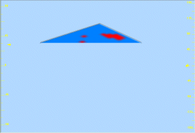

...the following image could represent the same data set with a Front clipping value of 1500 meters:

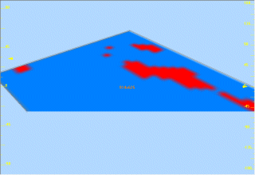

Similarly, the **Back** distance determines the cut-off point from which data is stripped from view. Using the example above, if the Front clipping value was set to [1500] (as in the image directly above), and the Back clipping value were set to [2000] meters, the following is displayed:  
  
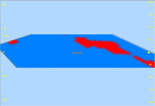

**Note** : Both **Front** and **Back** clipping distances can be set automatically. Check **Automatic** to adjust the clipping planes with respect to the loaded data. 

**Note** : clipping values specified are always set in relation to the viewpoint. If the viewpoint is moved (for example, as the result of a rotation or pan operation), the settings will be applied dynamically as the view is altered. The easiest way to visualize this is to image that the clipping limit values (Front and Back) are simply 'masks', attached to the virtual camera, that will affect whichever view of data is presented.

You can also Bias additional clipping planes to move the clipping plane by a small amount to overcome visibility issues with data drawn on a section plane (default 0.01).

When using section clipping (front or back), numerical tolerance issues can cause data drawn exactly on the plane to be randomly clipped out. The clipping plane bias setting is used to allow the OpenGL clip plane to be shifted by a small amount to ensure that items on the plane get drawn. The actual value required will be a function of the view's front and back clipping plane distance and the scale of the data.

A positive number here (0.01 by default) will push the OpenGL clipping plane backwards by the tolerance amount, that is, not clip objects within the tolerance distance of the plane. Negative biases are allowed, and have the effect of ensuring items within the tolerance distance are clipped from view.

Finally, you can Use polygon offset to slightly offset strings which have been digitized by snapping to a wireframe or section plane (default 'ticked'). Selecting this option will prevent the digitized data from being partially 'hidden' by the wireframe or section plane surface through a principle commonly known as 'z fighting'.

See [Clipping 3D Data](<Clipping-Data.md>)

### Background Colour

Any 3D window can be coloured either using a fixed colour, or a gradient fill from one position to another.

Gradient fills are applied between four screen locations (top right, top left, bottom right, bottom left) and each colour can be set independently. Setting two or more locations to the same colour can produce interesting effects:

Fixed Colour | The background is a static colour. | [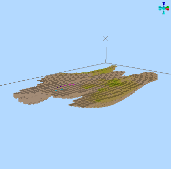](<javascript:void\(0\);>)  
---|---|---  
Gradient Colour - 3 and 1 | A single colour radiates from one corner of the scene. | [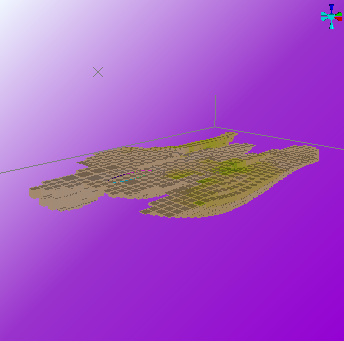](<javascript:void\(0\);>)  
Gradient Colour - 2 and 2 (diagonal) | A strip of colour diagonal crosses the screen, with the other colour radiating from opposite corners. | [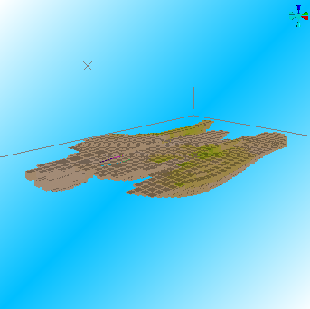](<javascript:void\(0\);>)  
Gradient Colour - 2 and 2 (vertical) | A gradient fill across the screen vertically, between two colours. | [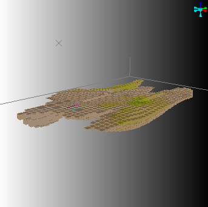](<javascript:void\(0\);>)  
Gradient Colour - All different | Each corner of the screen has a different radial colour. | [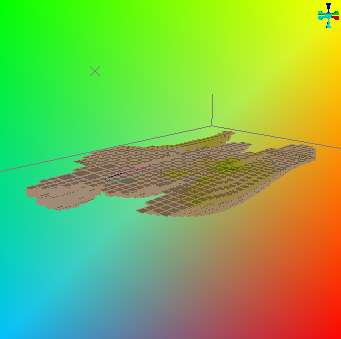](<javascript:void\(0\);>)  
  
**Note** : the background colour is not affected by light settings, although it can be used to achieve perceived 3D lighting effects through optical illusion. For example, if the background is in stark contrast to local light source colours, the impact can be more obvious.

### Fog Effects

Light hazing effects can make a scene appear more realistic. For Studio 3D windows, this can be simulated using 'fog'.

It is recommended to keep background and fog colours similar for more realistic effects, but this isn't a fixed rule, and having a contrasting fog colour can provide an interesting result.

If the default colour of the fog does not match the current sky colour, you are prompted with the following message:  
  
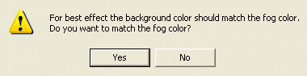  
  
Selecting Yes changes the current fog colour to match the sky colour. Selecting No applies the selected fog color.  
  
For example, the following scene...  
  
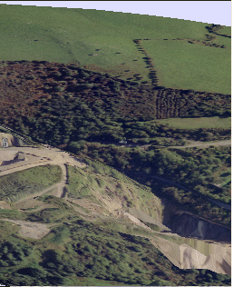  
  
When fog is added, becomes:  
  
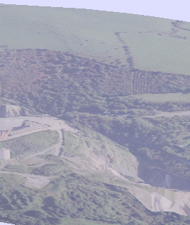

The recommended settings for day-time worlds are

  * Fog Color = Background Color = 'pale blue'

  * Minimum = 1000

  * Maximum = 10000

This has the effect of "hazing" the horizon and blends the sky colour into the sky texture. The distances used do however depend on the dimensions of your world. The units of distance will correspond to the units of distance used in your terrain surface i.e. '1000' corresponds to either '1000 feet' or '1000 meters' depending on the surfaces you have imported.

### View Exaggeration

Exaggeration settings allow you to stretch the view of the data that is displayed (and not, importantly, the data itself). This function can be thought of as a 'view correction' that will allow you to stretch the data in any of the virtual axes in which a scene is rendered. Separate values are available for X, Y and Z values (remember that the axis in question is that which is represented by the scene as a whole, i.e. using a world coordinate system). 

This is a different behaviour to that described for clipping; rotating the data, for example, after exaggeration, will appear as if it is the data object that has been stretched - the exaggeration is not applied in relation to the camera.

### General Environmental Settings Guidelines

  * As a rule, the best effects are obtained by keeping the fog and sky colours the same. For mist or fog, use 'white', and for gloom use 'black'. Try matching the sky colour to your sky texture to minimize edge effects.

  * Fog varies linearly from the close distance to the far distance, for the best results it is recommended that you set the Minimum Distance very close (near to or at zero)) and gradually increase the Maximum Distance until a satisfactory effect is found.

  * If the recommended fog, sky and lighting settings do not produce the desired effect, gradually decrease the Fog Minimum distance.
  * If reducing the Fog Minimum distance has no effect, or if you suddenly lose all visibility, then the problem is likely to be with your graphics card or monitor.
  * Check that your monitor is set to either High Color (16 bit) or True Color (32 bit) - lower colour settings have insufficient colour range to support these effects.
  * Check that your card supports DirectX graphics, and download and install the latest graphics driver from the card manufacturer.

### Environment Settings Activities

To control environment lighting for the target 3D view (and all linked views):

  1. Display the **Environmental Settings** screen.

  2. Choose if **Ambient Light** is needed:

     * If **Active** is **checked** , the slider is available to increase or decrease the intensity of the ambient light.

     * If **Active** is **unchecked** , only directional light sources illuminate the 3D scene. This might be a good option for underground development scenes, for example.

  3. Decide if **Directional Light** is needed:

     * If **Active** is **checked** , the global directional light source. You can then configure the global directional light using the following options:

       * Azimuthspecify the left-right azimuth location of the global light source for your scene.

       * Latitudespecify the up-down latitude of the light source. The centre line of the dial can be seen as the 'horizon' of the view plane in this instance.

       * Headlightif **checked** , apply a more focused, directional light projection; by default a global light is applied (**unchecked**).

       * 2-Sidedif **checked** , a global light source is 'shone' both away from the virtual source and towards it. Otherwise, light is only projected from the defined **Azimuth** and **Latitude**.

**Tip** : this option can be used to avoid the patchwork appearance of wireframes with inconsistent normals, when viewed as flat-shaded wireframes.

     * If **Active** is **unchecked** , only directional light sources illuminate the 3D scene.

  4. Click **Apply** or **OK** to update the 3D scene.

To alter world data clipping limits manually:

Clipping controls limit the data in the display area. This allows you to restrict virtual data display to a specific 'corridor' of information.

See "Clipping" above, for background information.

  1. If checked, **uncheck** **Automatic**.

  2. Set the **Front** scene clipping distance. 

  3. Set the **Back** distance.

  4. Set the **Bias additional clipping planes by** value to allow data to be drawn cleanly if it coincides with a clipping plane. A small bias is recommended.

  5. To minimize the impact of coincident data 'z-fighting', enable **Use polygon offset**.

  6. Click **Apply** or **OK** to update the 3D scene.

To change the background colour:

See "Background Colour" for background (no pun intended) information.

  1. Choose either **Single** or Gradient colour:

     * **Single** colours are static and invariable across the background of the 3D view. 

     * **Gradient** colours can be radiated from any corner of the 3D scene.

  2. Click **Apply** or **OK** to update the 3D scene.

To apply a fog effect:

See "Fog Effects", above, for background information.

  1. In the **Fog** command group, check **Fog**.

  2. If prompted, choose if you wish to set the fog colour to the current background colour (recommended for most scenes, but feel free to experiment!

  3. Expand the colour list to choose the colour of the fog. Again, if it is different from the current sky colour, you will need to confirm this.

  4. Set the **From** distance. This is the distance from your view position over which you have 100% visibility. The fog effect starts from this distance and then steadily increases.

  5. Set To distance. This is the distance from your view position beyond which you have 0% visibility. The fog effect starts from the minimum distance until you have zero visibility at the maximum distance. This distance value represents the distance of the farthest object (from the viewpoint) that can be displayed.

  6. Click **Apply** or **OK** to update the 3D scene.

To apply an animated background texture to your scene:

  1. In the **Clouds** command group, pick an image file. Bitmaps (.bmp, .ppm) and Portable Pixmaps (.ppm) are supported.

  2. Define the maximum **Tile Size** for the texture. Your image will be tiled across the sky 'surface'.

  3. Specify the number of **Segments** to subdivide the sky. A higher value provides a smoother animation.

  4. For animated image files, set the speed at which the texture image is translated across the sky surface in the X direction (**dX**). 

  5. For animated image files, set the speed at which the texture image is translated across the sky surface in the Z direction (**dZ**).

  6. Click **Apply** or **OK** to update the 3D scene.

Also see [3D Sky Settings](<Environment_Sky.md>).

To exaggerate (stretch) the 3D view:

  1. Set the ratio (where 1 means 'don't exaggerate) to stretch the view in the **X** direction.

  2. Similarly, set exaggeration ratios for Y and Z axes.

  3. Click **Apply** or **OK** to update the 3D scene.

Related topics and activities

  * [Getting the right effect](<Environment_Getting%20the%20right%20effect.md>)

  * [local light sources](<environment_adding%20more%20light%20sources.md>)

  * [Lighting](<Environment_Lighting.md>)

  * [Fog](<Environment_Fog.md>)

  * [3D Sky Settings](<Environment_Sky.md>)

  * [Clipping 3D Data](<Clipping-Data.md>)