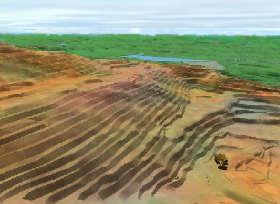
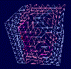
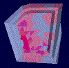
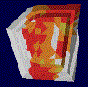
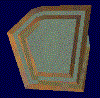
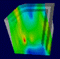

# Formatting Wireframes

Wireframes can be formatted using a variety of styles. For example, you can:

  * Drape an image over the Wireframe, like an aerial photo or a geophysical map. For information on draping images see [Wireframe draping](<Surfaces_Draping%20images.md>).

  * Colour the wireframe using a range of options, including legend colouring or RGB data held in the file.

  * Make the wireframe transparent or hidden. For information on hiding and showing wireframes see [Hiding Objects](<hiding%20objects.md>).

  * Display as a wireframe (edges), flat shaded or smooth shaded.

  * Change the opacity of a wireframe.

As with any 3D object overlay, format changes impact the target and all **[associated 3D views](<../COMMON/External_3D_Windows.md>)** , leaving **[independent](<../COMMON/Independent_3D_Windows.md>)** 3D views unaffected. This means you can display wireframe data in a range of different ways across multiple views.

## Draping Textures

More realistic worlds are created when draping coloured aerial photographs over wireframes. With a little effort you can produce excellent effects with wireframe textures. 

For surface rendering, ideally, drape the texture of an aerial image of the topography over the wireframe created from corresponding survey data. You can use **[image registration](<ImageRegistration_Dialog.md>)** to line up texture points with landmark positions.

## Rendering Without Textures

If you don't have an aerial photograph you can still create realistic wireframe surface effects.

  * Use a digital camera to capture the real-world textures, or scan in photographs of similar scenes, or search photo libraries on the web for useful images.

  * Use a photo editing program to tint, blend and brighten images:

    * Save as square images, for example 256x256 for a repeating texture tile.

    * Double-mirror the images into 512x512 tile so that one edge blends smoothly into the opposite edge. This is one of the bitmap textures used in the above image.

Experiment with the Tile Size wireframe 3D property to obtain the best result. A larger tile size will produce larger areas of contrasting tones.

  * Use a wireframe attribute field to create texture zones. You can use a legend to associate a texture with a categorical value or a range of continuous values.

  * Use a wireframe modeling program to create a texture zone with different values for rock faces, roads, grass, forest, sand, water etc. You can use wireframe properties like slope and elevation to further vary the textures within a zone. 

  * Simulate an aerial photograph:

    1. After texturing the wireframe with a legend, view the wireframe in plane view.

    2. Use an image capture program to take a 'snapshot' of the top down view of the 3D window data.

    3. Use a photo editing program to tint, blend and smooth the image. It is not the detail in the image which is so important, but the use of natural colour tones and the variety of textures which gives a realistic finish.

    4. Save or convert the image as a bitmap - the bitmap dimensions must be a power of 2 (256, 512, 1024,...).

    5. Drape the image just as you would an aerial photograph.

To change the opacity of a wireframe:

  1. In the 3D window, double-click anywhere on the overlay of the wireframe you wish to format.

  2. On the Wireframe Properties screen, drag the **Opacity** slider to the right (to make it more opaque) or left (to make it more transparent).

  3. Click **OK** to update the target view (and all linked views).

To change the wireframe colour or texture:

  1. In the 3D window, double-click anywhere on the overlay of the wireframe you wish to format.

  2. On the Wireframe Properties screen, make **Shading** , Color and **Texture** changes with reference to the table below, then click **OK**.

Shading |  Texture |  Colour Legend |  Color Field |  Sample (click to expand)  
---|---|---|---|---  
Wireframe |  - |  Solid colors |  Wireframe attribute field |  |    
---  
Attribute fields must be included when the wireframe is imported. Some Wireframe file types do not support attribute fields. Modelling programs provide facilities for transferring attributes from block models onto Wireframes.   
Flat |  - |  Solid colours |  Wireframe attribute field |  |    
---  
If more than one attribute field is available, select a suitable Color Legend whenever the Color is changed.  
Smooth |  - |  Solid colours |  Wireframe attribute field |  |    
---  
You can choose a default legend, or you can create your own legend.  
Any |  - | Textures |  Wireframe attribute field |  |    
---  
Increase the Tile Size to smooth the texture and reduce the tiling effect. You can create your own textures from digital photos and other images.  
Any |  Texture image |  - |  - |  |    
---  
Use georeferencing wherever possible.  
  
Related topics and activities

  * [3D Window Visualization](<VR_Introduction.md>)

  * [Formatting Object Overlays](<../COMMON/Formatting%203D%20Objects.md>)

  * [Environmental Settings](<EnvironmentalSettings_Dialog.md>)

  * [Image Registration](<ImageRegistration_Dialog.md>)

  * [Image Registration - Example 1](<Image%20Registration%20Worked%20Example.md>)

  * [Image Registration Example 2](<image%20registration%20worked%20example%202.md>)