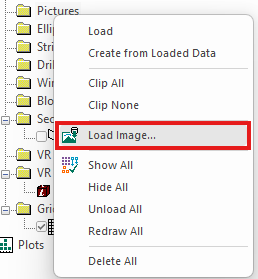
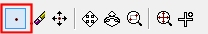
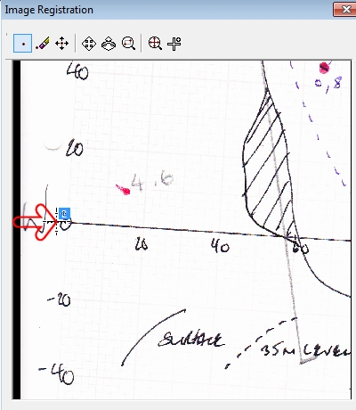
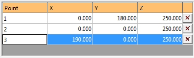
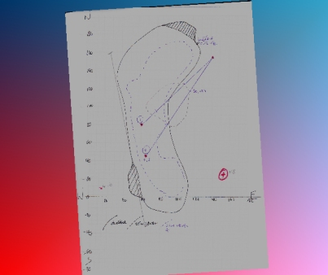

# Image Registration - Example 1

Note: A Datamine [eLearning course](<https://datamine.learnupon.com/>) is available that covers functions described in this topic. Contact your local Datamine office for more details.

An example of texture application using the Image Registration screen follows. This is one of two worked examples, with the other being available [here](<image%20registration%20worked%20example%202.md>).

This example uses the installed demonstration image data located on your local system. Details regarding the location of data are provide below.

## Sample Data

Sample data is already installed on your local system at the following location (assuming default settings were accepted during the install process):

  * C:\Database\DMTutorials\Data\VBOP

To overlay a 3D plot in specific geospatial coordinates:

In this example, you will load an image representing a hand-drawn plot, and use the coordinates found on that document to create a correctly-aligned wireframe in 3D space. This could then be used as a basis for digitizing, for example, or comparing against other loaded data from a related data set.

This example assumes that Studio RM is running.

  1. With your application running and a 3D data display in view, open your Sample Data Folder.

  2. In the **Project Data** control bar, locate the **Pictures** folder. Right-click this and select **Load Image**.

  3. Navigate to your Sample Data Folder and open the Pics folder.

  4. Double-click the IMG_PLOT.jpg file.

The Image Registration screen displays with a preview of the loaded image:  
  

  5. Next, you will define 3 points on the image to align with the 3D wireframe surface.

To make it easier to select the first point, select the Zoom Area button at the top of the screen:

  6. Left-click and drag a rectangle represented by the area shown below:

;>)

The texture preview zooms to the selected area:

   

  7. Click Add Point at the top of the screen:  
  

  8. Left-click to add an alignment point directly above the "1" on the "180" description, like this:

;>)

Note: The red arrow is shown for indication purposes only.

  9. The next point will be added at the intersection of the graph axes. Zoom the preview to show the area shown below:

  10. Click Add Point and click on the origin of both axes to position the second point, like this:

;>)

  11. Position the third and final point at the end of the horizontal access (this represents the "190" value position, even though it isn't shown in text:

;>)

  12. The table below now contains 3 rows (one for each digitized point). The values for X, Y and Z are all currently zero. This is because none of the digitized points have been 'assigned' to a point in 3D space yet. As the coordinates are known (they are on the chart), you will need to enter them into the table below, manually.

For the purpose of this demonstration, you can assume that the elevation that is relevant to the plot is 250 meters. In other words; all points have a Z value of 250.

Configure the table at the bottom of the screen so it appears as shown:  

;>)

Note: You can also pick coordinates in the 3D view, rather than entering them in. To do this, you can click New Point and digitize your texture image point as normal but them (immediately) click a point in the 3D window. You can snap to reference data (say, surveyed dig lines) to automatically add XYZ coordinates to the **Image Registration** table.

  13. Click **OK** and your image is loaded as a 'flat' wireframe. 

Tip: If you can't see the loaded image, click into the 3D window and type "za" to zoom-all-graphics.

Note how the chart axes, although scanned incorrectly, now appear in the correct (vertical, horizontal) orientation:

;>)

Tip: Add a 3D world grid with 20m intervals and the grid lines will also align with the axis intervals.

  14. Save your project. When prompted, choose to save all files and automatically reload those listed. 

  15. You can now reload your project to display your correctly georeferenced texture and wireframe.

Related topics and activities:

  * [Image Registration](<ImageRegistration_Dialog.md>)

  * [Image Registration Example 2](<image%20registration%20worked%20example%202.md>)