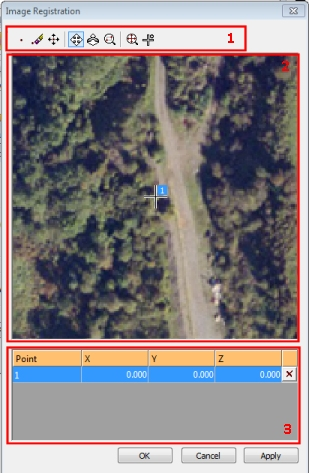
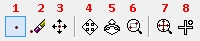
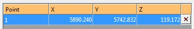
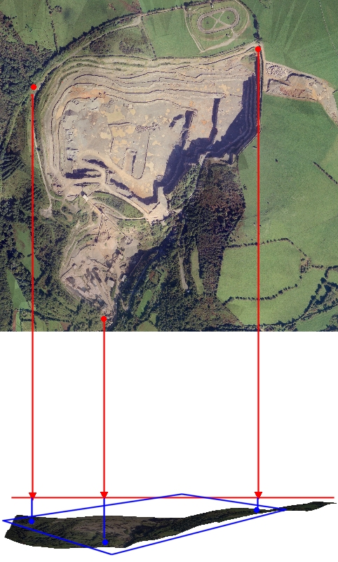

# Image Registration

To access this screen:

  * Display the [Texture Drape Settings](<Texture_Drape_Settings_Dialog.md>) screen and click Use Points.

  * Using either the **Sheets** or **Project Data** control bar, right-click the **Pictures** folder and select **Load Image**.

  * **Data** ribbon **> > External >> Image** and **Open** an image file.

  * Drag and drop any recognized image format into a **3D** window.

The Image Registration screen has three main purposes:

  * To position a texture on a wireframe using a series of anchor points, allowing for precise alignment to known visual references.

  * To load a texture and create a planar reference wireframe on which to place it, for the purpose of reviewing the texture or aligning it with other loaded data. This can help to support a presentation by combining a mixture of an imported texture (for example, a hand-drawn plot, aerial images, geological mapping images, seismic section data and so on) alongside data resulting from a digitizing or modelling process.

  * To automatically create a Pictures object (essentially, an image draped onto a flat, fitted wireframe) that can be reused elsewhere. See [Pictures Data Type](<Images%20Data%20Type.md>).

## Aligning Textures

Alignment of a texture is performed by matching a specified position on an image with the point to which it should be aligned with on the 3D data. 

You can do this by viewing your data from any direction, but for best results, you may wish to consider swapping to a plan view before you start. Note that all view direction commands are available to you even when the Image Registration screen is displayed, allowing you to rotate your data and perform other functions throughout the process of texture alignment.

Note: You can use as many alignment points as you need to position your image in the 3D world. 

Tip: Consider loading surveyed reference data before you import your image. For example, sample station points, surveyed blast or dig lines or other scan data.

## Screen Layout

The screen is comprised of three main components (see the image below for the location of each control):

  * the **Image Registration Toolbar** (1)

  * the **Image Preview Pane** (2)

  * the **Coordinates Table** (3).

;>)

There is an Apply button only if accessed via the Texture Drape Settings screen as this is only appropriate if you are editing the texture that is already applied to a loaded wireframe. If the screen was accessed any other way, only **OK** displays, which generates a new, flat reference wireframe to 'host' the loaded image.

##  Image Registration Toolbar

The following tools are available for you to accurately position a texture:

  1. New point: note that at least 3 points are required to align a texture in 3D space. Selecting this option requires a further click in the preview window. A numbered reference point will be created and a new row added to the points table at the bottom of the dialog.

  2. Delete point: enters deletion mode; any points selected (left-clicked) on the preview window will be removed as will the corresponding row in the table below.

  3. Move point: enters point editing mode; left-click and drag any point that has previously been digitized in the preview pane. Note that this will not edit the coordinates in the table below that correspond to the edited point; you are changing the reference point in the image, not the point that it represents in 3D space - see the worked example to familiarize yourself with this concept.

  4. Pan view: in a magnified view, select this to enter panning mode. Left-click and drag the texture preview to the required position.

  5. Zoom view: select this option and subsequently left-click and drag to dynamically zoom the texture preview and get a better look at potential alignment points on the texture.

  6. Zoom area: select and left-click to drag a rectangle representing the area of the texture preview you wish to magnify.

  7. Zoom all: maximizes the texture preview to show the full extents of the image.

  8. Pan to Selected Point: select this option to centre the view of the texture (at the current magnification) around the selected reference point. Select the reference point in the table first to highlight the relevant row, then click the Pan to Selected Point command.

## The Image Preview Pane

This pane displays a preview of the image to be draped and is also used to digitize the locations of image reference points.

## The Alignment Table

;>)

The table at the bottom of the Image Registration screen contains the 3D reference coordinates for each digitized image reference point shown in the **Image Preview Pane**. All values, other than the point number, are editable. The XYZ location of a particular reference point can be defined using one of the following methods:

  * typing coordinate values into the table and the clicking Apply.

  * clicking on a row in the table and then in the active 3D window, right-clicking on the corresponding reference point such as a point on a wireframe, string or another point.

The table may also be used for fine-tuning of reference point coordinates in a particular direction.

You can also use the delete function on the far right of each row in the table to remove a reference point. This will also remove it from the Image Preview pane.

## Guidelines for Best Results

For best results when texturing wireframes, you should consider the following general guidelines:

  * Align your wireframe in a plan view if texturing an 'open' surface. This helps to show a better correlation between the image preview and the resulting textured mesh.

  * Create a horizontal section through your data if texturing an open surface. To understand why, consider the following image:  
  
;>)  
  
The red points in the image preview represent the points determined in the Image Registration dialog as 'anchor points'. The horizontal red line represents a horizontal section created prior to texture application (using [Section functions](<workspace_sections.md>)). The red arrow heads represent the points in space to which the texture should be aligned. The texture will then be dropped in a vertical direction onto the resulting wireframe without distortion or skewing.  
  
If digitized directly onto the surface, in some cases the undulation of the surface will not invoke any significant distortion and the resulting image may be acceptable/accurate. However, where there is a big difference in, say, elevation values between the digitized 3D points and the points on the same image, it is possible that the projection may not accurately reflect the topography or volume that is being textured.  
  
As such, it is recommended that a suitable section is created to act as a digitizing canvas when determining alignment points in 3D space.

## Image Registration Examples

  * [Image Registration - Example 1](<Image%20Registration%20Worked%20Example.md>)

  * [Image Registration Example 2](<image%20registration%20worked%20example%202.md>)

Related topics and activities:

  * [Pictures Data Type](<Images%20Data%20Type.md>)

  * [Image Registration - Worked Example 1](<Image%20Registration%20Worked%20Example.md>)

  * [Image Registration - Worked Example 2](<image%20registration%20worked%20example%202.md>)

  * [Texture Drape Settings](<Texture_Drape_Settings_Dialog.md>)