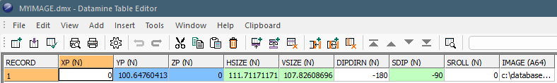
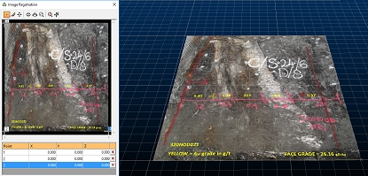

# Pictures Data Type

The Pictures data type represents image objects within your 3D windows. The objects are standalone planar image objects, not to be confused with [textured wireframes](<../COMMON/concept_introducing%20wireframes.md>). 

Displayed on a flat plane, oriented in any 3D direction, picture objects are useful references for further analysis and design. You can either use existing georeferencing data or configure your own at the point of loading.

Pictures data files will appear in the Project Files and Project Data control bars (if your product supports them). Once loaded, objects will appear in the Loaded Data control bar and overlays can be seen in the Sheets and Project Data control bars (again, only if your product includes these tools). 

You can export Pictures objects using any of Studio's [export options](<../COMMON/ExportTable.md>). The exported file isn't actually the image data (that's wherever you left it). Instead, a picture file contains the information needed to reload the image (click to expand):

;>)

An image object is represented by a Datamine database which describes the location of a raster image plus its georeferenced position in 3D world coordinates. 

  * **XP/YP/ZP** The world coordinate of the centre of the image plane.

  * **HSIZE/VSIZE** The dimensions of the image in world measurement units (_not_ pixels).

  * **DIPDIR** The azimuth of the image plane in 3D space.

  * **SDIP** The inclination of the image plane in 3D space.

  * **SROLL** The roll of the image plane in 3D space.

  * **IMAGE** Either the full path to the image on the local PC, or a relative path if the image sits in the project folder or subfolders.

## Loading a Picture

If you load a Picture file, Studio RM will automatically load the image data onto a flat plane in 3D, oriented as the file properties.

;>)

3D Registration Dialog and Georeferenced Image  

Images do not have to be previously georeferenced to be referenced by Datamine Picture objects; if no georeferencing information is available at the time the raw image is loaded (the image is not supported by a .bmpx, .pngx etc. partner file, or contains no georeferenced metadata) you can define your own georeferencing coordinates using the [Image Registration](<ImageRegistration_Dialog.md>) screen.

Pictures data object have [3D formatting](<Pictures%20Properties%20Dialog.md>) options and [Sheets](<Sheets_Pictures.md>) control bar options.  

## Creating a Picture Object

You can create a pictures data object (loaded data) by first loading the image, then (if required) georeferencing it by mapping local and world 3D points (image registration).

You load an image by either:

  * Dragging and dropping a recognized image type into any active 3D window
  * **Data** ribbon >> Load >> External >> Image
  * Enabling the [Project Files](<../COMMON/Concept_Project%20Files%20Control%20Bar%20Overview.md>) control bar and choosing Load External Data into the Project, then selecting the appropriate driver and file. 

## Creating a Picture File

Once loaded, an image is either displayed according to its existing world coordinates or, if no georeferencing data is available, you are shown the Image Registration screen to set up a minimum of 3 points on both the image and in 3D space. The image is resized and oriented to match the digitized coordinates. 

A Picture data object is created, containing the information needed to locate and orient the image data. To save this object to a file, just save it like any other data type: right-click the overlay and select **Data >> Save As**.

Note: You also get the opportunity to save loaded picture objects when you close your project.

## Alpha Channel Support

If your loaded image contains an alpha channel it is honoured, meaning transparent or partially-transparent textures will be supported.

You can choose to make all black pixels (RGB=0,0,0) transparent, even if your image doesn't support transparency.

Related topics and activities:

  * [Image Registration - Example 1](<Image%20Registration%20Worked%20Example.md>)

  * [Image Registration Example 2](<image%20registration%20worked%20example%202.md>)

  * [Image Registration](<ImageRegistration_Dialog.md>)

  * [Pictures Properties: General](<Pictures%20Properties%20Dialog.md>)