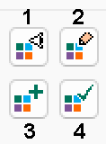

# Legend Controls

Several screens found in your product allow you to configure the legend used to display something.

This could be to format a 3D data type, for example, but are also found in other places.

_The Legend Style tools found throughout Studio products_

Wherever possible, a standard collection of controls is used to perform the following functions:

  * Choose between a **Fixed** legend value (which could be a colour, symbol or linestyle), or a **Legend** , where formatting is derived from the underlying data object's **Column** values.

  * Display a preview of the current legend, if one is applied.

  * Edit the selected legend using the **Legends Manager**.

  * Select an existing default legend for the select Column, or automatically create one.

  * Set the current Legend as the default for the current Column.

The following four buttons are the same in each case:

  1. Display a preview of the legend as a popup.

  2. Edit the selected legend using the Legends Manager.

  3. Either create (automatically) or select an existing default legend for the current column.

  4. Set the current legend as the default for the current column.

To define formatting using the legend tools:

  1. Load and display the data you intend to format.

  2. Display the appropriate screen containing the Legends Tools (for example, the 3D Points Properties screen).

  3. Choose either a Fixed or Legend formatting option.

     * Choose Fixed and pick a static option (colour, line style or symbol) to be applied to the target item consistently. For example, if a fixed colour is picked for a points overlay, all points are the same colour. Attribute values are ignored with this selection.

     * Choose **Legend** to configure a legend that uses attribute **Column** values to determine the colour, line style or symbol to apply at specific target positions of the object overlay. Use the legend buttons (see above) to preview, edit create/select or set a default legend for the selected column.

     * If the data item you are formatting supports it, you can configure **RGB** information. If available, select numeric columns (x3) to colour your data using red/green/blue index information. Only numeric fields are selectable.

       * Any colour depth is supported; define the Maximum Value for the colour attributes. For example:

       * 4-bit colour depth is described a Maximum Value of 15 (0-15 = 16 per colour channel)

       * 8-bit colour depth is described using a Maximum Value of 255 (0-255 = 256 per colour channel)

       * 12-bit colour depth is described using a Maximum Value of 4095 (0-4095 = 4096 per colour channel)

       * 16-bit colour depth is described using a Maximum Value of 65535 (0-65535 = 65536 per colour channel)

       * 24-bit colour depth is described using a Maximum Value of 16,777,215 (0-16,777,215 = 16,777,216 per colour channel)

Note: RGB specifications are not possible in all scenarios.

Related topics and activities

  * [Block Model Properties: General](<BlockModels_Properties_Dialog.md>)

  * [Block Model Properties: Labels](<BM_PropDialog_Labels.md>)

  * [Drillholes Properties: Labels](<DH_PropDialog_Labels.md>)

  * [Drillholes: Style](<DHPropDialog_Segments.md>)

  * [Format Structural Symbols](<DHProp-format-structural-symbols.md>)

  * [Ellipsoids Properties: Labels](<Ellipsoids_PropDialog_Labels.md>)

  * [Planes Properties: Labels](<Planes_PropDialog_Labels.md>)

  * [Points Properties: Symbols](<Point_PropDialog_Symbols.md>)

  * [Strings Properties: Symbols](<String_Properties_Dialog_VertexVisualTab.md>)

  * [Strings Properties: Lines](<Traces%20Properties%20Dialog%20\(Edge%20Visual\).md>)

  * [Strings Properties: Labels](<StringProp_Labels.md>)

  * [Wireframe Properties: Lines](<Surface%20Lines%20Properties%20Dialog.md>)

  * [Wireframe Properties: Labels](<WF_PropDialog_Labels.md>)

  * [Wireframe Properties: General](<Wireframe_Properties_Dialog.md>)

  * [Quick Color](<../COMMON/Quick%20Color%20Dialog.md>)

  * [Quick Filter Legend](<../COMMON/Quick_Legend_Dialog.md>)