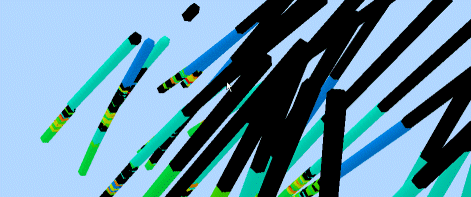

# VR Objects

A simulated 3D environment relies on the level of detail, placement and simulated effects to instill a sense of 'reality' in the viewer's mind. Every 3D environment that has been created by your application will be comprised of various objects; both loaded general data objects, e.g. terrain wireframe surfaces, geological modeling data, and 3D window-specific objects e.g. simulated vehicle.

Dynamic drillholes represented in a 3D window.

An _object_ , in the 3D sense, is a discrete packet of loaded data that represents a real-world object. 

**Note** : data, up to the point of loading, is a _file_. Once loaded, it becomes an _object_.

There are several object types, and all work in combination to provide a believable and immersive experience, as well as a simulated processes that can allow Mining Engineers and Geologists to visualize and interrogate mining scenarios. A 3D world could be made up, for example, of the following object types:

  * A Digital Terrain Model represent the surface topography.

  * A collection of mobile objects to be used in simulations.

  * Viewpoint objects for flythrus and pit analysis.

  * Stationary objects to represent real-world items such as trees, offices etc.

  * Light objects to provide specific areas of lighting effect.

  * A surrounding environment to represent the sky and environmental effects.

  * Information objects to 'tag' 3D models with additional information that is relevant to a simulation or other process.

  * Sound files to provide a more immersive experience.

  * A GPS connection to link the 3D world to movements in the real world.

  * Billboard objects to display corporate imagery.

  * Traces to provide a 'runway' for virtual models.

The above list provides a representative (but not exhaustive) list of the types of objects available. Placeable objects include the following data types:

  * **Points** point data e.g. survey coordinates. 

  * **Planes** an object type representing structural planes data

  * **Strings** this object type is used to represent the following:

    * Drillholes

    * String objects representing geological models, mine layouts and designs, and so on.

    * Paths for attach a Mobile or Simulation object as part of an animation

  * **Wireframes** wireframe objects representing geological models or mine designs

  * **Block Models** block model objects representing geological or mining models

  * **Sections** default or custom 3D section planes; a loaded section definition file.

  * VR Objects and Object Types, including:

    * [Stationary objects](<Objects_Stationary%20objects.md>) such as buildings, equipment and landscape features.

    * [Mobile objects](<Objects_Mobile%20objects.md>) including vehicles, pedestrians and hover viewpoints.

    * [Simulation objects](<Objects_Simulation%20objects.md>) like those attached to strings (simulations) and viewpoints attached to strings (fly-thru's).

    * [Object lights](<Objects_Object%20lights.md>) such as light bulbs, spotlights and headlights on stationary and mobile objects.

    * [Object sounds](<Objects_Object%20sounds.md>) including engine noises on stationary and mobile objects.

## Object Management

Objects are managed in the 3D window by setting up the following hierarchy:

  * A category of object is created, and settings are applied. This is referred to as the object _type_.

  * Individual instances of an object type are then created and added to the 3D world.

Object Types and Objects have different configurations, with all object _type_ settings applied to all instances of that object. Objects, however, can have their own settings. 

Related topics and activities

  * [Adding an Object Type](<Object_Adding_an_object_type.md>)

  * [Placing and creating objects](<Objects_Placing_objects_on_surfaces.md>)

  * [Placing a group of objects](<Objects_Placing%20a%20group%20of%20objects.md>)