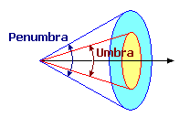
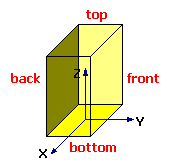

# Add a VR Object Light

Directional, point or spot light sources can be attached to a specified point on any VR object. This can help liven up a simulation, say, by adding haultruck lights or LDR lights in an underground drive.

To add a light source to a VR object:

  1. Add a **VR Object Type** to your project. See [Mobile Simulation Objects](<Objects_Mobile%20objects.md>) and [Stationary VR Object types](<Objects_Stationary%20objects.md>).

  2. In the Sheets control bar, active 3D window sub-folder, expand the Object Type folder.

  3. Right-click a VR object name and select Properties.

  4. In the Lights field, double-click <Add new light> to display the Light Properties screen.

  5. Select a light Type: 

Choose this... |  ...to do this  
---|---  
Directional |  A directional light source will illuminate all object surfaces equally and is not affected by the position of the object the light source is attached to. The direction of the light is specified relative to the object axes, and hence, is affected by the orientation of the object in the world.  
Point |  To create the effect of a light bulb which illuminates in all directions. A point light source provides general localized lighting \- the light intensity reduces as you move away from the light.  
Spot |  To create the effect of a searchlight, spotlight, headlight or a torch. A spotlight provides directional, localized lighting.  
  6. Select a light Color.

  7. For Point and Spot light types, define the Attenuation of the light source between 0 and 1. Consider the following examples:

0.1 = weak - torch

0.01 = bright - headlight

0.001 = intense - searchlight

  8. For Spot light types only: define the Umbrain degrees. The light is at full intensity inside the umbra, and reduces to zero intensity at the penumbra:  
  
  

  9. For Point and Spot light types: define the Position of the light source in X, Y, Z object coordinates. The light may be placed inside (buildings) or at any position on or outside the object. For example, you can add a spotlight (spot) in mid-air 20m (Z=20) above a building object to illuminate the exterior, or a light bulb (point) 3m above the floor (Z=3), just below the ceiling, to illuminate the interior.

The positioning of the light source is defined in the object coordinate system, with the origin at the center of the base of the object:

     1. Distance units are in meters.

     2. The coordinate (X, Y, Z) = (0, 0, 0) is at the center of the base or floor.

     3. A positive X coordinate positions the light source towards the right of the object (when facing forward).

     4. A positive Y coordinate positions the light source towards the front of the object.

     5. A positive Z coordinate of 1.7 positions the light source 1.7m above the base (eye level).

  9. For Directional and Spot light types: define the Orientation of the light source by the Yaw (rotation about the Z or vertical axis), Pitch (rotation about the X or transverse axis) and Roll (rotation about the Y or central axis) angles relative to the object axes:  
  

Yaw |  Pitch |  Roll |  Direction  
---|---|---|---  
0 |  90 |  0 |  Points vertically down  
180 |  0 |  0 |  Points horizontally backwards  
90 |  0 |  0 |  Points horizontally sideways  
0 |  30 |  0 |  Points 30 degrees down to the front  
45 |  -45 |  45 |  Points diagonally up to the top right  

## Lighting Guidelines

The lighting effect of light sources attached to objects is influenced by:

  * Ambient and Directional atmospheric lighting

  * Other object lights

  * The orientation of the light

  * The position of the light in the object

  * The position and orientation of the object in the world

  * The orientation, texture and color of surfaces being illuminated

If you are having trouble getting the right effect, try this exercise:

  1. Turn off or reduce the Ambient and Directional lighting in the Environment Settings dialog

  2. Place the object initially in a position where there are no other object light sources (so you can be sure there is no contribution from another light).

  3. Use a simple set of light source settings for which the light source effect is understandable, for example: place a spot light at eye-level (X=0 Y=0 Z=1.7) with a horizontal, forward direction (Yaw=0 Pitch=0 Roll=0), with an Umbra of 30, Penumbra of 60, Attenuation of 0.001 (bright) and a Range of 100.

  4. Place a 'cube' object 10 meters directly in front of the object (to remove the influence of surface texture, colour and orientation).

The cube should be clearly illuminated at this point. If the cube is not illuminated, the object axes are probably oriented differently to expected.

  1. Move the cube around the light source until you locate the brightest position for the cube - this is the direction of the central axis (see diagram above).

  2. Rotate and re-position the cube using the  buttons to see how the lighting effect changes as you rotate or move the cube away from or laterally to the object light. This will give you a clear demonstration of the effect of the Umbra, Penumbra, Attenuation and Range settings. Change these settings and move the cube again.

  3. Now position the cube where you wish to direct the light, and adjust the light settings accordingly. If the cube is not illuminated, check the **Yaw** , Pitch and Roll settings.

  4. Now change the position of the light source (X, Y and Z) and use the cube to confirm the direction and sense of each axis.

Related topics and activities

  * [Environmental lighting](<Environment_Lighting.md>)

  * [Additional light sources](<environment_adding%20more%20light%20sources.md>)

  * [Adding objects](<Object_Adding_an_object_type.md>)

  * [Placing objects](<Objects_Placing_objects_on_surfaces.md>)