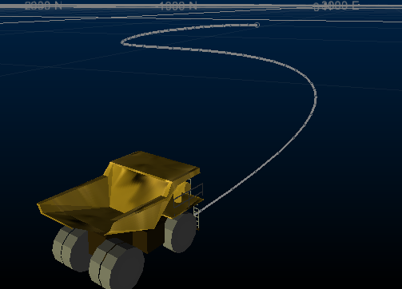

# VR Objects and Simulations

VR objects simulate movement in a 3D view. For example, a dump truck traveling along a defined haul route, or a viewpoint flying along an imaginary path to view geological data or a mine design. These simulations can be achieved in a variety of ways in Studio products:

  * Driving a mobile object along a wireframe surface

  * Flying through the active 3D window without a predefined path

  * Attaching and moving a mobile object(s) along an imported or digitized path (alignment string).

;>)

A mobile VR object with an alignment string

For information on how to define a mobile object see:

  * [Mobile objects](<Objects_Mobile%20objects.md>)

For information on how to import or digitize strings see:

  * [Import 2D strings and fit to a 3D surface](<Strings_Fitting%20a%20string%20to%20a%20surface.md>)

  * [Digitize strings directly onto surfaces](<Strings_Digitize%20and%20Edit.md>)

For information on how to attach objects to strings see:

  * [Attaching objects to strings](<Strings_Attaching%20objects%20to%20strings.md>)

For information on how to start the simulation see the help topics under:

  * [Creating a simulation](<Simulation_Creating%20a%20Flythrough.md>)

Related topics and activities

  * [Placing objects](<Objects_Placing_objects_on_surfaces.md>)

  * [Stationary VR Object types](<Objects_Stationary%20objects.md>)

  * [Add a VR Object Light](<Objects_Object%20lights.md>)

  * [Add Sound to VR Objects](<Objects_Object%20sounds.md>)

  * [Place a Group of VR Objects](<Objects_Placing%20a%20group%20of%20objects.md>)