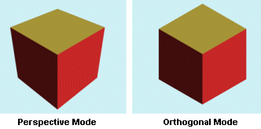
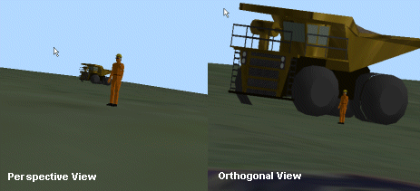
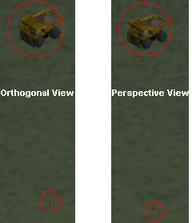
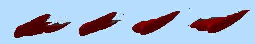
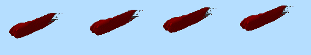

# Perspective and Orthogonal Views

How to change between viewing modes:

  * **3D View** ribbon **> > View >> Perspective.**

A **perspective** view simulates how objects appear in the real world by conveying depth. It displays a three-dimensional image with height, width, and depth, creating the sense of distance from a virtual camera. In this view, objects appear smaller as they move farther from the camera, and dimensions along the line of sight appear shorter than those across itan effect known as foreshortening.

An **orthogonal** (or isometric) view does not simulate depth or distance. Objects are displayed using true geometric dimensions, so their size remains constant regardless of their position relative to the camera.

By default, 3D windows display data in orthographic mode.

## Selecting a View Type

A perspective view simulates real-world vision, with objects appearing smaller as they recede into the distance. This provides a clear sense of depth and spatial context, making navigationsuch as rotating or moving through the scenefeel more natural and intuitive.

An orthogonal view removes perspective distortion. Objects are shown at their true scale regardless of distance from the viewpoint, which can be useful when comparing dimensions without accounting for depth.

In the example shown, the perspective view (left) conveys the distance between the human and haul truck through depth cues. In the orthogonal view, both objects appear at their actual size, as depth is no longer represented.

;>)

This gives the impression that the haultruck is much closer to the human. In this respect, even though neither view is technically nor computationally incorrect, the left hand image simulates the 'real-world' more effectively due to its support for denoting all three dimensions.

Drawn from a view more directly above the object pair, the effect of the different view modes becomes less apparent, for example:

## Zooming the View

Navigation in a parallel (orthogonal) projection can feel unintuitive if you are accustomed to perspective views. Moving the camera forward does not make objects appear closer, since their size does not change. Forward motion is typically only noticeable when objects are clipped by the front clipping plane. This can make free-flight navigation confusing, especially when rotating the camera.

For this reason, it is recommended to use free-flight tools only for panning in this mode. Other navigation should be performed using preset viewpoints or Look At mode.

To make objects appear larger on screen, you can either move the camera closer or apply zoom. Zoom controls allow you to define a new viewing area by dragging a bounding rectangle. When released, the view recenters on the selected area and adjusts the view width accordingly. A Look At point is automatically set at the center of the view to simplify further rotation.

In an orthogonal view, zooming changes the view width rather than moving the camera forward, unlike in a perspective view.

  * Zooming with the mouse wheel zooms around the cursor position.

  * In perspective mode, the view zooms by moving the camera. If a LookAt point has been set, the zoom 'speed' depends on the distance to that point.

## Panning the View

Panning changes the position of the 3D 'camera'. How data appears during panning depends on your viewing mode.

For example, the following image represents a series of still images of data being 'panned' whilst in a perspective view:

;>)

The same data dragged in an orthogonal view would show the following result:

;>)

## Recommendations

Generally, it is recommended that, for any activities that require the construction or navigation of 3D data for the purpose of producing a presentation, a perspective view will deliver a more immersive experience, and may also be more intuitive to navigate. 

The orthogonal view is better suited to more precise planning, where alignment of data is important, such as the development of underground drives or digitizing the boundaries of slope regions in plan view, and so on.

Note: Your 3D view is also affected by the camera's "field of view". This is typically set to 45 but can be adjusted using the [set-view-fov](<../command_help/set-view-fov.md>) command.

Related topics and activities:

  * [Navigation Modes](<VR_Navigation_Modes.md>)

  * [Viewing Data](<../COMMON/Interface_Viewing%20Data.md>)

  * [3D Window Visualization](<VR_Introduction.md>)

  * [View From Outside](<VR_Navigation_Outside_View.md>)

  * [View From Inside](<VR_Navigation_Inside_View.md>)

  * [Floating Viewpoint](<vr_navigation_floating.md>)

  * [Look At](<vr_navigation_look_at.md>)

  * [set-view-fov](<../command_help/set-view-fov.md>)

 |  Related Topics  
---|---  
|