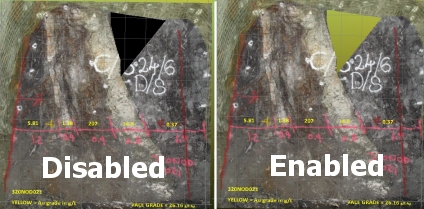

# Pictures Properties  
  
To access this screen:

  * **Sheets** or **Project Data** control bar **> > 3D Folder >> Pictures >> Right Click an Overlay >> Properties**.

  * Double click a pictures data object overlay in the Sheets or Project Data control bar.

  * Double-click a picture data object in any 3D window.

The Pictures Properties screen is used to set general properties of loaded [picture](<Images%20Data%20Type.md>) object overlays, including opacity and alpha channel behaviour.

This screen contains the following tabs:

  * General Set general visual formatting options for ellipsoid data type object overlays. See below for more information.
  * Associated files Review and launch any external data files associated with the current data object. See [Associated Files](<Associated%20Files%20Dialog.md>).
  * Info Mode List Control the attributes that are displayed for the data object when using **Dynamic Information Mode**. See [Info Mode List](<Traces%20Properties%20Dialog%20\(Info%20Mode%20List\).md>).
  * Templates Apply, edit, define and delete 3D window formatting templates here. See [3D Display Templates](<3D_Templates.md>).

## Alpha Channel Support

If your loaded image contains an alpha channel it will be honoured, meaning transparent or partially-transparent textures will be supported.

You can choose to make all black pixels (RGB=0,0,0) transparent, even if your image doesn't support transparency. This is explained more in the activity below.

To define picture object overlay general properties:

  1. Display the **Points Properties: General** screen.

  2. Review the Name of the overlay. You can also edit this.

  3. Review the **Source** of the overlay. This is the name of loaded data object represented by the overlay and is read-only.

  4. Set the Opacity of the overlay. By default, it is fully opaque (100%). Use the slider to adjust this. 

Tip: A semi-opaque picture can help you to digitize and review loaded reference data. For example, an aerial photograph may provide valuable information about barriers to mining or other structures that may influence your design or evaluation project.

  5. Use Make black areas transparent to control how (or if) an alpha channel is considered.

Tip: This could be useful to remove unimportant sections of an image, such as the background. You could even prepare your image in advance to ensure those areas are black before importing the data (or after, then [refreshing](<../COMMON/Data%20Refresh%20Dialog.md>) or [reloading](<../COMMON/Data%20Reload%20Dialog.md>) the picture data).

     * If **checked** , pixels with an RGB value of 0,0,0 are not rendered, making them fully transparent, for example:  
  
;>)

     * If **unchecked** , all image pixels are rendered regardless of their colour index.

  6. Choose if 3D scene clipping affects the overlay using Apply Clipping.

     * If **checked** , global scene clipping settings apply to the overlay.

     * If **unchecked** , the picture object is rendered without clipping regardless of scene clipping settings.

  7. Click **OK** to apply the overlay settings to the object overlay.

Related topics and activities:

  * [Pictures Data Type](<Images%20Data%20Type.md>)

  * [Associated Files](<Associated%20Files%20Dialog.md>)

  * [Info Mode List](<Traces%20Properties%20Dialog%20\(Info%20Mode%20List\).md>)

  * [3D Display Templates](<3D_Templates.md>)