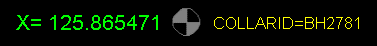
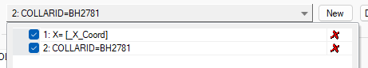
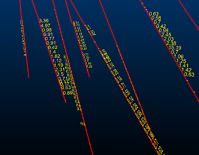

# Planes Properties: Labels

To access this screen:

  * Display the [Planes Properties](<Planes%20Properties%20Dialog.md>) screen and select the Labels tab.

Control the formatting of the labels for drillholes in the active 3D window.

A 'label' is represented by one or more text items. These can be freeform text, calculated values or values of point object attributes, or any combination. Labels are first defined by setting up the Text field with one or more text items (over one or multiple lines) and then defining that particular label's visual formatting.

You can define as many labels as you need, with each label supported by its own formatting settings. This means you could have, say, a large green label indicating the XYZ position of one aspect of your data on the left and a smaller label on the right of your data indicating another attribute value, for example:

   

In the above image, 2 separate labels have been defined for the same object overlay. You can quickly view all labels assigned to a particular overlay using the Label drop-down menu. This lists all labels in a table, letting you enable or disable particular labels as you need to, and even delete unwanted labels, for example:  

You can add labels to the list (and format them independently afterwards) by clicking **New**. 

To add and format labels for 3D overlays:

  1. Check **Display labels** if it is unchecked.

  2. Expand the **Label** list to see all previously defined labels. If none have yet been set up, a default label is added that shows the BHID value for the drillhole overlay. 

**Tip** : each label can be independently checked or unchecked in this list. Unchecked items are not displayed. This can be a useful way to enable or disable labels temporarily without deleting and recreating them.

     * Click **New** to create a new label with a unique numeric suffix. The **Label** description is read-only, but updates as label parameters are specified.

     * Click **Delete** to remove the currently displayed **Label**. This cannot be undone.

  3. Configure your label **Text**. This is what appears in the 3D window(s). 

You can do this in the following ways:

     * Text entered in square brackets indicates that an **attribute** value should be displayed. For example, "[BHID]" indicates that the value of the BHID attribute is required.

**Tip** : check and pick an attribute from the **Column** list and click **Insert** to enter it at the current cursor position.

     * Adding ":.n" after an attribute (all in square brackets) constrains numeric attribute values to _n_**decimal places**. For example, "[LENGTH:.2]" shows the LENGTH value to 2 decimal places.

**Tip** :check and pick an attribute from the **Column** list and choose anything other than _Auto_ in the **DP** list to Insert an attribute and decimal point constraint automatically.

     * Text entered without square brackets is represented **literally**. Whatever you type appears in each label at the position shown.

     * Check **Depth** and click **Insert** to specify that a depth indicator is required. Alternatively, enter "<Depth>" manually (or "<Depth:.3>" where the .3 is a decimal places indicator. 

**Note** : a label can be comprised of one or more elements, and you can mix and match Column, Depth and freeform text elements. For example "Borehole ID: [BHID] at <Level:.2> meters" could be displayed as "Borehole ID VB276 at 220.45 meters".

  4. Configure your label **Font** :

     * Choose your font type:

       * A **2D** font is always displayed 'face on' to the screen and at a constant screen size. If selected, the Plane orientation setting (see below) can't be used.

       * A **3D** font size varies depending on the viewing distance (if the viewing distance is too far, the label disappears). If 3D is selected, you can choose which 3D plane is used to orient your labels (see below).

     * Fontspecify the font style using the accompanying list.

     * Sizespecify the size of font using the spin buttons.

     * Alignmentjustify multiple rows of text to the left, right or centre.

  5. Choose the **Position** of your label (in relation to the data it represents). The options here vary on the type of data you are formatting:   
  
Data type| Option| Description  
---|---|---  
Points| Points| This is the only option for points. Add a symbol at each point location.  
Planes| Planes| This is the only option for planes. Add a symbol at the centre point of each plane.  
Ellipsoids| Ellipsoid Centers| This is the only option for ellipsoids. Add a symbol at the centroid of each ellipsoid.  
Block Models| Blocks| This is the only option for block models. Add a symbol at the centroid of each cuboid.Warning: Be careful with this setting. Models can contain a large number of cells and label display can slow down your system.  
Wireframes| Triangles| This is the only option for block models. Add a symbol at the centre of each triangle.  
Drillholes| Collars| Add a label at the top of each drillhole. If displaying a depth label, the current FROM value is displayed.  
Drillholes| End of hole| Add a label at the bottom of each drillhole. If displaying a depth label, the current TO value is displayed.  
Drillholes| Segments| Add a label for each drillhole segment.**Note** : If displaying a **Depth** label, the depth half way between the **FROM** and **TO** value for the segment displays.  
Strings| Every| Show symbols at the vertex (_Point_) position or the mid point position on each string _Edge_.  
Strings| % along| If you want to position symbols on a string edge, but need more control over precisely where, choose this option and at which part of the edge you want them to appear.  
Strings, Drillholes| Intervals| If the spacing of symbols is important, set the distance between symbols along the data. This could be useful, for example, to create a type of tape measure in 3D, or to show depth markers for a drillhole.  
All| Group by| Labels are displayed by any groups of data that have the same value for the column selected in the accompanying list. Labels are positioned at the center of the groups, calculated as the average position of the relevant points.  
  6. Choose your label Offset. 

Set the position of the label relative to the data. By default, the label is centred on the drillhole. The data is represented by the central black box in the grid.

  7. Define the Orientation of your label.

2D and 3D labels can be set as Screen, Parallel or (in the case of strings and drillholes) Perpendicular orientation. For 3D labels, their orientation can also be set as Plane. The rotation of both 2D and 3D labels, and the requirement to keep them upright can also be specified, under the conditions described below.

     * Screen labels are shown in the plane of the screen, according to the rotation angle. This option is available for both 2D and 3D labels.

     * (String and drillhole overlays) Parallel labels are orientated in the direction of the data.

     * (String and drillhole overlays) Perpendicularlabels are orientated at right angles to the data.

     * Plane only available if 3D is selected in the Font group. Labels are orientated in the specified plane.

**Note** : when the Plane option is selected, labels may appear back-to-front and/or upside-down, depending on the viewing angle.

       * **Azimuth** and **Dip** if selected, then you can define the azimuth of the labels within a range of -360 to 360 degrees, and the dip within a range of -90 to 90 degrees.

       * Sectionif selected, labels are aligned to the section that you select in the accompanying list. You can either select the active section, or any currently-loaded section. 

       * (String and drillhole overlays) Best fit labels are orientated in the best-fit plane of each individual drillhole, as shown below.

;>)

       * (Plane overlays) Plane Orient the text to align with the plane of the data.

  8. Choose if the font should have **Rotation**. Labels are rotated about their centre, within a range of -360 to 360 degrees. How this rotation is applied depends on whether the **Font** is **2D** or **3D** (see above).

The **Rotation** option is available in the following conditions:

     * **2D** labels**Screen** is selected in the **Orientation** group.

     * **3D** labels**Screen** or **Plane** is selected in the **Orientation** group.

  9. Check **Keep upright** to ensure your label remains. This setting only applies to the Parallel and Perpendicular orientation settings, where it is possible to invert your label when the data view is inverted around one axis.

  10. Choose your label **Color** settings. See [Legend Controls](<Legend-Pallete.md>).

  11. Choose your fine-tuning **Options** :

     * Always on topset this option to prevent labels being obscured by the displayed data. This is particularly useful when labelling 3D data which may make it difficult to see labels due to their shape.

     * Group thousandsif labels contain long numbers, selecting this option makes them more readable by separating each group of three digits with a comma.

     * Hide absent values: 

       * If **checked** , absent data values are not labelled.

       * If **unchecked** , absent data values are labelled as "-" in the 3D window.

Related topics and activities

  * [Plane Properties](<Planes%20Properties%20Dialog.md>)

  * [Points Properties: Symbols](<Point_PropDialog_Symbols.md>)

  * [Associated Files](<Associated%20Files%20Dialog.md>)

  * [Info Mode List](<Traces%20Properties%20Dialog%20\(Info%20Mode%20List\).md>)

  * [3D Display Templates](<3D_Templates.md>)