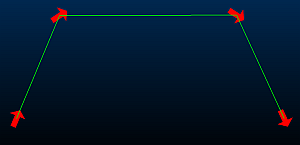
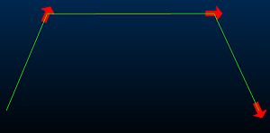

# Points Properties: Symbols

To access this screen:

  * Display the [Points Properties](<points%20properties%20dialog.md>) screen and select the Symbols tab.

Add 2D or 3D symbols to each point and configure their size, rotation and colour. 

A symbol's anchor point (commonly, the central point) is used to position a symbol. By default, a hollow circle symbol is used but this can be changed to any symbol that has been defined in a system library. See [3D Symbols Library](<../COMMON/Symbol%20List.md>).

To configure the symbol used to represent a point or string vertex in the 3D window (for the selected overlay):

  1. Load or create 3D data to format. Make sure it is visible in a 3D window.

  2. Display the **Symbols** screen.

  3. Check Display symbols. If unchecked, symbols are not displayed and can't be configured.

  4. Choose the **Type** of symbol to use:

     * _2D_ A two-dimensional (flat) symbol that is always displayed orthogonally to the view. This symbol can be rotated whilst honouring this orientation, but can't be adjusted in any other plane. A 2D symbol is represented by a bitmap graphic using [Legend Controls](<Legend-Pallete.md>).

     * _3D_ A three-dimensional symbol that can be rotated around any axis. These symbols are always scaled according to the current 3D world magnification. Choose from either:

       * _Default box_ A default cuboid shape appears at each point position.

       * _Imported model_ Show a .x (ActiveX) format 3D object at each symbol position. These 3D shapes can be oriented using **Rotation** controls (see below) around any major axis.

  5. Define **Size** options for the symbol using attribute values, or leave _< none>_ selected, meaning object data values aren't considered when sizing symbols.

     * Legend  Pick the legend that matches attribute values to a size

Note: A filter legend can also be used to define the size of symbols without the requirement to select a column. If a filter legend is selected, then the column dropdown list is not available. Filter legends use logical expressions to denote the various legend intervals. The difference between this and the other legend types is that a legend interval is explicitly defined (for example, AU>=3 AND AU< 10).

     * Column  Pick the data column containing the numeric size values.

  6. Define **Constraints** for the base size value by specifying a Minimum and Maximum size.The constrained values are then multiplied by the value in the **Scale** box to produce the final size.

  7. Set a **Scale** factor, and specify whether the size of symbols refers to their size 'on-screen' or in 'world-space'.

Note: The 'size' of a symbol refers to its longest dimension. 

Sizes can be defined in terms of screen pixels, by selecting Screen in the Scale group (2D symbols only). This setting provides a fixed, 'on-screen' size. Symbols can also be defined in world coordinates by selecting World. This setting allows size to be specified in the virtual world, and results in their size varying according to their distance from the 3D viewpoint in 'world-space'.

  8. (String overlays only) Use **Size adjustments** to differentiate between the first and other vertices of a string, and to optionally change the scale of symbols only on selected data.

     * First symbol you can either leave the point at the default size (No adjustment), **Scale** it by a factor, or **Set** it to a specific size.

     * Selected strings change the symbol size for selected strings using the same options as above. This can help to highlight selected string data in a busy 3D scene.

  9. (String overlays only) Use **Position** settings to define where symbols appear along the target string overlay.

     * Every  Show symbols at the vertex (_Point_) position or the mid point position on each string _Edge_.

     * % along If you want to position symbols on a string edge, but need more control over precisely where, choose this option and at which part of the edge you want them to appear.

     * Intervals  If the spacing of symbols is important, set the distance between symbols along the string. This could be useful, for example, to create a type of tape measure in 3D.

  10. Use **Rotation** settings to orient your symbol in either 2D or 3D space.

     * Fixed rotation (an azimuth around the view plane) is only available for 2D symbols. Enter a rotation value in degrees to orient all symbols by the same amount for the target overlay.

     * Dip / Dip direction / Roll can be set to orient a 3D symbol around any major axis in relation to the current Plane. 

       * Draw in 2D \- Only available for 2D symbols. If selected, then the symbols are displayed in the plane of the screen, but still orientated in the direction that you have specified. If Dipis selected and the Draw in 2D option is not selected, then only _World_ is available in the Scale list.

     * (String overlays only) **Point between lines** : if selected, then the symbol is positioned on each point, and is orientated as follows:

       * At the ends of an open string, it is orientated in the direction of the string segment.

       * On the vertex between two string segments, it is oriented half way between them, as shown below:

     * (String overlays only) Point along lines: if selected, the symbol is positioned on the vertex at the end of each string segment, and is aligned in the direction of the string, as shown below:

  11. Define the **Color** of symbols using [Legend Controls](<Legend-Pallete.md>).

Related topics and activities

  * [Points Properties: General](<points%20properties%20dialog.md>)

  * [Points Properties: Labels](<Points_PropDialog_Labels.md>)

  * [Associated Files](<Associated%20Files%20Dialog.md>)

  * [Info Mode List](<Traces%20Properties%20Dialog%20\(Info%20Mode%20List\).md>)

  * [3D Display Templates](<3D_Templates.md>)