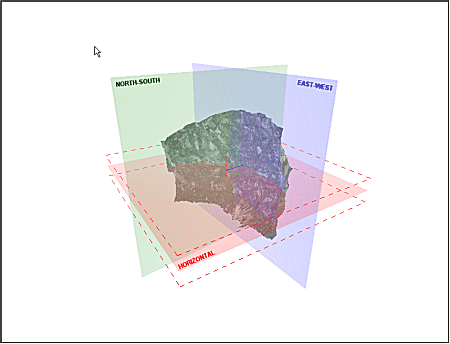

# Orientation by 1 Point

To access this screen

  * Run the [plane-by-one-point ("1")](<../command_help/plane-by-one-point.md>) command (quick key "1") and digitize a point in a 3D window.

  * Run the [view-by-one-point ("v1")](<../command_help/view-by-one-point.md>) command (quick keys "v1") and digitize a point.

  * **View** ribbon **> > Sections >> 1 Point** and digitize a point.

Define the orientation of a 3D window [section definition](<Sections.md>) or view direction using 1 point and specifying an alignment option.

Note: Plane commands adjust the current 3D window [section definition](<Sections.md>) for digitizing and design, whilst view commands simply orient the camera in the active 3D window. These commands are also available in other tasks and on other screens, such as the [Create Vein Surface](<../COMMON/Create_Vein_Surface.md>) screen, for example.

## Section by 1 Point

A Section Definition is the term given to a series of parameters that precisely define a 2D plane in space. This facility exists within the 3D window to allow reference planes to be displayed, providing a basis for indicating particular aspects of your virtual scene, or to be used as a 'canvas' upon which to digitize strings for the purpose of texture alignment, mobile object simulations.

In this scenario, you are defining the plane used in the 3D window for design and view clipping (among other things). You can also use this screen to automatically orient the view to the new section definition afterwards, if you wish.

For a command overview and activity steps, see [plane-by-one-point ("1")](<../command_help/plane-by-one-point.md>).

;>)

After creation, the defined section is added to the end of the list of section objects in the Sections folder of the **Sheets** or **Project Data** control bar.

## View by 1 Point

In this scenario, you are adjusting the view of your 3D data. The [3D Sections](<Sections.md>) isn't changed, only the camera orients to a new view direction.

For a command overview and activity steps, see [view-by-one-point ("v1")](<../command_help/view-by-one-point.md>).

Related topics and activities:

  * [plane-by-one-point ("1")](<../command_help/plane-by-one-point.md>)

  * [view-by-one-point ("v1")](<../command_help/view-by-one-point.md>)

  * [3D Sections](<Sections.md>)

  * [Orientation by 2 Points](<Section%20Orientation%202%20Point.md>)

  * [Using the Sections folder](<workspace_sections.md>)

  * [Section Properties](<Section%20Properties%20Dialog.md>)