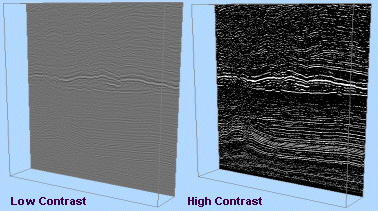

# Section Control

To access this utility:

  1. Use the [Block Model Properties: General](<BlockModels_Properties_Dialog.md>) screen, display the model as a **Quick Section**.

  2. In the **Sheets** or **Project Data** control bar, right-click the same model overlay and select **Quick Section Controls**.

Define the orientation and position of the quick section for the selected block model object, relative to the block model IJK axes.

Activity steps:

  1. Load and display a block model as a _quick section_.

  2. Display the **Section Control** bar.

  3. Choose the plane of the quick section to align with one of the major local axes of the model: IJ Plane, **IK Plane** or JK Plane.

Note: These axes may not align with the XYZ world axes, if the block model is a rotated block model.

The sectional display of data in the 3D window updates.

  4. Use the slider bar to skim back and forth along the selected axis, updating the quick section view dynamically. Alternatively enter a value within the cell range to move to a particular model position.

Note: The number of sections is determined by the block model's **NX** , **NY** and **NZ** parameters, or equivalent for non Datamine format block models. It also allows for situations where minimum X is not necessarily 0. The section spacings are equal to the block model's **XINC** , **YINC** and **ZINC** parameters.

Note: This setting persists for the _Quick Section_ rendering type, including 3D screen redraws but does not carry over to the _Intersection_ rendering type.

  5. Hybrid models are a combination of traditional block model and a binary data dump, designed primarily for rapid visualization of seismic models.

If a 'hybrid' model format is being viewed, such as that used to visualize seismic data, an additional **Contrast** slider is available to allow you to increase or decrease the contrast between colored areas displayed according to a 'fast legend'. For example, the image below shows a section through imported seismic data at different contrast settings:

;>)

Tip: View multiple block model sections simultaneously by loading more than one instance of the same data set, and selecting the Quick Section Controls option for each. This allows you to control more than one section of the same block model independently, with each section available for display formatting using different legends, if desired.

Related topics and activities:

  * [Block Model Properties](<BlockModels_Properties_Dialog.md>)

  * [Block Models Introduction](<blockmodels_introduction.md>)