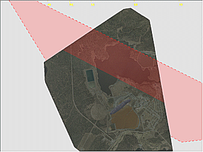
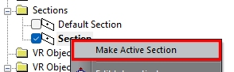
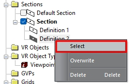
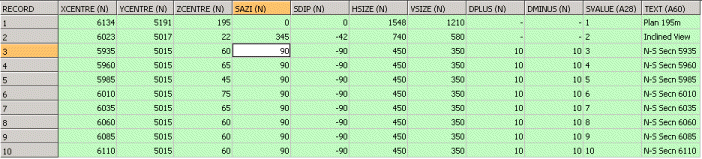
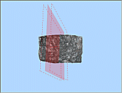
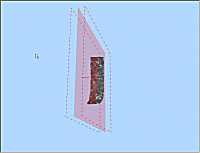
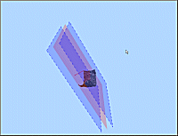
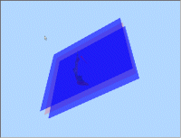
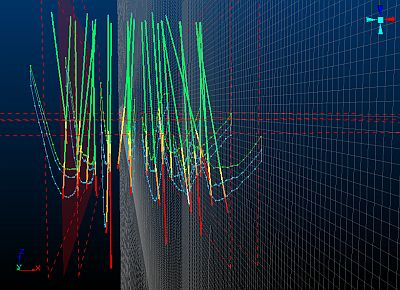
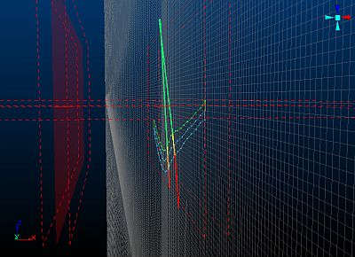

# 3D Sections

3D sections are working planes in 3D space which have user-definable location, orientation and extents parameters. They can be used for digitizing, slicing objects and viewing data within the 3D window. 

3D sections are used for:

  * Displaying a cross-section of loaded data.

  * Acting as a 'canvas' upon which to create new data.

  * Specifying a planar orientation for an application function, such as splitting a wireframe with the [Split Wireframe](<../COMMON/Wireframe%20Split%20Dialog.md>) screen, for example (there are many other commands that can work in a relation to a section definition).

Sections typically have the following properties:

  * Visual settings (colour, opacity and displayed elements). These can only be set for a standalone or parent section.

  * The section orientation (azimuth, inclination) and position (any section type).

  * Its size, for display purposes (sections extend infinitely outwards regardless of what is shown on screen) (any section type).

  * How it clips data each side of the section (by what distance) either as primary or secondary clipping. (any section type).

See [Clipping 3D Data](<Clipping-Data.md>).

You can edit sections by:

  * Displaying either the [Section Properties](<Section%20Properties%20Dialog.md>) (parent and standalone sections) or [Section Row Properties](<../COMMON/SectionRowProperties.md>) (child sections) screen.

  * Opening a saved section definition file in Table Editor and making adjustments.

  * Interactively adjusting a section's position or orientation in real time. See [Section Widgets](<../COMMON/Section_Widgets.md>).

  * Updating the current section using a design command such as [plane-by-one-point ("1")](<../command_help/plane-by-one-point.md>), [plane-by-two-points ("2")](<../command_help/plane-by-two-points.md>), [plane-by-three-points ("3")](<../command_help/plane-by-three-points.md>) and so on.

  * Using section management tools such as [Section Locking](<../COMMON/Section_Locking.md>) and aligning the section with the current view.

  * Adjusting [clipping](<Clipping-Data.md>) settings in the 3D window (this actually changes the active section's clipping definition).

A scene can be supported by one (default) section or multiple sections, each with their own collection of child sections (more on this below).

Sections can be accessed using either the **Sheets** or **Project Data** control bar. You can manage them from there, and can also manipulate them using the **3D View** ribbon.

Tip: You can also double-click a section in any 3D window to see its 3D properties, providing no other data is 'in front' of it.

A 3D section displayed in red in a 3D window

The following concepts are important when discussing sections:

  * Default Section The default section within the 3D window and always present. This is the section created in new projects.

  * **Parent Section** A standalone section which may or may not have child entities. If not, it is also referred to as a 'standalone' section. The default section is a standalone section.

  * **Child Section** One or more sections of the same parent. This collection of sections is supported by a section definition table (see below).

  * Section Definition \- A data object containing multiple section definition records; used when working with regularly used fixed section locations. This can be saved to a physical file.

## The Active Section

A 3D scene can be supported by one or more sections, either as independent 3D sections, or definitions within a 'parent' section object.

Typically, a parent section hosts child sections of different orientations and positions. This collection of section properties is stored as a "section definition" data object which can be reused and even transferred for us in other projects and even products.

Child sections can also have their own size and clipping settings, in addition to the section position and orientation.

You can activate a section (default, parent or child) by double-clicking or tapping its entry in the **Sheets** or **Project Data** control bar. Alternatively, use the context sensitive menu option which will either be Make Active Section for a top-level section object, or Select for a child section.  
  

Making a default or parent section object active - note the bold text

Making a child section definition active \- note the filled in icon and a bold parent item   

Section and definition selections are independent, although a section definition will only become truly active when its parent object is active (as in both images above).

Making a section or definition active can have the following effects:

  * The active section becomes the current 'digital canvas' for digitizing operations where snapping isn't used.
  * If the activated section has clipping properties associated with it, clipping in the 3D view can be altered, although this will depend on other section properties (see below).
  * If 3D objects have been set to be displayed as an intersection with the active section, such as a wireframe or a block model, the view of that data section will be altered, effectively swapped to the new active section. This can be useful where you wish to display multiple objects as an intersection with the same section.

## Section Definitions

A set of section definitions is stored within a section definition data object and can be saved to a physical file. This is a standard Datamine table type and has fixed field (column) names, as shown in the image below (click to expand). It contains the necessary series of parameters used to precisely define a section in space; each record (row) represents a single section:

;>)

In the above example, ten separate sections are defined. The first three columns dictate the geometric centre of the section (**XCENTRE** , **YCENTRE** , **ZCENTRE**), followed by a specification for the azimuth and dip (**SAZI** , **SDIP**). Next up is the overall size of the plane (**HSIZE** , **VSIZE**), followed by **DPLUS** and **DMINUS** , which define the clipping distance either side of the section plane. Each record has a unique section identifier (**SVALUE**) as well as a short description (**TEXT**).

For example, a section definition file could contain four sections representing plan, horizontal, east-west and an arbitrary custom section with 15 azimuth and a 45 dip. Sections within the table can be applied in turn using the **Previous** and **Next** section controls that appear on the 3D View ribbon in most Studio products (Studio Mapper is an exception).

Note: Only the active section is displayed in a 3D window. [Independent 3D windows](<../COMMON/Independent_3D_Windows.md>) can display their own active section. For example, window 1 can display a North-South slice of data with 10m clipping each side and window 2 can display a plan section with 5m clipping.

## Section Clipping

A useful feature of sections is that they allow you to restrict the display of data both in front of and behind the section plane; but not laterally in the plane of the section. Clipping properties can be defined independently for each section, again, using the [Section Properties](<Section%20Properties%20Dialog.md>). 

Clipping limits can optionally be displayed alongside your section, as hatched lines or transparent planes, for example:

 |    
---|---  
Unclipped Data, North-South section showing front and back clipping limits as lines (not yet applied) |  Clipped data, North-South section showing clipping limits as hatched lines. Default colors.  
 |    
Clipped data, North-South section showing clipping limits as transparent planes and lines with default (20%) opacity and non-default color. |  Clipped data, North-South section showing clipping limits as transparent planes only with custom (40%) opacity and non-default color.  
  
Having multiple sections defined and clipping set with each, can easily result in data being hidden from view. This happens when the Disable on Hide option is cleared in the Section Properties screen for a parent or standalone section (child sections don't have this property). Depending on the clipping widths, data can be being hidden when that section is hidden. In order to prevent this, make sure Disable on Hide unchecked.

### Clipping Examples

In the example below, two north-south and one horizontal section are defined. In addition, the current section indicator is displayed, but no clipping is set on any of the sections:

;>)

In the following image, the north-south section on the right is the current section (visible by the position and orientation of the Section Indicator) and has its Clipping option set to Outside. The other two sections both have Section Width parameters set, but have their Clipping options set to None. This results in data only being displayed using the right north-south section's clipping limits. If clipping was turned on for both north-south sections, no data would be visible:

;>)

Related topics and activities:

  * [Section Locking](<../COMMON/Section_Locking.md>)

  * [3D Section Widgets](<../COMMON/Section_Widgets.md>)

  * [Section Row Properties](<../COMMON/SectionRowProperties.md>)

  * [Create or Modify a 3D Section](<../COMMON/3D%20Section%20Manager.md>)

  * [Create Multiple Sections](<../COMMON/Create-multiple-sections.md>)

  * [Clipping 3D Data](<Clipping-Data.md>)

  * [Viewing Data](<../COMMON/Interface_Viewing%20Data.md>)