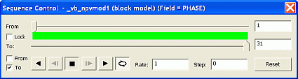

# Sequence Control

To access this control bar:

  1. Load and display 3D data.

  2. Display the corresponding 3D properties screen.

  3. Specify a **Sequence Column**. See [Sequence Animations](<Sequencing.md>).

  4. Click **OK**.

  5. In the **Sheets** or **Project Data** control bar, right-click a block model overlay and select **Sequence Controls**.

The Sequence Control screen is used to control the sequence animation in the 3D window for the selected data. This can be any data type supported by a **Sequence Column** property.

;>)

The Sequence Control screen

How does it work? When a **Sequence Column** is defined, the numeric values held there define a sequence order. The **Sequence Control** screen then defines which value or range of data values are displayed in the 3D window at any point in time.

In essence, this is a tool that dynamically filters the display of data (it never changes data values), which in turn controls what you see in the 3D window. 

Example usage:

  * Playing back a sequence of development activities.

  * Displaying the sequence of pushbacks over the life-of-mine.

  * Revealing grade shells with decreasing cutoffs.

  * Simulating the layout of a drilling plan over time.

  * ...and so on.

## Screen Controls

There's no fixed way to use the Sequence Control screen, so consider it a collection of related tools:

Control | Description  
---|---  
From/To Slider Bars |  Use these bar to determine at which point (according to the Sequence Column) a sequencing animation is to be played from, and played to. The resulting green region indicates the full extent of the animation, when compared to all available sequencing 'frames'.  
Lock | The green area of the slider bar can be used to determine the absolute start and end positions of the sequence animation, but can also be used to simply describe the maximum data viewed on screen at any one time; Data can either be built up from the start (From) point to the end (To) point and then halt (or loop again from the start) - or the green area of the slider bar can be 'locked' to ensure it remains the same size when setting the From and To values, effectively preserving the distance (and subsequently the scope of the animation) during playback.  
Animate From/Animate To |  By default, both of these are checked, meaning the From and To settings defined by the slider bars above are always honoured during animation playback. If either of these check boxes are disabled, the corresponding slider indicator is also disabled during animations. For example, if you elected to disable Animated From and play an animation, data would be built up on screen from the start (From) position, and appended with additional frames (views of data records) according to the specified animation rate. Conversely, if Animated To is unchecked and Animated From is checked, playing back an animation would slowly decrease the amount of data on screen (represented by the green section of the slider bar) until the From and To positions coincided, then the movie will either halt or be replayed from the beginning (see the **Loop** item, below).  
Play back/forward/step back/step forward |     
  
These controls initiate, step through or stop simulation playback. You can play simulations in either reverse or forward directions, and you can stop the animation at any point.  
Loop | Check this to replay the sequencing animation from the start when the final frame has been reached.  
Rate |  Set the 'speed' at which the 'steps' are played. The most appropriate value depends on many factors, including the density of the data and how many 'steps' are in a particular animation.  
Step | Choose the step size in the animation and equates to the number of records displayed or hidden for each frame. It is based on the values in the selected Sequence Column.  
Reset | Reset the From and To positions with this button. This will force the animation to encompass all of the records within the block model database.  
  
Related topics and activities:

  * [Sequence Animations](<Sequencing.md>)