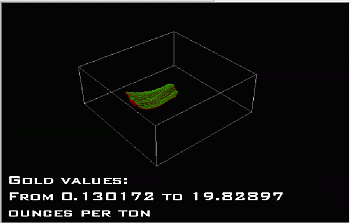

# Sequence Annotation Overlay

To access this screen:

  1. Specify a **Sequence Column** for any supporting data object overlay. See [Sequence Animations](<Sequencing.md>).

  2. Expand the **Annotate** list and select a field containing values to display during animation playback.

  3. Check Show Annotation.

  4. Click Configure.

Use this screen to configure an object's annotation font, position and display text parameters, for use in [Sequence Animation](<Sequencing.md>) playback.

For example:

;>)

To configure annotation for sequence animations:

  1. Display the **Sequence Annotation Overlay** screen.

  2. Click Change to select a new font face, size, style, effects or colour using the **Font** screen.

  3. Click **OK** to return to the **Sequence Annotation Overlay** screen.

  4. Specify the **X** (horizontal) offset for the annotation either by setting the _Pixels from left_ or _Pixels from right_.

  5. Do the same for the Y (vertical) offset.

  6. Next, specify what text you want to appear using the **Display Text** area. Any text may be entered here. When the sequence animation is run, the words `[FROM]` and `[TO]` are replaced by the minimum and maximum values for the annotation column, for the relevant step.

For example, you could display the mining periods from a date (encoded within the Sequence Column) to a date (encoded in the same column) using something like this:
         
         Mining period from: [FROM]  
         To [TO]

An example readout would be:
         
         Mining period from: 06/02/2026  
         To: 10/02/2026.

Note: Click **Reset** to reinstate the default "From" and "To" prefixes.

  7. Click **OK** to return to the 3D properties (**General** tab) screen for your data overlay.

Related topics and activities:

  * [Sequence Animations](<Sequencing.md>)

  * [Points Properties: General](<points%20properties%20dialog.md>)

  * [Plane Properties](<Planes%20Properties%20Dialog.md>)

  * [Pictures Properties](<Pictures%20Properties%20Dialog.md>)

  * [Ellipsoids Properties: General](<Ellipsoids%20Properties%20Dialog.md>)

  * [String Properties: General](<String_Properties_Dialog_General.md>)

  * [Drillhole Properties: General](<DH_PropDialog_General.md>)

  * [Wireframe Properties: General](<Wireframe_Properties_Dialog.md>)

  * [Block Model Properties: General](<BlockModels_Properties_Dialog.md>)