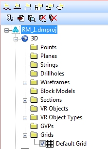

# 3D Data Folders

Your application can display one or more 3D windows. The overlays of each window, that is, the visible representations of loaded 3D data are displayed in each window. 3D windows can be linked, or independent. See [External 3D Views](<../COMMON/External_3D_Windows.md>) and [Independent 3D Windows](<../COMMON/Independent_3D_Windows.md>).

See [The View Hierarchy](<../COMMON/View%20Hierarchy.md>).

Each window is represented in the **[Sheets](<../COMMON/Sheets%20Control%20Bar%20Overview.md>)** control bar as a secondary level item (below the icon representing the project), for example:

Each 'view level' entry in the **Sheets** control bar menu represents an entire view, and can be used to access context-sensitive functions that relate to all overlays displayed in that view and, if any exist, any linked 3D views.

## 3D Menus

Each **3D** window folder controls the display of 3D objects, and gives access to overlay-related functionality.

Right-clicking a view-level icon reveals a standard menu of view-specific commands. Anything actioned here will be applied to all visible overlays in the selected view. 

Each sub-menu (one for each window) splits out visual data into the standard Datamine visual display types (e.g. wireframes, points etc.) and can be used to interrogate and manage all of the 3D overlays associated with those visual data objects:  
  

Each folder (and sub-folder) within this section has a dedicated context-sensitive menu. These commands apply to all overlays of the selected data type, within the selected view (plus any linked views if they exist).

### 3D Data Type Folders

Each 3D view folder contains a sub folder for all recognized 3D data types.

  * Points: contains a list of all 3D point overlays currently associated with your currently active window. See **[3D Points](<Sheets_points.md>)**.

  * Planes: contains a list of 3D planes overlays associated with your project. They are mainly used in the current 3D window to visualize and analyze joint spacing and alignment data for the investigation of joint discontinuities. See **[3D Planes](<Sheets_Planes.md>)**.

  * Ellipsoids: loaded ellipsoids data objects are listed here. See **[3D Ellipsoids](<Sheets_Ellipsoids.md>)**.

  * Strings: contains a list of all 3D string overlays currently associated with your currently active window. See **[3D Strings](<Sheets_strings.md>)**.

  * Drillholes: contains a list of all 3D drillhole overlays currently associated with your currently active window. See [3D Drillholes](<Sheets_Drillholes.md>).

  * Wireframes: contains a list of all 3D Wireframe overlays and plan / section images currently in use in your currently active window. See **[3D Wireframes](<Sheets_surfaces.md>)**.

  * Block Models: contains a list of all 3D block model overlays associated with your currently active window. See **[3D Block Models](<Sheets_blockmodels.md>)**.

  * Sections: contains a list of all default and user defined sections for the active window. See **[3D Sections](<Sections.md>)**.

  * VR Objects: DirectX objects already added to your currently active window are listed here. See **[3D VR Objects](<sheets_vrobjects.md>)**.

  * VR Object Types: object categories are displayed here. You can use the context menu to add new object types to the list, and your currently window. See **[3D VR Object Types](<sheets_vrobjecttypes.md>)**.

  * Grids: lists any 3D grids that you create for the currently active window. Right-click the Grids folder to create a grid that can be applied to loaded objects or sections in the 3D window. See **[3D Grids](<../COMMON/TheGridsFolder.md>)**.

Each folder above has a dedicated right-click menu. Expanding a folder reveals the overlays of that type that are currently available. See [3D Folder Menus](<3D%20Folder%20Menus.md>).