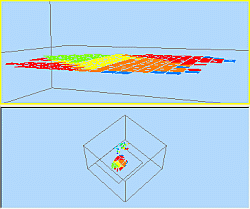
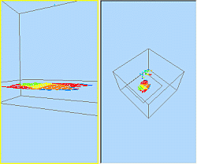
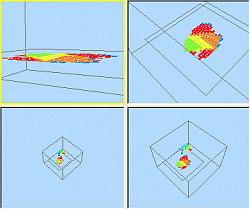

# Splitting Windows  
  
3D windows can be split into either two (vertical or horizontal) or four panes (vertical _and_ horizontal). 

These individual panes can be used for design, visualization and presentation work the same way as a single 3D window. The advantage of split windows is that they provide additional working views of the data without the need to keep adjusting the view as would be the case when using a single window. 

The highlighted pane (the border is highlighted yellow) is the active pane and the one that will respond to a command. Any pane can be selected to be the active plane; moving between planes can be done using either the cursor or TAB key. The split window boundaries can also be resized.

  * The view location and orientation can be defined differently for each split window. 

  * Section orientations are the same across all split windows. See [3D Sections](<Sections.md>).

**Tip** : Use a split 3Dwindow when modeling or designing complex 3D data sets. This will allow the data to be viewed simultaneously from different orientations and thus make it easier to check the location or placement of data e.g. when selecting an item, drawing a string while snapping to objects.

  * A 3D window can be split horizontally:  
  

  * A 3D window can be split vertically:  
  

  * A 3D window can be split both horizontally and vertically:  
  

**Note** : you can also split external 3D windows. See [External 3D Views](<../COMMON/External_3D_Windows.md>).

To create a split 3D window:

  1. Select the 3D window.

  2. Using the Viewribbon's Splitcommand, digitize a point on screen to split the 3D window into 2 or 4 components.

  3. Check that the 3D window has been split either vertically or horizontally (or both). The currently active section has a yellow highlighted border.

  4. Resize the splitters by clicking or tapping and dragging them to new positions, although be careful not to drag one too far, or you will remove it (see below).

To remove a 3D window split:

  1. Select the 3D window.

  2. Drag the window splitter you wish to remove until it reaches the edge or top of the screen, then release the mouse button. Alternatively, disable the active toggle on the View ribbon.

Related topics and activities

  * [About the 3D Window](<VR_Introduction.md>)

  * [External 3D Windows](<VR_Introduction.md>)

  * [Independent 3D Windows](<VR_Introduction.md>)

  * [Independent View Dialog](<VR_Introduction.md>)