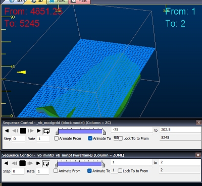

# String Properties: General

To access this screen:

  * In the Sheets control bar, active 3D window, Strings sub-folder, right-click a strings object, select Properties.

  * Double click string data in any **3D** window (including **Task** windows).

Configure the appearance of string data displayed in a 3D window.

String data is formed from connected points. Connections are always straight line, and known as 'edges'. The points are referred to as 'vertices'. Each can be independently formatted.

The **General** screen manages the general properties of a string, including any sequencing options (to allow string data to appear gradually according to a nominated numeric attribute value.

Settings made here affect the current string overlay. An overlay is a representation of a 3D object, and an object can have one or more overlays (or even no overlays at all). See [The View Hierarchy](<../COMMON/View%20Hierarchy.md>).

The **Name** of each string overlay is set automatically, and doesn't have to be unique to the project (but this is recommended, unless you want to group overlays). The Source data is not editable - this is the data _object_ the _overlay_ represents.

### Sequencing String Data

It can be useful to build up strings based on the presence of numeric data. This could be to show the development of underground drive design strings, or the gradual build up of bench crest and toe strings, for example.

First, you must specify a **Sequence Column**. This is a numeric data field in the string's data object. This would typically identify each string trace in the order in which you want them to appear (or disappear).

Data can be animated by _trace_ or _edge_. 

  * **Sequence by Trace** For this type of playback to be effective, the overlay must be showing multiple traces. A trace is either shown or hidden according to its sequence value. This mode is the default, and when **Sequence by Edge** is unchecked.

  * **Sequence by Edge** \- If **Sequence by Edge** is checked, animation affects individual string edges. For example, if a single string trace had multiple vertices that differed in the X direction, you could set the **Sequence Column** to __X_Coord_ with this option selected and gradually build up a single trace during playback.

#### Sequencing Order

By default, animation is set up to reveal data of the overlay from the lowest sequence value to the highest. Ultimately, all data displays. This is the **Forwards** Sequence Option.

You can also show only data represented by the sequence value, hiding all other data. This is the **Single Frame** option.

You can also turn things around and play the animation in reverse, revealing the highest sequence column value first, then building up the view to show the initial string data. This is the **Reverse** option.

#### Other Sequencing Options

Otherwise, you can control your sequence playback using these further controls:

  * Anim. Rate The 'speed' at which the 'steps' are played. The most appropriate value depends on many factors, including the density of the data and how many 'steps' are in a particular animation.

  * Anim. Step The step size in the animation and equates to the number of records displayed or hidden for each frame. It is based on the values in the selected Sequence Column.

  * Loop Animation: select this checkbox to replay your animation from the beginning once the final 'frame' has been displayed.

  * Annotate: select a field from the object that will be shown as on-screen annotation during sequence playback. Select the Show Annotation check box to annotate the wireframe with sequence column data. You can control the formatting of the on-screen annotation using the Configure button to display the Sequence Annotation Overlay dialog. Select Configure to define the annotation's font, position and display text parameters, using the [Sequence Annotation Overlay](<SequenceAnnotationOverlay_Dialog.md>) screen.

In the example below, an annotation attribute has been defined for a block model (**IJK**) and a wireframe (**ZONE**). Each object is supported by its own **Sequence Control** bar below. The annotation is displayed for both objects (although configured differently for each). When the sequence slider of either object is adjusted, the corresponding annotation will be updated automatically.   
  

This can be useful for interrogating data with respect to particular attribute values, or combinations of values. For example, you could render a block model using two separate overlays (by copying one), then sequence model 1 based on a grade value and model 2 on a density value.

  
  

  * String Following: these options control how an object behaves during movement along a string (only if it is used as an alignment string for a flight or drive path for a VR Object in a simulation):

    * Loop Continuously loop objects following this string in simulations.

    * Return Trip Return along alignment string from ends.

    * Offset Stagger objects by a fixed distance following this string in simulations.

  * **Apply Clipping** Enable or disable 3D view clipping for this overlay.

Related topics and activities

  * [Strings Properties: Symbols](<String_Properties_Dialog_VertexVisualTab.md>)

  * [Strings Properties: Lines](<Traces%20Properties%20Dialog%20\(Edge%20Visual\).md>)

  * [Strings Properties: Labels](<StringProp_Labels.md>)

  * [3D Window Visualization](<Visualizing%20in%20VR.md>)

  * [Project a String ](<Strings_Fitting%20a%20string%20to%20a%20surface.md>)

  * [Create Alignment Strings](<Strings_Digitize%20and%20Edit.md>)

  * [Attaching Objects to Strings](<Strings_Attaching%20objects%20to%20strings.md>)