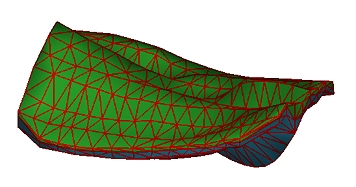

# Wireframe Properties: Lines

To access this screen:

  1. Display the Wireframe Properties screen

  2. On the **General** tab, set the **Shading** to _Wireframe_ , _Highlighted Edges_ or _Intersection_.

  3. Select the **Lines** tab.

Control how a wireframe data represented as a sectional intersection, wireframe line or highlighted edges is drawn to the screen in the active 3D window. 

Tip: These settings are particularly useful for formatting a wireframe intersection view as it allows you to distinguish between multiple wireframe objects displayed in section.

You can also use these settings to achieve more complex formatting of, say, a wireframe displayed with highlighted edges. In this situation, the wireframe can be coloured based on the Color setting on the [General](<Wireframe_Properties_Dialog.md>) tab, whilst the line aspect can be coloured using the color specified on the Lines tab, for example:  
  
  

To configure the line display of wireframe data:

  1. Display the **Lines** tab.

  2. Choose the **Style** of the line, which can be either a **Fixed** line style, or using a Legend lookup (see [Legend Controls](<Legend-Pallete.md>)).

  3. Choose the **Size** (=the width) of the line). This can either be a fixed setting (where <none> is selected for a legend), or you can choose a **Legend** and **Column** to control the width of the string based on data values in the data object.

  4. Either set an independent **Color** for the wireframe line data, or use the Fixed colour set on the **[General](<Wireframe_Properties_Dialog.md>)** screen.

Related topics and activities

  * [Wireframe Properties: General](<Wireframe_Properties_Dialog.md>)

  * [Wireframe Properties: Labels](<WF_PropDialog_Labels.md>)

  * [Associated Files](<Associated%20Files%20Dialog.md>)

  * [Info Mode List](<Traces%20Properties%20Dialog%20\(Info%20Mode%20List\).md>)

  * [3D Display Templates](<3D_Templates.md>)