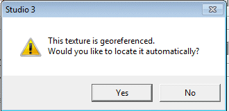
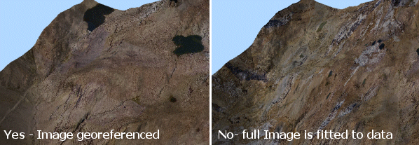

# Draping Images onto Wireframes

Images can be projected from any angle and draped over any wireframe surface to form a wireframe texture, for example you can:

  * Drape an aerial photograph over a DTM and fit the image to match the features of the wireframe.

  * Drape a previously georeferenced image data object onto a wireframe.

  * Load a wireframe with an existing texture, and modify that texture.

  * Drape a texture on an orebody wireframe wireframe. 

If your loaded wireframe already contains texture position information (such as found with data types such as Wavefront .obj files, or .ply files, for example), the texture is automatically applied and located. You can override this behaviour if you wish, using [Wireframe Properties](<Wireframe_Properties_Dialog.md>) and apply a texture manually, or adjust the existing texture using [Texture Drape Settings](<Texture_Drape_Settings_Dialog.md>).

Textures are image files. They can be georeferenced, which may involve positional information embedded within the file itself, or as a partner file (such as .bmpx, .pngx and so on). 

See  **External Georeference Files**, below.

An image may also be without georeference data, meaning it can either be tiled onto a wireframe, or the texture can be oriented manually or interactively (and a subsequent georeference data file saved).

The following file formats can be used as textures in Studio software.

  * Windows Bitmap (*.bmp)

  * Graphics Interchange Format (*.gif)

  * GeoTIFF/TIFF (*.tif, *.tiff)

  * Portable Network Graphics (*.png)

  * JPEG (*.jpg)

  * JPEG2000 (*.jp2;*.j2k)

  * ER Mapper Compressed Image (*.ecw)

  * MrSID Multi-resolution Seamless Image Database (*.sid)

  * Virtual Raster (*.vrt)

  * National Imagery Transmission Format (*.ntf)

  * Erdas Imagine Images (*.img)

  * CEOS SAR Image (*.img)

  * REsTEC/NASDA CEOS (*.dat)

  * ELAS (*.*)

  * Arc/Info Binary Grid (*.adf)

  * Arc/Info ASCII Grid (*.grd)

  * SDTS Raster (*.ddf)

  * DTED Elevation Raster (*.dt0;*.dt1)

  * In Memory Raster (*.mem)

  * Japanese DEM (*.mem)

  * Envisat Image Format (*.n1)

  * Maptech BSB Nautical Charts (*.kap)

  * X11 PixMap Format (*.xpm)

  * AirSAR Polarimetric Image (*.dat)

  * RadarSat 2 XML Product (*.xml)

  * PCIDSK Database File (*.pix)

  * PCRaster Raster File (*.map)

  * ILWIS Raster Map (*.nsc)

  * Swedish Grid RIK (*.rik)

  * Portable Pixmap Format (netpbm) (*.pgm;*.ppm)

  * USGS DOQ (Old Style) (*.doq)

  * USGS DOQ (New Style) (*.doq)

  * ENVI .hdr Labelled (*.hdr)

  * ESRI .hdr Labelled (*.hdr)

  * PCI .aux Labelled (*.aux)

  * Atlantis MFF Raster (*.hdr)

  * Atlantis MFF2 (HKV) Raster (*.hdr)

  * Fuji BAS Scanner Image (*.*)

  * GSC Geogrid (*.*)

  * EOSAT FAST Format (*.*)|*.*

  * VTP .bt (Binary Terrain) 1.3 Format (*.bt)

  * Erdas .LAN/.GIS (*.lan;*.gis)

  * Convair PolGASP (*.*)

  * Image Data and Analysis (*.img)

  * NLAPS Data Format (*.hd;*.h1;*.h2)

  * NOAA Polar Orbiter Level 1b Data Set (*.*)

  * FIT Image (*.*)

  * Raster Matrix Format (*.rmf)

  * EUMETSAT Archive native (*.nat)

  * USGS Optional ASCII DEM (and CDED) (*.dem)

  * GeoSoft Grid Exchange Format (*.gxf)

## External Georeferenced Textures

Many of the formats listed at the start of this topic have the ability to store additional metadata that represents the local coordinate positioning for the image file in relation to the loaded 3D surface. Where the loaded wireframe surface correlates with the image file (or files - multiple georeferenced images can be applied to the same surface. 

Similarly, a single image file may only be partly utilized to drape a smaller wireframe. This process is automatic, but you will have to accept the prompt that is shown when these extended image formats are loaded into the 3D window:

Selecting Yes at this prompt will force Studio to align the reference points specified in the loaded image with the corresponding points on the loaded wireframe object. Selecting No will resize the image so that it is fitted to the maximum data extents of the wireframe surface. For example, the loaded image, was automatically (and correctly) referenced in image 1 but in image 2, **No** was chosen.

;>)

Related topics and activities

  * [Texture Drape Settings](<Texture_Drape_Settings_Dialog.md>)

  * [Wireframe Properties: General](<Wireframe_Properties_Dialog.md>)

  * [Wireframe Texture Options](<Wireframe-Texture-Options.md>)

  * [Image Registration](<ImageRegistration_Dialog.md>)