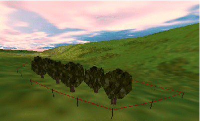
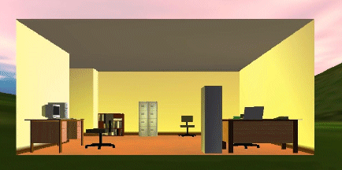

# VR Objects and Types

VR objects are ideal for simulating both static and dynamic scene elements. The object's shape and other simulation properties such as movement capabilities, light sourcing, sound and orientation are inherited from its **type**.

## VR Object Types

A VR Object Type represents the visual appearance of a simulation object. This includes its 3D model, movement capabilities, lighting audio and orientation in relation to the world.

As such, each distinct 3D model is represented by its own type. VR object types are defined before their corresponding objects (which all inherit properties from the type).

Once a type has been defined, you can drop objects of that type into your scene using the VR Object Type's **Place Objects** command. Once the objects exist, they can be formatted independently using further controls.

;>)

An example of tree VR objects based on the same type, aligned to a topography surface

A good example of a VR object type is a haultruck. It can have its own distinct 3D appearance (unique to that type), a maximum speed, acceleration, climbing capabilities, lights, sound and orientation. These properties are defined using the [VR Object Type Properties](<Object_Type_Properties_Dialog.md>) screen.

Otherwise, objects can be static. See [Stationary VR Object types](<Objects_Stationary%20objects.md>).

A collection of different object types sitting in a wireframe cuboid

Every object of the same type will inherit these properties. 

**Note** : Typically, the type is defined before the objects, but it is possible to set up generic objects and assign them to types afterwards.

## VR Objects

Once objects have been placed into a scene, they must be 'attached' to other scene data. VR objects are either attached to a string or wireframe (surface or volume).

VR objects are defined using the [VR Object Properties](<Object_Properties_Dialog.md>) screen.

This can be as simple as attaching an object to a one-point string that exists somewhere in your 3D scene (maybe a light source sitting above the topography). 

The data to which the object is attached can be shown or hidden. For example, you could set up a string for a viewpoint to following during a 'fly by' of a 3D scene, but hide the string and viewpoint object. See [VR Objects and Simulations](<Objects_Simulation%20objects.md>).