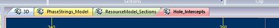
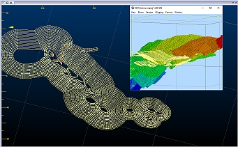
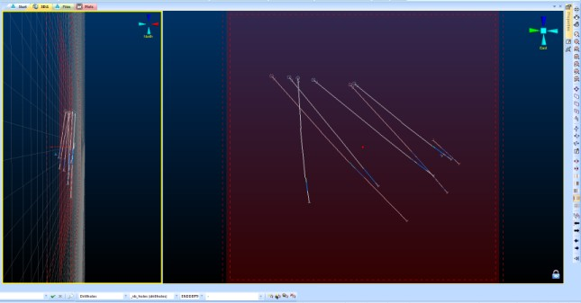
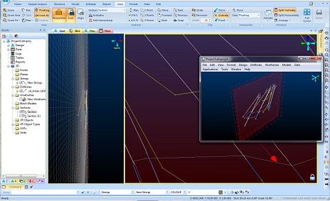
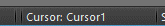

# 3D Window Visualization

Note: A Datamine [eLearning course](<https://datamine.learnupon.com/>) is available that covers functions described in this topic. Contact your local Datamine office for more details.

Some 3D visualization programs do little more than spin the data around, whereas a Studio 3D window lets you move around inside your data. The data links then give you access to as much detail about the objects as you require and enable easy access to plots, logs, reports and charts without specialist knowledge of where the data is stored, the format it is stored in or the programs used to create them - in other words, it puts everyone directly in touch with the project.

  * 3D Default Window: This window is always available to your system (although it does not have to be visible). This window display can be toggled using the Home ribbon's Show menu. This has traditionally been referred to as "the 3D window" (capitalization included). Throughout this help file, references to "the 3D window" can be considered synonymous with "the active 3D window", meaning any 3D window, system or independent (see below). 
  * External-Linked: A floating window that is linked to a current ("parent") window. This window will automatically update if the contents, overlay formatting, clipping, grid and/or section definition is changed in the parent window. 
  * Any 3D window can be used to spawn an external-linked window. See [External 3D Views](<../COMMON/External_3D_Windows.md>).
  * Embedded-Independent: A new window within your application frame. These windows have their own display tab and can be accessed as any other window, for example:

;>)

The title image shows two independent embedded views and a single independent external view (see below). 

Any 3D window can be used to spawn an embedded-independent window. See [Independent 3D Windows](<../COMMON/Independent_3D_Windows.md>).  

  * Embedded External: similar to external linked views, this option allows you to create a standalone, floating 3D window that can be independently formatted in the same way as its linked counterpart (but without affecting the parent window used to spawn it), e.g.:

;>)

Any 3D window can be used to spawn an independent-external window.

A 3D window provides the following key functions:

  * Design and Modeling \- design and modelling in a virtual reality environment. See [3D Design](<Designing_in_VR.md>).

  * Geological data immersion \- Display fault planes, geophysical grids, geological interpretations, structural models, grade models, drillholes and terrain surfaces, then color and texture the objects to reveal their hidden secrets.

  * Real world data connection \- every object in the virtual world can be linked to other documents and programs accessible on the local network, company intranet or worldwide Internet. You can click on say a drillhole to display a drill log or section plot, or on a blast markup line to report the tonnes and grades, or step inside the mine office and click on the telephone to dial-up and upload the latest drilling results \- the possibilities are endless and limited only by your imagination. 

  * Terrain navigation \- jump into any vehicle and take it for a drive up the road, across country, or down the mine. Take a visitor or a company director on a virtual tour of your exploration project or mine site. Change the transparency of the terrain surface and peer down to see the orebody and pit design. 

  * Fly-thru's \- drape an aerial photo over your terrain surface, grab a joystick and go flying. Swing down into the pit then dive below ground and fly right inside the orebody. 

  * Simulations \- define haulage routes, then add trucks, shovels, draglines, drill rigs and service vehicles and watch the mine come to life.

  * Sequence Animations \- play back sequencing animations. See [Sequence Animations](<Sequencing.md>).

  * Section Views \- show sections through geological models in 3D space. See [3D Sections](<Sections.md>).

These functions provide the following benefits:

  * Maximizes the value and use of the data

  * Controls what data can and should be published

  * Simplifies access to specialist data sources

  * Minimizes time spent in managing published data

  * High impact presentation of exploration projects, mine development proposals, mine expansion plans and mine site activities

  * Uses industry standard data connections to maximize available data sources.

## Drawing Units

Each 3D window (or window collection - see below) can render 3D items, that require a height or width property, in one of two ways:

  * Rendering 3D items to be a particular height and/or width in millimetres. This ensures data is drawn to the screen at the same size on monitors with differing size and/or resolution. This is the default setting for all new projects.

  * Rendering 3D items using pixel width and/or height. This is the method adopted by Studio products prior to October 2021. Data may appear at a different relative size between different monitor configurations.

## Locking 3D Sections

;>)

Sometimes, it is useful to be able to digitize to a fixed section plane that is orthogonal (face-on) to the camera. Each 3D window allows you to lock the current view to the active section to allow you to digitize in a similar manner.

Once a section is locked, a padlock indicator appears in the bottom right corner of the window. See [Section Locking](<../COMMON/Section_Locking.md>).

#### External 3D Views

;>)

One of the great improvements made with the advent of Studio RM (and subsequently in Studio EM, OP and UG) was the ability to create a standalone, floating 3D window that is dynamically linked to all other views, including locked sections. All of these windows are 'live' in that they can be used for digitizing, editing and other purposes. Once set up, you can digitize in true 3D by using multiple windows to create data points, even within the same command. See [External 3D Views](<../COMMON/External_3D_Windows.md>)

## 3D Window Cursors

[Custom 3D window cursors](<../COMMON/CursorEditor.md>) can be set independently for each view. Once a view is active, the cursor associated with that view is shown on the Status Bar, e.g. 

**Tip** : When 3D windows are [split horizontally and/or vertically](<Split_Windows.md>), each window 'split' can have its own custom cursor.

## Multiple 3D Windows

Your application supports multiple, linked 3D windows.

These additional windows can be additional representations of the current window (and linked to it), either by splitting the screen [horizontally and/or vertically](<Split_Windows.md>), or can be an ['external'](<../COMMON/External_3D_Windows.md>) floating view that is connected to your primary 3D window data and formatting options. All of these views are linked to a single data source and formatting settings.

Each window is supported by its own Sheets control bar sub-menu.

Independent 3D windows are also available. These allow you to set your own window-specific formatting of overlays, sections, grid and many other scene controls. Independent windows can either be embedded or external/floating.

## Hardware vs. Software Rendering

There are wide variety of hardware options for PC users, and your application will attempt to make the most effective possible use of your graphics card in all situations.

The broad spectrum of graphics hardware, whether on-board or installed separately, rely heavily on the software drivers that allow the various components to interact and display the expected visual output. However, it is not possible, with the ever-changing nature of this aspect of PC technology to guarantee total compatibility with all possible hardware options, and all possible settings that accompany them. In the distinct majority of cases, InTouch will utilize the available hardware graphic resources to their optimum level.

As well as supporting hardware graphic devices (if installed), your system will also support a software-based rendering facility. Although this can result in a slightly reduced graphics performance when compared to an installed graphics card, this is often a useful way of resolving graphic-card-related issues such as incomplete rendering, poor rendering performance or other unexpected screen display output.

More information on graphics card support in Studio products

The following Knowledge Base articles offer more detailed help on graphics card support in Studio products (requires Internet connection and Datamine Support Website login credentials):

  * [Graphics card recommendations](<https://datamine.freshdesk.com/en/support/solutions/articles/19000045479-studio-products-graphics-cards-recommendations>)
  * [Graphics card driver maintenance](<https://datamine.freshdesk.com/en/support/solutions/articles/19000063017-graphics-cards-checking-and-maintaining-drivers>)

To create a new embedded, independent 3D window:

  1. Activate the View ribbon
  2. Select New 3D Window >> Independent
  3. Using the [Independent View](<../COMMON/IndependentView_Dialog.md>) screen, choose a name for the new window (this will appear on a new window tab)
  4. Select the Embedded option.
  5. Choose if you want to copy the overlays from the currently active window to the new window.
     * If Copy overlays from the current view is checked, overlays from the currently active 3D view are copied to the new one, and can be modified independently afterwards.
     * If Copy overlays from the current view is unchecked, an empty 3D scene will be created.
  6. Click OK. Your new window is displayed automatically. A new branch is added to the Sheets control bar, and is automatically expanded for the new view.

To create a new embedded, external 3D window:

  1. Activate the View ribbon
  2. Select New 3D Window >> Independent
  3. Using the [Independent View](<../COMMON/IndependentView_Dialog.md>) screen, choose a name for the new window (this will appear on a new window tab)
  4. Select the External option.
  5. Choose if you want to copy the overlays from the currently active window to the new window.
     * If Copy overlays from the current view is checked, overlays from the currently active 3D view is copied to the new one, and can be modified independently afterwards.
     * If Copy overlays from the current view is unchecked, an empty 3D scene is created.
  6. Click OK. Your new window is displayed as a floating screen. This window features the same controls as the standard [External 3D Window](<../COMMON/External_3D_Windows.md>) dialog.

Related Topics and Activities

  * [Splitting the 3D Window](<Split_Windows.md>)
  * [External 3D Windows](<../COMMON/External_3D_Windows.md>)
  * [Independent 3D Windows](<../COMMON/Independent_3D_Windows.md>)
  * [Independent View Dialog](<../COMMON/IndependentView_Dialog.md>)
  * [Custom 3D Window Cursors](<../COMMON/CursorEditor.md>)