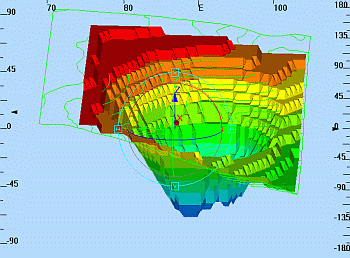

# Heading, Pitch and Roll Indicators

To show or hide 3D window indicators:

  * **3D View** ribbon **> > 3D Display >> Scales >> Heading Scale**.

  * **3D View** ribbon **> > 3D Display >> Scales >> Pitch Scale**.

  * **3D View** ribbon **> > 3D Display >> Scales >> Roll Scale**.

The Heading, Pitch and Roll scales are used to indicate the angular deviation of the view from north and the horizon..

## Heading, Pitch or Roll?

The Heading scale is located along the top edge of the active 3D window and the heading values (a range of 0-360 degrees, clockwise from north) change as the view direction changes. The direction of the view is indicated by the value in the centre of the scale. The Pitch scale is located along the left edge of the active 3D window and indicates the dip of the view relative to the horizontal. Pitch can be up (0-90 degrees)i.e. looking up, or down (-90 -0) i.e. down. The Roll scale is located along the right edge of the window and has values ranging from -180 to 180 degrees. It represents the rotation angle of the view away from the horizontal, about an axis indicating the heading+pitch orientation.

 |  In order to get a feel for how different view orientations translate to different heading, pitch and roll values, toggle on the three indicator scales and then select different view orientations use the various view and navigation controls.  
---|---  
  
## When to Use These Indicators

When setting up and using Viewpoints, the heading and pitch scales can be used to indicate the direction and dip of a particular view e.g. the direction and dip down a particular underground mining drive. When setting up and using [flythroughs](<Simulation_Creating%20a%20Flythrough.md>) or driving 3D Objects along wireframe surfaces in Control Object view mode, the three indicators provide comprehensive orientation information for the moving 3D Object at any point along it's travel path. The latter may be used to check a detailed open pit ramp or an underground excavation haulage route design for irregularities in the drive surface.

 |  Related Topics  
---|---  
| [Navigation controls](<VR_Navigational_Controls.md>) [View modes](<VR_Navigation_Modes.md>)