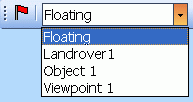

# Viewpoints

**Note** : 3D viewpoints can be set in all Studio products apart from Studio Mapper.

A viewpoint is either a floating or fixed position from which data can be viewed in the 3D window.

Only one floating viewpoint is available, namely the viewpoint "Floating". It is associated with Floating view mode and has the Pan View, Zoom View and Spin View navigation control options. Equivalent mouse and keyboard navigation control options are also available. See [Navigational Controls](<VR_Navigational_Controls.md>).

Viewpoints are stored as part of your project. In many Studio products, available viewpoints can be selected using the **3D View** ribbon. Selecting a viewpoint automatically orients the view.

A list of viewpoints on the 3D (view) ribbon menu

Stored viewpoints are related to the view in which they were originally captured; the active **3D** window and, if your product supports one, the Task window have their own viewpoint lists and their contents are not transferable between windows.

See [Navigation guide](<VR_Navigational_Controls.md>). 

Using viewpoints, you can also create a mobile viewpoint to represent a vehicle or a mining machine. This can be driven in **Control Mode** , or attached to strings for a fixed travel path or fly-thru.

For more information on how to create mobile viewpoints see [Mobile Objects](<Objects_Mobile%20objects.md>).

To create a viewpoint:

  1. Orient a 3D view as required.

  2. Activate the **3D View** ribbon.

  3. **Viewpoints >> Store.**

The viewpoint is added to the **View** list. The name is "Viewpoint" with an incremental suffix.

To apply a viewpoint:

  1. Activate the **3D View** ribbon.

  2. Expand the **Viewpoints >> Store >> View** list.

  3. Select the viewpoint to apply.

Related topics and activities

  * [Mobile Objects](<Objects_Mobile%20objects.md>)

  * [Navigational controls](<VR_Navigational_Controls.md>)

  * [View modes](<VR_Navigation_Modes.md>)