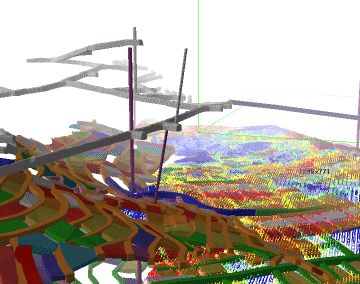

# 3D Window Visualization

Datamine products have long featured 3D windows to render and visualize your loaded geometric data. 

You render your data for a multitude of different reasons, with a 3D window providing the flexibility to match an impressive array of situations, from simple visualization of geometry to real-time realization of mine resources operating within photo-textured worlds.

You can have one or more 3D windows displayed, and these windows can either be linked or completely independent. See [External 3D Views](<../COMMON/External_3D_Windows.md>) and [Independent 3D Windows](<../COMMON/Independent_3D_Windows.md>).

The 3D window's visualization capabilities include (but are not limited to) the following:

  * Full scene, object group, or independent item visualization, with full spin, pan and zoom controls. 

  * Photographic texture support, including georeferenced textures. This facility is only available via the 3D window.

  * Context-sensitive configuration allowing you to set the display properties (transparency, base format, border, colour, exaggeration and more) for any data object within a scene.

  * The 3D window derives data from your project files, but allows you to 'spawn' as many copies and variations of data as are required. Additional data can be created and visualized instantly. See [The View Hierarchy](<../COMMON/View%20Hierarchy.md>).

  * Environmental effects, such as [lighting](<environment_adding%20more%20light%20sources.md>), [sky](<Environment_Sky.md>) and [fog](<Environment_Fog.md>) can be applied without leaving the 3D window.

  * Data can be clipped to show a cross-section through each data type. Ideal for geological interrogation. See [Clipping 3D Data](<Clipping-Data.md>).

Related topics and activities

  * [Viewing Data](<../COMMON/Interface_Viewing%20Data.md>)

  * [The View Hierarchy](<../COMMON/View%20Hierarchy.md>)