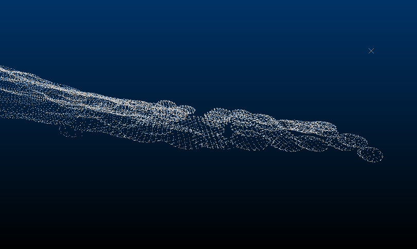
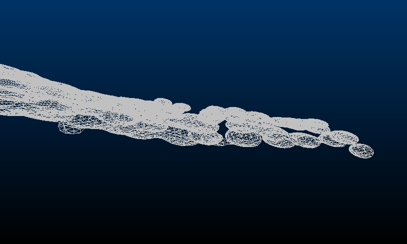
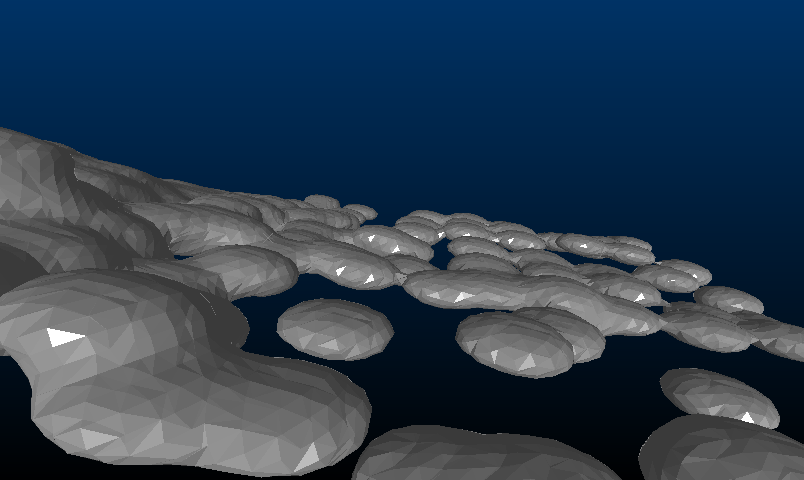
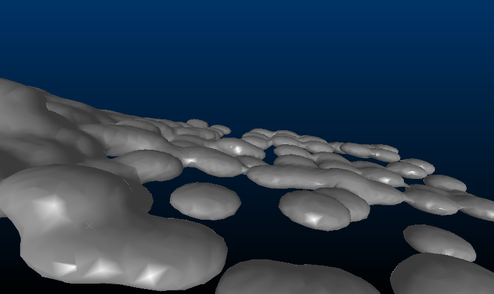
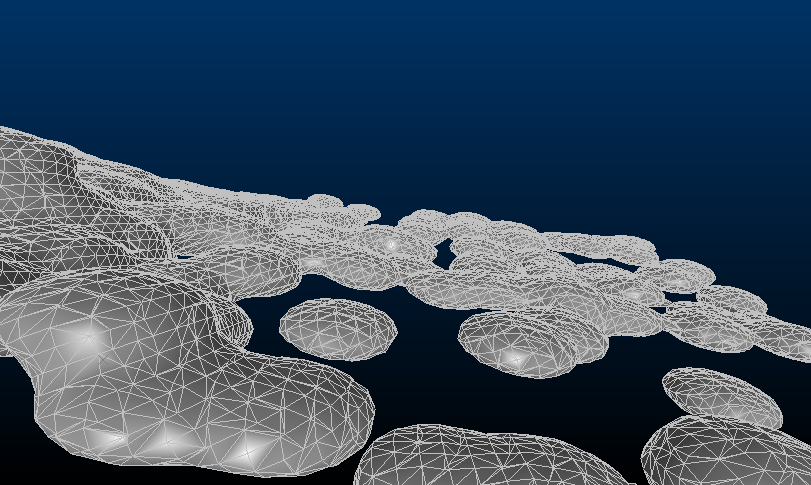
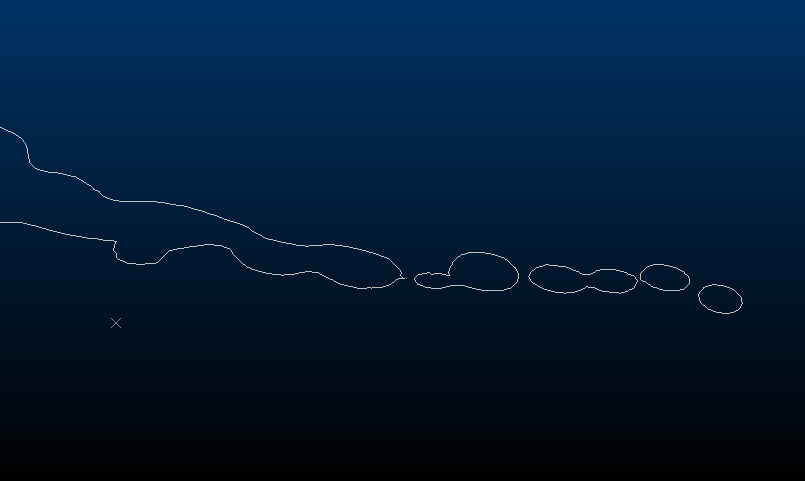
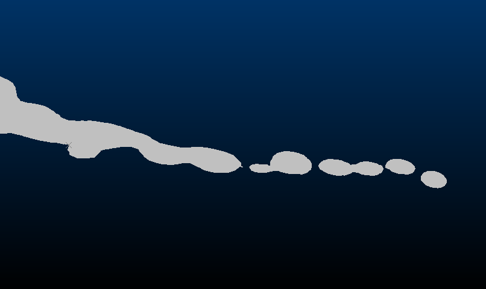
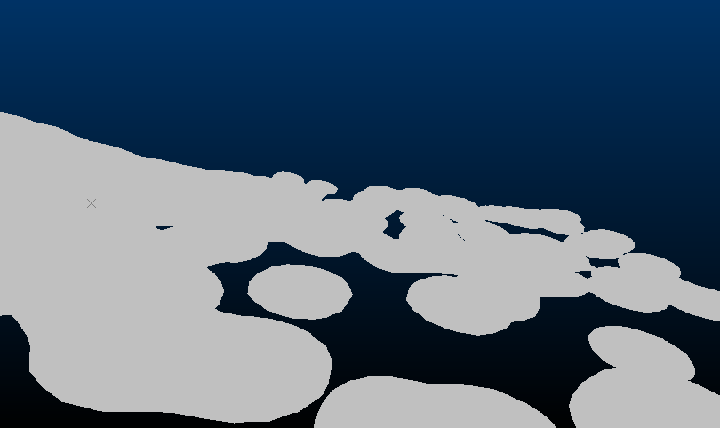
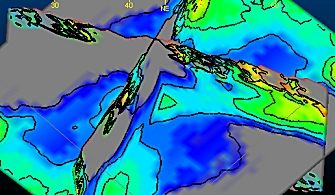

# Wireframe Shading Methods

The **[Wireframe Properties](<Wireframe_Properties_Dialog.md>)** screen is used to format the appearance of wireframe overlays in 3D windows.

These options determine the rendering method used to display wireframe data.

| Shading Mode | Comments  
---|---|---  
;>) | Points | Display the current wireframe as vertex data only. This data is held in the "wireframe points" file, typically ending with a "pt" suffix prior to the file extension.  
;>) | Wireframe | Display only the wireframe edges.  
;>) | Flat | Shade wireframe triangles distinctly and individually.  
;>) | Smooth | Interpolate (dither) the shading between wireframe triangles.  
;>) | Highlighted Edges | A combination of **Smooth** and **Wireframe** modes.  
;>) | Intersection | Display the cross-section of the wireframe with the current (active) section, or the **Intersection Section** , which can be any loaded section definition.  
;>) | Intersection (filled) |  If Intersection is selected, you can fill intersection outlines with **Fill intersection**. This also caps the ends of wireframe data that has been clipped in the view. **Note** : This setting is currently offered as a preview only. We are planning further work on ensuring the display is correct for multiple overlapping volumes.  
;>) | Unlit | Available for Flat and Smooth modes, if Unlit is checked, a solid colour (no **[environmental lighting](<Environment_Lighting.md>)**) is used to render the wireframe data.  
;>) | 3 Way Intersection | Only available for **3D Variogram** window data. Selected by default for all generated isosurfaces that support a variogram map display (using the Advanced Estimation \- [Investigate Anisotropy](<../STUDIO_RM/Multivariate_Investigate_Anisotropy.md>) screen). The selected wireframe surface is shown as an intersection with all 3 displayed sections. This differs from the standard Intersection option (see above) which will only display an intersection with the currently active display section.  
  
Related topics and activities

  * [Wireframe Properties: General](<Wireframe_Properties_Dialog.md>)

  * [Associated Files](<Associated%20Files%20Dialog.md>)

  * [Info Mode List](<Traces%20Properties%20Dialog%20\(Info%20Mode%20List\).md>)

  * [3D Display Templates](<3D_Templates.md>)

  * [Sequencing](<Sequencing.md>)

  * [3D Sections](<workspace_sections.md>)