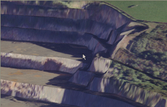

# Wireframe Texture Options

The **[Wireframe Properties](<Wireframe_Properties_Dialog.md>)** screen is used to format the appearance of wireframe overlays in 3D windows.

An example of a textured wireframe

You can apply a texture to your wireframe to show real-life landmarks, guide digitizing or survey reporting or even overlay information to enhance the display.

The following options are available:

  * _None_ Disable all texture mapping for the target wireframe. If the wireframe is currently textured (either with a nominated image file or using embedded triangle-based texture information), selecting this option disables texturing and displays the wireframe in whichever Color is set.
  * _Texture image_ Browse for a texture image. If the selected image contains georeferencing information (for example, as part of a .png/.pngx file pair or an .ecw format file), you are asked if you wish to use this data. See [Draping Images](<Surfaces_Draping%20images.md>). 

  * _From object_ If your loaded data object contains per-triangle texture position information, you can choose to use it with this option (this is the default option for certain wireframe data types, such as Wavefront .obj files and similar). If selected, the triangle-based information is used to position your wireframe texture.   

If your loaded wireframe object does not contain embedded texture position information, the From object option is unavailable.

Note: If your loaded data object supports per-triangle texture position information (such as with loaded .obj, .ply and similar data object types), this information is set for texturing by default.

Related topics and activities

  * [Wireframe Properties: General](<Wireframe_Properties_Dialog.md>)

  * [Associated Files](<Associated%20Files%20Dialog.md>)

  * [Info Mode List](<Traces%20Properties%20Dialog%20\(Info%20Mode%20List\).md>)

  * [3D Display Templates](<3D_Templates.md>)

  * [Sequencing](<Sequencing.md>)

  * [3D Sections](<workspace_sections.md>)