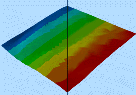
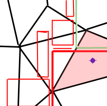
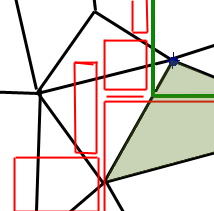

# Wireframe Properties: General

To access this screen:

  * **Sheets** control bar **> > 3D >> Wireframes >> Right click >> Properties**.

  * Double click a wireframe object overlay in any **3D** window.

Manage the rendering and sequence animation options for a wireframe surface displayed in a 3D window. 

These settings affect the target overlay only, although that overlay may be represented in multiple linked windows.

To configure the 3D formatting of a wireframe overlay:

  1. Review the Name of the target overlay and edit it if required. This does not rename physical data files.

  2. If the in-memory data has an associated physical file, the file pair (triangles and points) appears in **Source**.

  3. Choose the Shading method. See [Wireframe Shading Methods](<Wireframe-Shading-Methods.md>).

  4. If you have chosen a **Wireframe** shading mode, you can apply a **Texture** to your wireframe. See [Wireframe Texture Options](<Wireframe-Texture-Options.md>).

  5. Choose the **Color** options for your wireframe. See [Legend Controls](<Legend-Pallete.md>).

  6. If the **Intersection** option is active, pick an **Intersection Section**. This is the section used to create a cross sectional profile of the target wireframe. It is displayed using the current **Fixed** **Color**.

  7. To animate wireframe data based on numeric index field, pick a Sequence Column. Use the object's [Sequence Controls](<Sequence%20Control%20Dialog.md>) tool to play back the animation, using these settings:

     * **Forwards** Sequence the animation according to the increasing value of the selected attribute.

     * **Single Frame** Replace instead of adding to displayed view frames.

     * **Reverse** Play the sequencing animation for the selected Wireframe starting with the highest record value and working backwards. In most circumstances, this will result in the view of a Wireframe being eroded throughout the animation.

     * **Anim. Rate** Select a play rate, units per simulated second. These values effect the appearance of the Wireframe when the simulation Play button is pressed. A positive value in the rate setting adds new faces to the empty mesh as time progresses. A negative value in the rate setting removes faces from the completed mesh.

     * _Anim. Step_ Used in conjunction with Anim. Rate (see above), group points of data so the animation is built up in larger 'blocks' than before. 

For example, if the animation rate were constant between two simulations, setting an **Anim. Step** to zero in simulation 1 causes a build up of data on a row-by-row basis. If a step of 10 were implemented, the model is built up 10 blocks at a time, with each animation phase remaining for 10 times longer.

     * _Loop_ Make the animation repeat.

     * Annotate Select a field from the object containing values shown as on-screen annotation during sequence playback. Check Show Annotation and configure the text display using the [Sequence Annotation Overlay](<SequenceAnnotationOverlay_Dialog.md>) screen.

  8. Choose wireframe **Face Direction** options:

     * Verify  Attempt to produce consistent face normals from the input wireframe when generating the visualisation. Leaving this option unchecked will honor the wireframe's original normal directions. Choosing this option will result in slower preprocessing of the object on loading the visualisation.

Tip: To avoid duplicate verification stages in the future, another option would be to use Verify option in the **Project Files** control bar and save the resulting object. 

     * **Double side** Render both sides of the Wireframe. Double Side, actually generates 2 versions of the Wireframe: the normal one, and one with the normals flipped. This means that you can see it from both sides (but does create twice as much geometry, slowing things down a little). Obviously Flip Normals makes no sense with Double Side, which is why it is disabled in this case. 

     * Flip Normals Turn an object inside out. A Wireframe normal is the vector which determines in which direction a face is pointing. In DirectX, faces can normally only be seen from one (the 'outside') as determined by the face normal. Flipping Normals leaves the geometry exactly where it is, but allows it to be seen from the other side instead (e.g. inside the tunnel, instead of outside).

     * Crease angle Specify the crease angle, which is the maximum angle between 2 faces at which smooth shading is applied. Any angles sharper than this will have a well-defined edge between the faces, whereas any angles less than this will look like smooth curve (default '45').

  9. If a block model is loaded, you can superimpose its colours on the wireframe by checking **Color with Block Model**. Pick a load block model and use the Column list (see above) to choose a block model field containing values for colouring (an appropriate legend must also be picked).

  10. Set the **Opacity** of the wireframe using the slider.

  11. Set wireframe rendering general **Options** :

     * Use vertex color data Interpolate colour across each wireframe face. In effect, display a softer boundary between different values. For example, the image below shows a wireframe coloured according to the X coordinate position. The left-hand section of the image is displayed without vertex colour data and the right shows a comparative view, with the face display interpolated:

When colouring a wireframe based on block model cell display values (for example, to see how a wireframe wireframe interrelates with a geological model at the same location), this option will determine how colours are assigned to each wireframe triangle:

       * If **unchecked** , the position of the centre of each wireframe triangle (the 'centroid') is important as the triangle is coloured according to the block model cell (or subcell) that it falls within, taking the colour associated with the block model legend and column at that position. For example, in the image below, the centre of the wireframe triangle (shown as a blue dot) falls within a model cell that would be drawn in red:

       * If **checked** , the subcell the vertex of each wireframe is located within controls the vertex colour, as opposed to the triangle centroid. Continuing the example above, this time it is the vertex of the wireframe that dictates the colour of the triangle; as the vertex (represented by the blue dot) falls within a green model cell:

     * Transparent texture Make black transparent in the applied texture.

     * Tile texture Repeat (tile) a texture across the wireframe surface(s).

     * Tile size When applying a texture from a legend, the Legend tile size is the factor by which the texture block is scaled.

     * Shiny Surface To change the wireframe reflectiveness. 0 (zero) equates to a dull plastic whilst 100 is a very reflective surface.

  12. Click **OK** or **Apply** to update the target wireframe overlay.

Related topics and activities

  * [Wireframe Shading Methods](<Wireframe-Shading-Methods.md>)

  * [Wireframe Texture Options](<Wireframe-Texture-Options.md>)

  * [Wireframe Properties: Lines](<Surface%20Lines%20Properties%20Dialog.md>)

  * [Wireframe Properties: Labels](<WF_PropDialog_Labels.md>)

  * [Associated Files](<Associated%20Files%20Dialog.md>)

  * [Info Mode List](<Traces%20Properties%20Dialog%20\(Info%20Mode%20List\).md>)

  * [3D Display Templates](<3D_Templates.md>)

  * [Sequencing](<Sequencing.md>)

  * [3D Sections](<workspace_sections.md>)